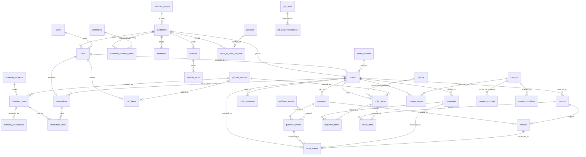
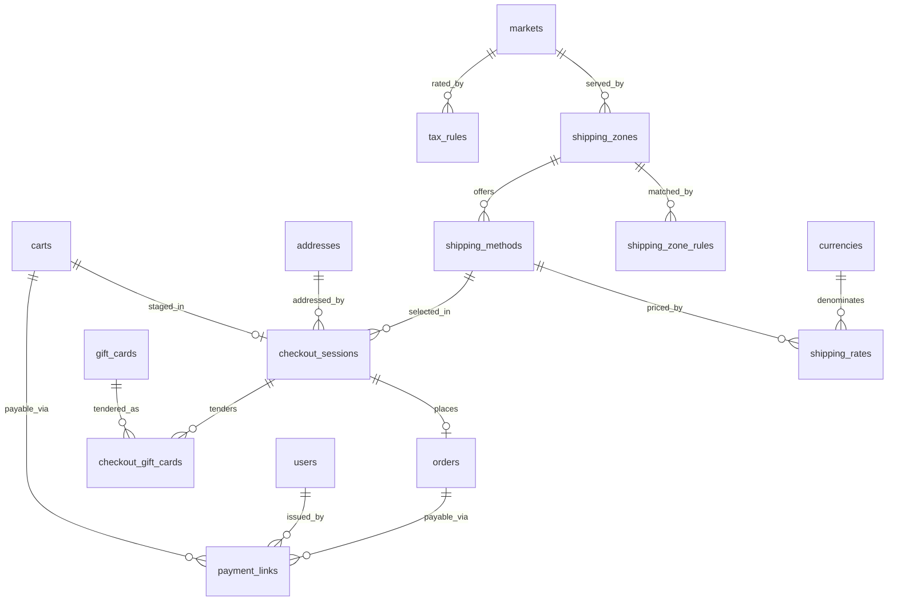

# 02 — Database Schema and Entity-Relationship Model

Scope: every table, column, type, constraint and index in the Millennium Designs
database. **This document is the canonical naming authority.** Table names,
column names, enum type names and enum values written here are reused verbatim by
every other section, by `prisma/schema/*.prisma`, by `src/lib/db/types.ts` and by
the CSV import/export column headers. A name that appears here and differently
elsewhere is a defect in the other document.

Target: PostgreSQL 17 (Neon) via Prisma 7 + `@prisma/adapter-pg` (01 §1.1–1.2).
Everything Prisma cannot express — generated columns, partial and expression
indexes, `CHECK` constraints, composite foreign keys, triggers — is hand-written
into the migration SQL, per 01 §1.2 and 01 §5.4 rule 4.

**Prisma schema file map** (extends 01 §3; one file per domain under
`prisma/schema/`):

| File | Domain in this document |
| --- | --- |
| `schema.prisma` | datasource, generator, every `enum` in §1.9 |
| `market.prisma` | §2.1 markets and currencies |
| `identity.prisma` | §2.2 identity and access, §2.3 customers |
| `catalog.prisma` | §2.4 catalogue |
| `pricing.prisma` | §2.5 pricing |
| `inventory.prisma` | §2.6 inventory |
| `commerce.prisma` | §2.7 commerce |
| `cms.prisma` | §2.8 content |
| `ops.prisma` | §2.9 operations |

---

## 1. Modelling principles

These ten rules are not style. Each one is applied without exception below, and
each exception that does exist is named at the table where it occurs.

### 1.1 Money: integer minor units + an ISO currency code, always as a pair

**The column convention, exactly:**

- An amount column is named `<role>_minor` and typed **`BIGINT`**. Examples:
  `orders.total_minor`, `order_items.unit_final_minor`,
  `metal_rates.rate_minor_per_gram`, `gift_cards.balance_minor`.
- Every table that holds an amount also holds **`currency_code CHAR(3) NOT NULL`**
  on the *same row*. There is no amount column anywhere whose currency lives on
  another table and can drift out from under it.
- Every amount column carries `CHECK (<col> >= 0)` unless it is explicitly a
  signed delta, in which case its name ends in `_delta` (`inventory_transactions
  .quantity_delta`, `gift_card_transactions.amount_delta_minor`).
- Every `currency_code` column carries
  `CHECK (currency_code = upper(currency_code))` and
  `REFERENCES currencies (code) ON DELETE RESTRICT`.
- Percentages are never stored as a decimal fraction. They are **basis points**,
  `INTEGER`, column suffix `_bp`, `CHECK (<col> BETWEEN 0 AND 10000)`.
  `discount_value_bp = 1750` is 17.5%.
  **Two named exemptions from the `0..10000` bound**, both because the quantity is
  a multiplier rather than a share of something: `prices.making_charge_bp`
  (`CHECK BETWEEN 0 AND 1000000`) — labour on a hand-finished piece routinely
  exceeds 100% of the metal value, and a 10000 cap would make a legitimate 150%
  making charge unwritable — and `price_history.change_bp`, which is signed (§2.5).
- Physical weights are the one place a decimal is legitimate:
  `NUMERIC(10,3)` grams (`variant_materials.weight_grams`). A weight is a
  measurement, not a settlement amount; it is never summed into money without
  passing through `src/lib/pricing/`.

**Why floats and JS numbers are banned.** `NUMERIC` in Postgres would actually be
exact, and `FLOAT`/`DOUBLE PRECISION` obviously would not (0.1 + 0.2). The real
reason the type is `BIGINT` and not `NUMERIC` is the JavaScript boundary: Prisma
maps `NUMERIC` to `Decimal` or to `string` depending on configuration, and the
first developer who writes `Number(row.price)` to do arithmetic has silently moved
the amount into an IEEE-754 double. `BIGINT` maps to a JavaScript `bigint`, which
**cannot** be mixed with a `number` — `1299n * 2` works, `1299n * 2.0` throws
`TypeError: Cannot mix BigInt and other types`. The type system refuses the bug at
the point it is written instead of producing a plausible wrong number at the till.
The corollary — `bigint` cannot cross a JSON boundary and must become the `Money`
string shape from 01 §2.6 — is the service layer's job, not the schema's.

`₹` and `$` both have two minor digits, but `currencies.minor_unit SMALLINT`
exists anyway so that a future JPY/KWD market does not require a migration of
every amount column.

### 1.2 Identifiers: UUIDv7, application-generated

| Option | Trade-off |
| --- | --- |
| `BIGSERIAL` | Smallest and fastest, but an order id in a URL publishes the business's order count to any competitor who places one order, and merging environments or seeding from a fixture collides. |
| UUIDv4 (`gen_random_uuid()`) | Opaque, but random: every insert lands on a random B-tree leaf, so `orders`, `audit_logs`, `analytics_events` and `inventory_transactions` — the four highest-insert tables — pay constant page splits and lose all index locality for range scans. |
| **UUIDv7** | Opaque *and* time-ordered: the first 48 bits are a millisecond timestamp, so inserts append to the right edge of the index like a serial, and `ORDER BY id` is `ORDER BY` creation time. |

**Decision: `id UUID PRIMARY KEY`, values generated in application code by
`newId(): string` in `src/lib/db/id.ts`** — a ~20-line hand-written UUIDv7
implementation over `node:crypto`, so no dependency is added (01 §1.5). Every
column is declared `id UUID PRIMARY KEY DEFAULT gen_random_uuid()`; the default is
a safety net for hand-written migration SQL and seed inserts only, and is never
relied on by the application.

**Two deliberate exceptions**, both natural keys, both chosen because the FK reads
as data and never needs a join to be understood:

- `currencies.code CHAR(3)` and `markets.code CHAR(2)` — so `orders.market_code =
  'US'` is self-describing in an export, a log line and a support ticket.
- `permissions.key TEXT` — `role_permissions.permission_key = 'product.update'`
  matches the string in `requirePermission(actor, 'product.update')` exactly.

Customer-facing identifiers are separate from primary keys and never derived from
them: `orders.order_number`, `products.slug`, `returns.rma_number`.

### 1.3 Timestamps

Every table has:

```sql
created_at TIMESTAMPTZ NOT NULL DEFAULT now(),
updated_at TIMESTAMPTZ NOT NULL DEFAULT now()
```

**`TIMESTAMPTZ`, never `TIMESTAMP`.** The app runs in `iad1`, the database in
`aws-us-east-1`, one market is `Asia/Kolkata` and the client reads reports in
both. A naive timestamp is a bug waiting for the first daylight-saving boundary.

`updated_at` is maintained by a **trigger**, not by Prisma's `@updatedAt`:

```sql
CREATE FUNCTION touch_updated_at() RETURNS trigger LANGUAGE plpgsql AS $$
BEGIN NEW.updated_at = now(); RETURN NEW; END $$;
-- applied per table:
CREATE TRIGGER trg_<table>_touch BEFORE UPDATE ON <table>
  FOR EACH ROW EXECUTE FUNCTION touch_updated_at();
```

Prisma's `@updatedAt` is client-side and does not fire for the `$queryRaw`
`UPDATE` paths that 01 §1.2 mandates (optimistic-lock updates, bulk edits,
backfills) — so half the writes would leave `updated_at` stale and every
"recently changed" admin view would lie.

Append-only tables (`audit_logs`, `inventory_transactions`, `price_history`,
`payment_events`, `analytics_events`, `search_queries`, `content_versions`,
`gift_card_transactions`, `coupon_usages`) have **`created_at` only** and carry no
`updated_at` and no trigger: a row that can be updated is not an audit trail.

Pure join rows whose only write path is delete-and-reinsert (`product_categories`,
`product_collections`, `product_stones`, `product_tags`, `variant_materials`,
`variant_option_values`, `market_locations`, `role_permissions`, `user_roles`,
`journal_post_tags`) carry **`created_at` only** as well: they are never updated in
place, so an `updated_at` would be a column that always equals `created_at` and a
trigger that never fires. Every other table, including every table with a mutable
counter, carries both columns and the trigger — `order_items` is the one that is
easy to get wrong (§2.7).

Business-meaningful times are their own columns and never inferred from
`created_at`: `published_at`, `paid_at`, `shipped_at`, `cancelled_at`,
`valid_from` / `valid_to`, `effective_at`, `expires_at`.

### 1.4 Soft delete vs hard delete — per entity, not per project

A blanket soft delete leaves every query one forgotten `WHERE deleted_at IS NULL`
away from showing deleted products, and a blanket hard delete destroys order
history. The rule is: **a row is soft-deleted if and only if something immutable
references it, or a URL pointed at it.**

| Policy | Tables | Why |
| --- | --- | --- |
| **Soft delete** — `deleted_at TIMESTAMPTZ NULL`, every unique index and every read filtered by `WHERE deleted_at IS NULL` | `products`, `product_variants`, `prices`, `categories`, `collections`, `stones`, `materials`, `attributes`, `media`, `cms_pages`, `journal_posts`, `coupons`, `gift_cards`, `inventory_locations`, `users` | Referenced by `order_items` / `payments` / `content_versions` with `ON DELETE RESTRICT` (01 §2.7), or had a public URL that must keep resolving or redirecting. |
| **Anonymise, never delete** — `anonymized_at TIMESTAMPTZ NULL` + PII columns overwritten in place | `customers`, `addresses` | An erasure request must not delete the orders that the business is legally required to retain. `customers.email` becomes `deleted+<id>@invalid.millennium`, names become `'Removed'`, `anonymized_at` is set; `orders.customer_id` stays intact and `order_addresses` keeps its own snapshot for the statutory retention period. |
| **Hard delete** | `cart_items`, `carts`, `wishlist_items`, `reservations`, `reservation_lines`, `sessions`, `otp_requests`, `rate_limits`, `product_categories`, `product_collections`, `product_stones`, `variant_materials`, `product_tags`, `product_attribute_values`, `product_media`, `navigation_items`, `cms_sections`, `cms_blocks`, `collection_rules`, `coupon_conditions`, `saved_views`, `import_job_rows` | Join rows and ephemeral rows. Nothing immutable points at them, and keeping tombstones in a join table makes every membership query wrong-by-default. |
| **Hard delete on a retention schedule** (`/api/cron/cleanup-sessions`, 01 §5.6) | `analytics_events` (400 days), `search_queries` (180 days), `webhook_events` (90 days, **floor: never below 30**), `email_logs` (365 days), `jobs` (90 days), `import_job_rows` (30 days after the job finishes), `carts` (90 days inactive, if `status <> 'converted'`), `content_versions` (§2.8) | These grow without bound and have no legal retention requirement. Retention days are `settings` rows, not constants, so the client can change them without a deploy. **`webhook_events` is the one with a hard floor**: pruning a row removes the `(provider, provider_event_id)` uniqueness that makes replay idempotent, so `payments.retention_days` is validated `>= 30` at write time and the order state machine — not the dedupe table — is the second line of defence against a manual dashboard replay of a year-old event (§2.7). |
| **Never deleted, by constraint** | `orders`, `order_items`, `order_addresses`, `payments`, `payment_events`, `refunds`, `shipments`, `returns`, `price_history`, `inventory_transactions`, `audit_logs`, `coupon_usages`, `gift_card_transactions` | Financial and audit history. There is no service function that deletes from these tables, and `ON DELETE RESTRICT` on every inbound FK makes a cascade impossible even by hand. |

Soft delete has one non-negotiable companion, already required by 01 §1.2: every
unique index on a soft-deleted table is **partial**, `WHERE deleted_at IS NULL`.
Otherwise deleting a product permanently burns its SKU and its slug.

### 1.5 Slug uniqueness scope

| Entity | Scope | Index |
| --- | --- | --- |
| `products.slug` | **Global across the whole catalogue**, live rows only | `CREATE UNIQUE INDEX idx_products_slug_live ON products (slug) WHERE deleted_at IS NULL;` (verbatim from 01 §2.7) |
| `categories.slug` | Global, live rows only | `CREATE UNIQUE INDEX idx_categories_slug_live ON categories (slug) WHERE deleted_at IS NULL;` |
| `collections.slug`, `stones.slug`, `materials.slug`, `journal_posts.slug` | Global per table, live rows only | same partial-unique shape |
| `cms_pages.path` | Global; the **full** path (`/about/our-heritage`), not a leaf slug | `CREATE UNIQUE INDEX idx_cms_pages_path_live ON cms_pages (lower(path)) WHERE deleted_at IS NULL;` |
| `curated_facets.slug` | **Scoped to the category** | `UNIQUE (category_id, slug)` |

**Slugs are not market-scoped and not localised.** Markets are path prefixes
(01 §1.4), so the same product is `/products/larimar-drop-pendant` and
`/in/products/larimar-drop-pendant`. One slug, one canonical string, `hreflang`
alternates between the market prefixes. Market-specific *titles* are a different
thing and live in `product_market_content` (§1.8) — changing a title does not
change the URL.

Categories are globally unique rather than unique-per-parent because a category
URL is root-level (`/rings`), so two children named `stacking` under different
parents would collide at the URL layer regardless of what the database permitted.

**A slug change always writes a `redirects` row** (`source = 'slug_change'`,
`status_code = 301`) in the same transaction as the update. This is enforced by
the service layer, not the database — see §5.

### 1.6 Snapshot vs reference

**The rule: if a row must still be *correct* after the thing it describes changes,
it snapshots. If it must still be *current* after the thing it describes changes,
it references.**

| Snapshots (copied at write time, never re-read from source) | References (FK, joined live) |
| --- | --- |
| `order_items.*` — title, SKU, image URL, stones, materials, attributes, every amount, tax, discount breakdown | `product_categories`, `product_collections`, `product_stones` |
| `order_addresses.*` — the shipping/billing address as typed | `carts.customer_id`, `wishlist_items.product_id` |
| `cart_items.unit_list_minor` / `unit_final_minor` / `priced_at` — the server-issued quote the checkout price-check compares against (01 §2.5 step 2) | `cart_items.variant_id` |
| `payments.amount_minor`, `currency_code` | `prices.variant_id` |
| `content_versions.snapshot` — the whole entity subtree | `cms_blocks.media_id` |
| `refunds.amount_minor`, `returns.*` restock decisions | `navigation_items.category_id` |
| `analytics_events.revenue_minor`, `market_code` | — |

An order page, invoice, packing slip, CSV export or revenue report reads **only**
snapshot columns and never joins `products` (01 §2.7). `order_items` additionally
keeps the FKs `product_id`, `variant_id` and `price_record_id` with
`ON DELETE RESTRICT` — they exist so an admin can navigate from a historical line
to the current product, and so the referenced rows can never be hard-deleted. They
are **never** used to render the line.

### 1.7 Translations and market-specific content

Markets are not languages (01 §1.5 rejects `next-intl`). Launch is English-only
across US and India; what genuinely differs per market is *merchandising copy,
visibility and sort order*, not language.

**The fork.** A generic `translations (entity_type, entity_id, field, locale,
value)` EAV table handles any future language with no migration, but makes every
listing query a self-join per field, is unindexable for filtering, and gives the
type system nothing. Per-entity override tables are typed, indexable, and cost one
small table per entity that actually needs overriding.

**Decision: per-entity override tables, and only for the three entities that need
them** — `product_market_content`, `category_market_content`,
`collection_market_content`. Each has a composite primary key
`(<entity>_id, market_code)`, every content column is **nullable**, and **NULL
means "inherit from the base row"**. A market with no override row renders the
base row; there is no duplication and no fan-out.

`cms_blocks`, `cms_sections`, `navigation_items`, `email_templates`, `settings`
and `pricing_rules` take the same shape with a **`market_code CHAR(2) NULL`**
column where `NULL` means "all markets" — because for those entities the whole row
is market-specific, not individual fields.

**When a second language is commissioned**, the expand/contract path is already
laid: add `locale TEXT NOT NULL DEFAULT 'en'` to the three override tables, widen
the primary key to `(<entity>_id, market_code, locale)`, and add `locale` to the
`markets` row. No table is created, no existing row is rewritten, no route
changes. That is recorded here so it is not rediscovered as a rewrite.

> **NEEDS INPUT:** whether any market at launch requires a language other than
> English. If India is to be served in Hindi or Gujarati, the `locale` column ships
> in release 1 rather than later; the schema is identical either way, but the
> admin UI and the editorial budget are not.

### 1.8 JSONB — four places, and nowhere else

JSONB is used where the shape is *genuinely open* and the database will never need
to filter or join on the interior. Everywhere else, a column.

| Column | Why it is open | What it costs, accepted |
| --- | --- | --- |
| `cms_blocks.config`, `config_tablet`, `config_mobile` | Each block type has its own props (a hero has `headline`/`media_id`/`overlay_opacity`; a product grid has `collection_id`/`columns`/`limit`). Forty block types would otherwise be forty tables. | No FK from block config into `media` or `collections`, so a deleted media row leaves a dangling id. Mitigated: the block registry's Zod schema validates on write, the renderer treats a missing target as "render nothing", and `scripts/backfill/` ships an orphan-scan. |
| `product_attribute_values.value_json` | Only for `attributes.data_type = 'composite'` (e.g. `{"length":18,"width":2,"unit":"mm"}`). Every **filterable** attribute type uses the typed columns beside it. | None for filtering, because filterable types never land here (§2.4). |
| `order_items.discount_breakdown`, `order_items.attributes_snapshot`, `order_items.stones_snapshot`, `order_items.materials_snapshot` | A frozen copy of a structure whose live shape may change in a future release. A typed table would have to be migrated, which would rewrite history. | Not queryable. Correct: reporting aggregates the numeric columns beside them, never the JSON. |
| `jobs.payload`, `import_jobs.mapping`, `import_job_rows.raw`, `saved_views.filters`, `audit_logs.before` / `after`, `analytics_events.properties`, `webhook_events.payload`, `settings.value`, `content_versions.snapshot` | Operational envelopes: the shape is the caller's, by definition. | `audit_logs.before/after` and `content_versions.snapshot` get a GIN index only where a screen actually searches them (§4). |

**JSONB is banned** for: any amount, any currency code, any status, any foreign
key, anything a customer filters by, anything a report sums. If a field appears in
a `WHERE`, an `ORDER BY` or a `SUM()`, it is a column.

Every JSONB column is `NOT NULL DEFAULT '{}'::jsonb` unless its absence is
meaningful (`cms_blocks.config_mobile` is `NULL` = "inherit desktop").

### 1.9 Enums: DB enum or lookup table

**The rule: if adding a value requires a code change, it is a Postgres enum. If a
merchant can add a value from the admin panel, it is a lookup table.** A merchant
must never need a deploy to add a category; an engineer must never be able to
introduce an order status the state machine does not handle.

Postgres enums (declared in `prisma/schema/schema.prisma`, added with
`ALTER TYPE … ADD VALUE` in a migration; renaming or removing a value is an
expand/contract migration, 01 §5.4):

| Type | Values |
| --- | --- |
| `product_status` | `draft`, `active`, `archived` |
| `inventory_policy` | `tracked`, `made_to_order`, `untracked` |
| `attribute_data_type` | `text`, `long_text`, `number`, `boolean`, `select`, `multi_select`, `date`, `composite` |
| `collection_mode` | `manual`, `automatic` |
| `collection_rule_field` | `category`, `stone`, `material`, `tag`, `attribute`, `price`, `status`, `created_at`, `is_one_of_a_kind`, **`stone_is_lab_grown`**, **`is_on_sale`** (03 §6.2, each its own migration) |
| `collection_rule_operator` | `equals`, `not_equals`, `in`, `not_in`, `contains`, **`not_contains`** (03 §6.2), `starts_with`, `gt`, `gte`, `lt`, `lte`, `is_true`, `is_false` |
| `price_source` | `manual`, `metal_linked`, `hybrid` — matches `ResolvedPrice.priceSource` (01 §2.3) exactly |
| `price_change_reason` | `manual_edit`, `bulk_edit`, `csv_import`, `recalc_run`, `rule_activation`, `rule_expiry`, `seed` |
| `pricing_rule_scope` | `all`, `product`, `category`, `collection`, `material`, `stone`, `tag`, `customer_group` |
| `pricing_rule_adjustment` | `percentage_off`, `fixed_amount_off`, `fixed_price` |
| `recalc_run_status` | `previewing`, `pending_approval`, `approved`, `applying`, `applied`, `rejected`, `failed` |
| `inventory_transaction_type` | `initial`, `receipt`, `adjustment`, `sale`, `return_restock`, `transfer_in`, `transfer_out`, `write_off`, `recount` |
| `reservation_status` | `active`, `committed`, `released`, `expired` |
| `reservation_ref_kind` | `cart`, `order` |
| `cart_status` | `active`, `merged`, `converted`, `abandoned` |
| `order_status` | `pending_payment`, `paid`, **`pending_review`**, `paid_unfulfillable`, `processing`, `completed`, `cancelled` — **seven values** (§2.7, 11 §7.3) |
| `payment_status` | `unpaid`, `authorized`, `paid`, `partially_refunded`, `refunded`, `failed` |
| `fulfillment_status` | `unfulfilled`, `partially_fulfilled`, `fulfilled`, `partially_returned`, `returned` |
| `payment_event_type` | `intent_created`, `authorized`, `captured`, `failed`, `cancelled`, `refund_created`, `refund_succeeded`, `refund_failed`, `dispute_opened`, `dispute_closed` |
| `shipment_status` | `pending`, `label_created`, `in_transit`, `delivered`, `failed`, `cancelled` |
| `return_status` | `requested`, `approved`, `rejected`, `in_transit`, `received`, `refunded`, `closed` |
| `refund_status` | `pending`, `succeeded`, `failed` |
| `discount_type` | `percentage`, `fixed_amount`, `free_shipping` |
| `discount_trigger` | `code`, `automatic` |
| `coupon_condition_type` | `min_subtotal`, `product`, `category`, `collection`, `customer_group`, `first_order_only`, `market`, `excludes_discounted` |
| `gift_card_status` | `active`, `redeemed`, `expired`, `cancelled`, `disabled` |
| `content_status` | `draft`, `scheduled`, **`publishing`** (06 §4.3 — the in-flight state between claim and commit; never reaches the storefront), `published`, `archived` |
| `content_entity_type` | `cms_page`, `cms_section`, `journal_post`, `navigation_menu`, `product`, `email_template`, `settings` |
| `media_kind` | `image`, `video`, `document`, `vector` |
| `product_media_role` | `gallery`, `hero`, `swatch`, `lifestyle`, `video`, `three_sixty`, `certificate` |
| `seo_entity_type` | `product`, `category`, `collection`, `stone`, `material`, `cms_page`, `journal_post`, `curated_facet`, `home` |
| `redirect_source` | `manual`, `slug_change`, `import` |
| `email_log_status` | `queued`, `sent`, `delivered`, `bounced`, `complained`, `failed`, `skipped_unconfigured`, `skipped_sandbox` |
| `job_status` | `queued`, `running`, `succeeded`, `failed`, `cancelled` |
| `job_kind` | **Nineteen values** — see immediately below. The eight declared here originally are `import_apply`, `export`, `bulk_edit`, `recalc_apply`, `collection_refresh`, `sitemap_rebuild`, `email_batch`, `reindex_search` |
| `import_mode` | `create`, `update`, `upsert` |
| `import_row_status` | `pending`, `valid`, `invalid`, `applied`, `skipped`, `failed` |
| `webhook_status` | `received`, `processed`, `failed`, `ignored`, `duplicate` |
| `otp_purpose` | `customer_login`, `email_verification`, `password_reset`, `admin_2fa_recovery`, **`staff_invite`**, **`data_export`** (07 §1.5, each its own migration) |
| `actor_type` | `staff`, `customer`, `system`, `webhook`, `cron` |
| `saved_view_resource` | `products`, `variants`, `orders`, `customers`, `inventory`, `prices`, `returns`, `media` |
| `address_kind` | `shipping`, `billing` |
| `tax_mode` | `provider_stripe_tax`, `rules_table`, `none` |

**`job_kind`, in full.** The eight values above were the complete set when this document
was written; `03`–`09` then enqueued nine more kinds, four of which (`send_email`,
`analytics_dispatch`, `feed_rebuild`, `audit_archive`) were **used and never declared** —
an `INSERT INTO jobs` that fails at runtime on an invalid enum value, in the paths that
send order confirmations and rebuild product feeds. Each value ships in its **own
migration** ahead of the migration that uses it, because Postgres will not let a value
added inside a transaction be used by a statement in that transaction and Prisma Migrate
wraps a file in one (01 §5.4):

```sql
-- the original eight
CREATE TYPE job_kind AS ENUM (
  'import_apply','export','bulk_edit','recalc_apply',
  'collection_refresh','sitemap_rebuild','email_batch','reindex_search');

-- eleven additions, one migration file each
ALTER TYPE job_kind ADD VALUE 'publish_scheduled';        -- 03 §1.2
ALTER TYPE job_kind ADD VALUE 'media_orphan_scan';        -- 06 §7.1
ALTER TYPE job_kind ADD VALUE 'product_metrics_refresh';  -- 06 §2.1, refreshing product_market_sort
ALTER TYPE job_kind ADD VALUE 'consistency_check';        -- 09 §2.7
ALTER TYPE job_kind ADD VALUE 'reconcile_inventory';      -- 09 §2.7
ALTER TYPE job_kind ADD VALUE 'send_email';               -- 05 §4.3
ALTER TYPE job_kind ADD VALUE 'analytics_dispatch';       -- 08 §7.2
ALTER TYPE job_kind ADD VALUE 'feed_rebuild';             -- 08 §3.7
ALTER TYPE job_kind ADD VALUE 'audit_archive';            -- 07 §7.4
ALTER TYPE job_kind ADD VALUE 'account_export';           -- 07 §8.4
ALTER TYPE job_kind ADD VALUE 'customer_group_refresh';   -- 15 §1.4
```

`account_export` exists for the same reason and was found the same way. `07` §8.4's
customer subject-access bundle was filed under `job_kind = 'export'`, which is
`systemPermitted: false` and carries a human creator — but the export is enqueued by
`requestDataExport()` from a **customer** session, so `jobs.created_by_user_id` is `NULL`
and `runJob()` would have refused it. That is precisely the failure that silently killed
the order-confirmation email (`11` §3.2), arriving a second time in a different feature:
a machine-originated job wearing a human-only kind. `customer_group_refresh` (`15` §1.4)
is the eleventh, enqueued nightly and on a rules edit above 2,000 members.

`audit_archive` replaces `07 §7.4`'s use of `job_kind = 'export'` for the weekly off-site
audit copy: `export` is a human-originated kind that must never run with a `NULL` creator,
and filing a machine-scheduled archive under it would make the one kind whose whole point
is that a person asked for it machine-originated. Per-kind metadata — whether a `NULL`
`created_by_user_id` is permitted, the dedupe key shape, `maxAttempts` — lives in
`src/lib/jobs/kinds.ts` and is tabulated in `11 §3.2`; `tests/unit/job-kinds.test.ts`
asserts the `pg_enum` values and `Object.keys(JOB_KINDS)` are the same set.

Lookup tables (merchant-editable rows, every one with `is_active`, `rank`,
`deleted_at` where §1.4 requires): `currencies`, `markets`, `categories`,
`collections`, `stones`, `materials`, `tags`, `attributes`, `attribute_options`,
`inventory_locations`, `customer_groups`, `roles`, `permissions`,
`email_templates`, `settings`.

Two judgement calls worth naming:

- **`roles` is a table, `permissions.key` is a string, and neither is an enum**,
  even though the 7 launch roles are fixed. The admin panel must be able to create
  an eighth role and re-point permissions without a deploy (01 §1.1), and
  `requirePermission(actor, 'product.update')` compares against
  `permissions.key`, so the permission catalogue is seed data that CI asserts
  against — not a type.
- **`markets.code` is a row, not a TypeScript union**, restating 01 §1.4:
  `generateStaticParams()` queries this table, and adding Canada is one row.

**The third case: a small value set local to one table, stored as `TEXT`.** Several
columns below take three or four values that only one table uses and that the
merchant never edits — `materials.kind`, `collections.rule_match`,
`collections.sort_order`, `coupons.applies_to`, `curated_facets.facet_type`,
`navigation_items.link_type`, `cms_pages.page_type`, `cms_sections.layout`,
`cms_sections.padding_scale`, `newsletter_subscribers.status`,
`recalc_run_lines.status`, `reservations.release_reason`,
`gift_card_transactions.type`, `import_jobs.resource`, `settings.value_type`,
`returns.reason_code`, `product_collections.source`, `coupon_conditions.operator`.
A Postgres enum for each would be eighteen more types to `ALTER`.
**Every one of them carries an explicit `CHECK (<col> IN (…))` listing its values**,
named `chk_<table>_<col>`. Without it the set is documentation, and the first
`'Manual'` written where `'manual'` was meant is a rule that silently matches
nothing — a collection that renders empty, or a nav item that links nowhere, with no
error anywhere. The `CHECK` is the cheapest possible substitute for a type, and
widening it is a one-line migration.

**Two of those eighteen `CHECK`s were named in the list above and never written down**,
and both are added here:

```sql
ALTER TABLE import_jobs ADD CONSTRAINT chk_import_jobs_resource
  CHECK (resource IN ('products','variants','prices','inventory','customers','redirects'));

ALTER TABLE cms_sections ADD CONSTRAINT chk_cms_sections_background_token
  CHECK (background_token IS NULL OR background_token IN (
    '--md-ivory-soft','--md-ivory','--md-stone',
    '--md-emerald-deep','--md-forest','--md-green-dark','--md-green-black'));
```

`import_jobs.resource` has exactly six values and
`requiredPermissionsForImport(resource, mode)` (`11 §1.5`) is exhaustive over the same
six, so a seventh importable resource without a permission decision fails to compile
rather than importing under `import.run` alone. `cms_sections.background_token` is the one
small closed `TEXT` set in this schema that had no `CHECK`, and it is the single place a
designer-facing token can leak a **hex value** into the database — which §2.8 forbids in
prose and nothing enforced. The seven permitted values are the surface tokens from
`10 §2.1`, generated into `src/lib/cms/backgroundTokens.ts` from `src/styles/tokens.css`
at build time (`11 §7.7`); `NULL` means "inherit the page ground". A token deleted from
the stylesheet then fails `tests/unit/background-tokens.test.ts` instead of rendering
`var(--md-gone)` as transparent.

### 1.10 Rounding and allocation — the rule the CHECK constraints depend on

§1.1 gives the storage type. This rule gives the arithmetic, and it is not optional:
`chk_orders_total`, `chk_order_items_subtotal` and `chk_order_items_total` are
**exact integer identities**, so an order whose discount or tax was rounded
per-line without a residue rule does not produce a penny of drift — it fails the
`INSERT` and the customer sees a checkout error. Three concrete lines, a 17.5%
coupon, `floor()` per line: the line discounts sum to one minor unit less than
`orders.discount_total_minor`, `chk_orders_total` rejects the row, and the order is
lost. This is the single most likely way this schema breaks in its first week.

**The rules, applied in `src/lib/pricing/money.ts`, all operands `bigint`:**

1. **One rounding, at the end.** A percentage is applied once, to the largest
   available base, and the result is rounded once. Never round an intermediate.
   `applyBp(amountMinor, bp) = (amountMinor * BigInt(bp) + 5000n) / 10000n`
   — integer division after adding half, i.e. **half-up**, matching what a customer
   computes on a phone and what an Indian GST invoice expects.
2. **Metal-linked prices round once, at the end of the whole expression:**
   `round((rate_per_gram × purity_ratio_bp × weight_milligrams × (10000 + making_charge_bp)) / 10^k)`
   evaluated entirely in `bigint`, with `purity_ratio` and `weight_grams` converted
   to integers (basis points, milligrams) at the edge. `NUMERIC(6,5)` and
   `NUMERIC(10,3)` are storage for a measurement (§1.1); they never enter money
   arithmetic as `Decimal` or as `number`.
3. **Order-level amounts are allocated to lines by largest remainder**, never by
   rounding each line independently. `allocate(totalMinor, weights[]): bigint[]`
   computes each line's exact share, floors it, then hands the remaining minor units
   one each to the entries with the largest fractional remainders, **ties broken by
   the lowest index**. The function takes weights, not rows: it has no access to a
   `line_number` and does not need one — **the caller is responsible for passing
   entries in the order the tie-break should favour.** Order lines are passed in
   `line_number` order; price components are passed in the fixed order
   metal → making → stone → other (04 §2.3). One rule, both call sites correct, and
   the signature is implementable exactly as written.

   > **DECISION CHANGED:** this rule previously read "ties broken by `line_number`",
   > which the signature cannot express — `allocate()` never receives a line number,
   > so the tie-break was unimplementable as specified, and 04 §2.3 reused the same
   > function with a *different* stated tie-break. Lowest-index plus caller-ordering
   > satisfies both call sites with one rule.

   Its postcondition is `sum(result) === totalMinor`, asserted in the
   function and in `tests/unit/money-allocate.test.ts` over a property-based sweep
   — which also asserts the tie-break is stable under permutation of equal weights
   (the property that catches the day someone sorts the array for tidiness).
   This is what makes `SUM(order_items.line_discount_minor) = orders
   .discount_total_minor` true by construction rather than by luck, and the same
   function allocates `line_tax_minor` and `line_shipping_minor`.
4. **Tax is allocated, not recomputed.** `tax_total_minor` comes from the tax
   authority (Stripe Tax response, or the `rules_table` evaluation) as one number
   per jurisdiction; the per-line split is `allocate()` over
   `line_subtotal_minor - line_discount_minor`. Recomputing tax per line from
   `tax_rate_bp` would produce a different total from the one the provider will
   settle against.
5. **Rounding direction is never currency-dependent.** Both launch currencies have
   `minor_unit = 2`; a future `minor_unit = 0` currency (JPY) changes the *unit*, not
   the rule, and `currencies.minor_unit` is the only place that knowledge lives.

---

## 2. The schema

Reading conventions used in every table below. `Null` = `Y` means the column is
nullable. Columns present on every table per §1.3 (`created_at`, `updated_at`) are
listed only where the table deviates. `FK → t(c) [ACTION]` gives the referenced
table and the `ON DELETE` action; `ON UPDATE RESTRICT` is the default on every
foreign key in this schema and is not repeated.

### 2.1 Markets and currencies

These two tables are the root of the multi-market model and are read by almost
every other domain. They are small, cached (`tags.market`, `tags.settings`), and
changed only by an owner/admin.

#### `currencies`

| Column | Type | Null | Notes |
| --- | --- | --- | --- |
| `code` | `CHAR(3)` | N | **PK**. ISO 4217, uppercase: `USD`, `INR` |
| `name` | `TEXT` | N | `US Dollar` |
| `symbol` | `TEXT` | N | `$`, `₹` |
| `minor_unit` | `SMALLINT` | N | `2` for both launch currencies |
| `is_active` | `BOOLEAN` | N | default `true` |
| `created_at` / `updated_at` | `TIMESTAMPTZ` | N | |

- **PK** `(code)`.
- **CHECK** `chk_currencies_code_upper: code = upper(code)`;
  `chk_currencies_minor_unit: minor_unit BETWEEN 0 AND 4`.
- No index beyond the PK. Two rows at launch; a sequential scan is the plan.

#### `markets`

| Column | Type | Null | Notes |
| --- | --- | --- | --- |
| `code` | `CHAR(2)` | N | **PK**. Uppercase ISO 3166-1 alpha-2: `US`, `IN`. The URL segment is its lowercase form (01 §1.4) |
| `name` | `TEXT` | N | `United States` |
| `currency_code` | `CHAR(3)` | N | FK → `currencies(code)` [RESTRICT] — a currency in use cannot be deleted out from under live prices |
| `locale` | `TEXT` | N | `en-US`, `en-IN`. Read by `formatMoney` (01 §2.6); never hardcoded |
| `country_code` | `CHAR(2)` | N | Default shipping country for the market |
| `timezone` | `TEXT` | N | `America/New_York`, `Asia/Kolkata`. Used for report day boundaries and scheduled publishing |
| `payment_provider_key` | `TEXT` | Y | `stripe`, `razorpay`. `NULL` ⇒ `getProviderForMarket()` returns `null` and checkout blocks (01 §4.9) |
| `tax_mode` | `tax_mode` | N | `provider_stripe_tax` for US, `rules_table` for IN |
| `prices_include_tax` | `BOOLEAN` | N | `false` US, decided by client for IN (see NEEDS INPUT in 01 §4.4) |
| `default_location_id` | `UUID` | Y | FK → `inventory_locations(id)` [SET NULL] — a deleted location must not make the market unresolvable |
| `weight_unit` | `TEXT` | N | `g` — display only |
| `is_active` | `BOOLEAN` | N | default `false`. `listActiveMarkets()` filters on this; an inactive market 404s |
| `rank` | `INTEGER` | N | Market-switcher ordering |
| `created_at` / `updated_at` | `TIMESTAMPTZ` | N | |

- **PK** `(code)`.
- **UNIQUE** `uq_markets_code_currency (code, currency_code)` — exists solely so
  that `prices`, `orders`, `carts`, `coupon_amounts`, `gift_cards`, `metal_rates`
  and `pricing_rules` can declare a **composite FK** `(market_code, currency_code)
  → markets (code, currency_code)`. That composite FK is the database-level
  guarantee that an INR amount can never be attached to the US market — the single
  highest-value constraint in the multi-market model, and one that is otherwise
  left to hopeful service code.
- **CHECK** `chk_markets_code_upper: code = upper(code)`.
- **Index** `idx_markets_active ON markets (rank) WHERE is_active` — the
  market switcher and `generateStaticParams()`.

#### `market_locations`

Which physical stock locations fulfil which market. Required by
`getAvailability(variantIds, marketCode)` (01 §2.3): stock held only in Mumbai is
`out` for a US shopper.

| Column | Type | Null | Notes |
| --- | --- | --- | --- |
| `market_code` | `CHAR(2)` | N | FK → `markets(code)` [CASCADE] — deactivating a market removes its routing, and the join row carries no independent meaning |
| `location_id` | `UUID` | N | FK → `inventory_locations(id)` [RESTRICT] — a location that fulfils a live market must be soft-deleted, not removed |
| `priority` | `SMALLINT` | N | Allocation order, lowest first |
| `created_at` | `TIMESTAMPTZ` | N | |

- **PK** `(market_code, location_id)`.
- **Index** `idx_market_locations_location ON market_locations (location_id)` —
  the reverse lookup used when a stock movement must decide which market caches to
  purge.

---

### 2.2 Identity and access

**Staff and customers are separate tables.** The fork: one `users` table with a
`type` column is fewer joins, but half its columns are always `NULL` for one of
the two populations (TOTP secret, role assignments, marketing consent, group), and
a privilege escalation becomes one boolean flip on a row a customer-facing signup
flow already writes to. **Decision: `users` (staff only, 7-role RBAC, TOTP,
impersonation) and `customers` (storefront shoppers, OTP login, groups, consent)
are distinct tables with distinct write paths.** `sessions` serves both with a
mutually-exclusive pair of nullable FKs.

#### `users` — staff

| Column | Type | Null | Notes |
| --- | --- | --- | --- |
| `id` | `UUID` | N | **PK** |
| `email` | `TEXT` | N | Login identity |
| `password_hash` | `TEXT` | N | argon2id (01 §1.1). Never a plaintext or reversible value |
| `first_name` / `last_name` | `TEXT` | N | |
| `avatar_media_id` | `UUID` | Y | FK → `media(id)` [SET NULL] |
| `is_active` | `BOOLEAN` | N | default `true`. A deactivated user keeps their audit trail |
| `totp_secret_encrypted` | `TEXT` | Y | AES-GCM ciphertext, key from `AUTH_SECRET`. `NULL` = 2FA not enrolled |
| `totp_enrolled_at` | `TIMESTAMPTZ` | Y | |
| `totp_recovery_codes` | `TEXT[]` | Y | Argon2 hashes of single-use recovery codes |
| `last_login_at` | `TIMESTAMPTZ` | Y | |
| `password_changed_at` | `TIMESTAMPTZ` | N | Sessions issued before this are invalid |
| `failed_login_count` | `SMALLINT` | N | default `0` |
| `locked_until` | `TIMESTAMPTZ` | Y | |
| `version` | `INTEGER` | N | default `0` — optimistic lock (01 §2.3 step 3) |
| `deleted_at` | `TIMESTAMPTZ` | Y | Soft delete (§1.4) |
| `created_at` / `updated_at` | `TIMESTAMPTZ` | N | |

- **UNIQUE** `CREATE UNIQUE INDEX idx_users_email_live ON users (lower(email)) WHERE deleted_at IS NULL;`
  — case-insensitive without the `citext` extension.
- **CHECK** `chk_users_totp_pair: (totp_secret_encrypted IS NULL) = (totp_enrolled_at IS NULL)`.
- **Index** `idx_users_active ON users (is_active, last_name) WHERE deleted_at IS NULL`
  — the `/admin/settings/users` list.

#### `roles`

| Column | Type | Null | Notes |
| --- | --- | --- | --- |
| `id` | `UUID` | N | **PK** |
| `key` | `TEXT` | N | Stable machine key: `owner`, `admin`, `catalog_manager`, `inventory_manager`, `order_manager`, `content_editor`, `analyst` |
| `name` | `TEXT` | N | Display label |
| `description` | `TEXT` | Y | |
| `is_system` | `BOOLEAN` | N | `true` for the 7 seeded roles — cannot be deleted or have its `key` changed |
| `rank` | `INTEGER` | N | |
| `created_at` / `updated_at` | `TIMESTAMPTZ` | N | |

- **UNIQUE** `uq_roles_key (key)`.
- The role→permission matrix is owned by the RBAC section; the **role keys above
  are canonical** and that section must use them verbatim.

#### `permissions`

| Column | Type | Null | Notes |
| --- | --- | --- | --- |
| `key` | `TEXT` | N | **PK**. `<resource>.<action>`: `product.update`, `order.refund`, `price.approve_recalc`, `settings.manage`, `user.impersonate` |
| `resource` | `TEXT` | N | Grouping for the admin matrix UI |
| `action` | `TEXT` | N | |
| `description` | `TEXT` | N | Rendered next to the checkbox — an unexplained permission is granted carelessly |
| `created_at` | `TIMESTAMPTZ` | N | |

- **PK** `(key)`. Seeded from `src/lib/rbac/catalogue.ts`;
  `tests/unit/rbac-catalogue.test.ts` asserts the table and the constant agree, so
  a permission referenced in code but absent from the DB fails CI rather than
  silently denying at runtime.

#### `role_permissions`

| Column | Type | Null | Notes |
| --- | --- | --- | --- |
| `role_id` | `UUID` | N | FK → `roles(id)` [CASCADE] — deleting a custom role removes its grants; no orphan grant may survive |
| `permission_key` | `TEXT` | N | FK → `permissions(key)` [CASCADE] — a permission removed from the catalogue must not linger as an unmatchable grant |
| `granted_by_user_id` | `UUID` | Y | FK → `users(id)` [SET NULL] |
| `created_at` | `TIMESTAMPTZ` | N | Who widened a role, and when, is the first question of any access review |

- **PK** `(role_id, permission_key)`.
- **Index** `idx_role_permissions_permission ON role_permissions (permission_key, role_id)`
  — "which roles grant `order.refund`" is the query the permission matrix screen and
  every access review runs, and the PK's leading column is the wrong one for it.

#### `user_roles`

| Column | Type | Null | Notes |
| --- | --- | --- | --- |
| `user_id` | `UUID` | N | FK → `users(id)` [CASCADE] |
| `role_id` | `UUID` | N | FK → `roles(id)` [RESTRICT] — a role held by a user cannot be deleted; the admin must reassign first |
| `granted_by_user_id` | `UUID` | Y | FK → `users(id)` [SET NULL] |
| `created_at` | `TIMESTAMPTZ` | N | |

- **PK** `(user_id, role_id)`. Many-to-many: a user may hold several roles and the
  effective permission set is the union.
- **Index** `idx_user_roles_role ON user_roles (role_id)` — "who holds this role",
  required before a role can be deleted.

#### `sessions`

| Column | Type | Null | Notes |
| --- | --- | --- | --- |
| `id` | `UUID` | N | **PK** |
| `token_hash` | `BYTEA` | N | SHA-256 of the cookie value. **The plaintext token is never stored** (01 §2.7) |
| `user_id` | `UUID` | Y | FK → `users(id)` [CASCADE] — deactivating staff kills their sessions |
| `customer_id` | `UUID` | Y | FK → `customers(id)` [CASCADE] |
| `impersonator_user_id` | `UUID` | Y | FK → `users(id)` [SET NULL]. Non-null ⇒ this session is a staff member acting as a customer; every write it makes is audited with both actors |
| `ip_address` | `INET` | Y | |
| `user_agent` | `TEXT` | Y | |
| `expires_at` | `TIMESTAMPTZ` | N | `SESSION_TTL_HOURS` / `ADMIN_SESSION_TTL_HOURS` |
| `last_seen_at` | `TIMESTAMPTZ` | N | |
| `revoked_at` | `TIMESTAMPTZ` | Y | |
| `created_at` | `TIMESTAMPTZ` | N | |

- **CHECK** `chk_sessions_one_principal: (user_id IS NOT NULL)::int + (customer_id IS NOT NULL)::int = 1`
  — a session belongs to exactly one principal. Without it, a row with both set is
  a staff session that a customer cookie can present.
- **CHECK** `chk_sessions_impersonation: impersonator_user_id IS NULL OR customer_id IS NOT NULL`.
- **UNIQUE** `CREATE UNIQUE INDEX idx_sessions_token_hash ON sessions (token_hash);`
  (verbatim from 01 §2.7) — hit on every authenticated request.
- **Index** `idx_sessions_expiry ON sessions (expires_at) WHERE revoked_at IS NULL`
  — the `cleanup-sessions` cron.
- **Index** `idx_sessions_customer ON sessions (customer_id, created_at DESC) WHERE customer_id IS NOT NULL`
  — "sign out everywhere".

#### `otp_requests`

| Column | Type | Null | Notes |
| --- | --- | --- | --- |
| `id` | `UUID` | N | **PK** |
| `purpose` | `otp_purpose` | N | |
| `identifier` | `TEXT` | N | Email or E.164 phone, lowercased |
| `code_hash` | **`TEXT`** | N | An **Argon2id PHC string** over (code ‖ `OTP_HASH_PEPPER`) — `$argon2id$v=19$m=…,t=…,p=…$<salt>$<hash>`. **`TEXT`, not `BYTEA`**: 07 §4.2 verifies it with `argon2.verify(row.code_hash, token)`, which takes and returns a PHC string carrying its own parameters and salt. A `BYTEA` column storing a bare digest has nowhere to put either, so the verify call in the document that owns OTP verification could not compile against the column in the document that owns the schema. The row is looked up by `(purpose, identifier)` and verified, never matched on the hash — which is why a per-row salt is correct here and is **not** correct for `gift_cards.code_hash` (§2.7) |
| `customer_id` | `UUID` | Y | FK → `customers(id)` [CASCADE] |
| `user_id` | `UUID` | Y | FK → `users(id)` [CASCADE] |
| `attempts` | `SMALLINT` | N | default `0` |
| `max_attempts` | `SMALLINT` | N | default `5` |
| `consumed_at` | `TIMESTAMPTZ` | Y | |
| `expires_at` | `TIMESTAMPTZ` | N | `now() + 10 minutes` |
| `created_at` | `TIMESTAMPTZ` | N | |

- **Index** `idx_otp_lookup ON otp_requests (purpose, identifier, created_at DESC)`.
- **Index** `idx_otp_expiry ON otp_requests (expires_at) WHERE consumed_at IS NULL`
  — cleanup cron.
- Not soft-deleted, and pruned aggressively: a table of live credential hashes is
  a liability, not history.

---

### 2.3 Customers

#### `customer_groups`

| Column | Type | Null | Notes |
| --- | --- | --- | --- |
| `id` | `UUID` | N | **PK** |
| `key` | `TEXT` | N | `retail`, `trade`, `vip` |
| `name` | `TEXT` | N | |
| `description` | `TEXT` | Y | |
| `is_default` | `BOOLEAN` | N | Exactly one row true |
| `created_at` / `updated_at` | `TIMESTAMPTZ` | N | |

- **UNIQUE** `uq_customer_groups_key (key)`;
  `CREATE UNIQUE INDEX idx_customer_groups_default ON customer_groups ((true)) WHERE is_default;`
  — a single-row partial unique index, so "two default groups" is impossible.
- Group pricing is **not** a second price table: it is a `pricing_rules` row with
  `scope_type = 'customer_group'` (§2.5). One discount mechanism, one place to
  audit.

#### `customers`

| Column | Type | Null | Notes |
| --- | --- | --- | --- |
| `id` | `UUID` | N | **PK** |
| `email` | `TEXT` | N | |
| `email_verified_at` | `TIMESTAMPTZ` | Y | |
| `password_hash` | `TEXT` | Y | `NULL` for OTP-only accounts — passwordless is a first-class state, not a placeholder |
| `first_name` / `last_name` | `TEXT` | Y | Nullable: a guest checkout creates a customer row from an email alone |
| `phone` | `TEXT` | Y | E.164 |
| `phone_verified_at` | `TIMESTAMPTZ` | Y | |
| `customer_group_id` | `UUID` | N | FK → `customer_groups(id)` [RESTRICT] |
| `default_market_code` | `CHAR(2)` | Y | FK → `markets(code)` [SET NULL]. A hint for the switch banner only — **never** used to resolve the market of a rendered page (01 §1.4) |
| `default_shipping_address_id` | `UUID` | Y | FK → `addresses(id)` [SET NULL] |
| `default_billing_address_id` | `UUID` | Y | FK → `addresses(id)` [SET NULL] |
| `accepts_marketing` | `BOOLEAN` | N | default `false` — opt-in, never opt-out |
| `marketing_consent_at` | `TIMESTAMPTZ` | Y | |
| `marketing_consent_source` | `TEXT` | Y | `checkout`, `footer_form`, `admin_import` — the provenance an audit will ask for |
| `is_guest` | `BOOLEAN` | N | `true` until the customer sets a credential |
| `total_orders_count` | `INTEGER` | N | default `0`. Denormalised, written inside the order transaction. Currency-free, so it lives here |
| `last_order_at` | `TIMESTAMPTZ` | Y | |
| `internal_note` | `TEXT` | Y | Staff-visible only |
| `anonymized_at` | `TIMESTAMPTZ` | Y | §1.4 |
| `version` | `INTEGER` | N | default `0` |
| `created_at` / `updated_at` | `TIMESTAMPTZ` | N | |

- **UNIQUE** `CREATE UNIQUE INDEX idx_customers_email ON customers (lower(email)) WHERE anonymized_at IS NULL;`
- **Index** `idx_customers_created ON customers (created_at DESC)` — admin list default sort.
- **Index** `idx_customers_group ON customers (customer_group_id) WHERE anonymized_at IS NULL`.
- **Index** `idx_customers_search ON customers USING GIN (to_tsvector('simple', coalesce(first_name,'') || ' ' || coalesce(last_name,'') || ' ' || email))`
  — the admin customer search box, which must match on partial name or email.

The denormalised counters are accepted duplication: the alternative is a
`COUNT(*)`/`SUM()` over `orders` on every row of the admin customer list, which is
the slowest query in the admin panel at 5,000 customers. They are written only
inside the order-creation and refund transactions, and
`/api/cron/reconcile-payments` re-derives and flags drift.

#### `customer_currency_totals`

Lifetime value, **one row per (customer, currency)**.

| Column | Type | Null | Notes |
| --- | --- | --- | --- |
| `customer_id` | `UUID` | N | FK → `customers(id)` [CASCADE] |
| `currency_code` | `CHAR(3)` | N | FK → `currencies(code)` [RESTRICT] |
| `total_spent_minor` | `BIGINT` | N | default `0` |
| `total_refunded_minor` | `BIGINT` | N | default `0` |
| `orders_count` | `INTEGER` | N | default `0` |
| `last_order_at` | `TIMESTAMPTZ` | Y | |
| `created_at` / `updated_at` | `TIMESTAMPTZ` | N | |

- **PK** `(customer_id, currency_code)`.
- **CHECK** `chk_cct_nonneg: total_spent_minor >= 0 AND total_refunded_minor >= 0 AND orders_count >= 0`.
- **Index** `idx_cct_currency_spend ON customer_currency_totals (currency_code, total_spent_minor DESC)`
  — the "top customers in the US" list, which is a per-currency ranking and cannot
  be anything else.

**Why this is a table and not `total_spent_minor_usd` / `total_spent_minor_inr`
columns on `customers`.** Two hardcoded currency columns are the exact rigidity
00-CONTEXT §1 forbids: opening Canada would be a migration on the largest
customer-facing table *plus* an edit to every query, export, segment and admin
column that names the two columns literally — and every one of those edits is a
place to forget CAD. One row per currency makes a third market a `currencies`
insert and nothing else. The no-FX rule (hard rule 2) is preserved and in fact
strengthened: there is no query in this schema that can sum across rows of this
table, because `SUM(total_spent_minor)` without `GROUP BY currency_code` is
meaningless and reviewers are told to reject it on sight. `customers.total_orders_count`
stays on the parent row because a count has no currency.

#### `addresses`

| Column | Type | Null | Notes |
| --- | --- | --- | --- |
| `id` | `UUID` | N | **PK** |
| `customer_id` | `UUID` | N | FK → `customers(id)` [CASCADE] — an address book entry has no meaning without its owner; order history is unaffected because orders snapshot into `order_addresses` |
| `label` | `TEXT` | Y | `Home`, `Studio` |
| `recipient_name` | `TEXT` | N | |
| `company` | `TEXT` | Y | |
| `line1` | `TEXT` | N | |
| `line2` | `TEXT` | Y | |
| `city` | `TEXT` | N | |
| `region` | `TEXT` | Y | State / province. Required for US and IN; nullable because not every country has one |
| `postal_code` | `TEXT` | Y | |
| `country_code` | `CHAR(2)` | N | ISO 3166-1 alpha-2 |
| `phone` | `TEXT` | Y | |
| `tax_identifier` | `TEXT` | Y | GSTIN for Indian B2B invoices |
| `extra` | `JSONB` | N | default `'{}'` — country-specific fields that are not worth a column |
| `is_archived` | `BOOLEAN` | N | Hidden from the picker, kept for history |
| `version` | `INTEGER` | N | |
| `created_at` / `updated_at` | `TIMESTAMPTZ` | N | |

- **CHECK** `chk_addresses_country_upper: country_code = upper(country_code)`.
- **Index** `idx_addresses_customer ON addresses (customer_id) WHERE NOT is_archived`.

#### `newsletter_subscribers`

| Column | Type | Null | Notes |
| --- | --- | --- | --- |
| `id` | `UUID` | N | **PK** |
| `email` | `TEXT` | N | |
| `customer_id` | `UUID` | Y | FK → `customers(id)` [SET NULL] — unsubscribing a deleted account must not lose the suppression record |
| `market_code` | `CHAR(2)` | Y | FK → `markets(code)` [SET NULL] |
| `status` | `TEXT` | N | `pending`, `subscribed`, `unsubscribed`, `bounced` — a lookup-free 4-value set local to one table; a Postgres enum here would be one more type for no benefit |
| `confirmed_at` | `TIMESTAMPTZ` | Y | Double opt-in |
| `unsubscribed_at` | `TIMESTAMPTZ` | Y | |
| `source` | `TEXT` | Y | |
| `created_at` / `updated_at` | `TIMESTAMPTZ` | N | |

- **UNIQUE** `CREATE UNIQUE INDEX idx_newsletter_email ON newsletter_subscribers (lower(email));`
- **CHECK** `chk_newsletter_status: status IN ('pending','subscribed','unsubscribed','bounced')` (§1.9).
- **Index** `idx_newsletter_sendable ON newsletter_subscribers (market_code) WHERE status = 'subscribed'`
  — the send list. Without it every campaign export is a sequential scan that also
  has to be trusted not to mail an unsubscribed address.

---

### 2.4 Catalogue

#### `categories`

A tree (`CHAINS` → `Stacking chains`), but rendered at root-level URLs.

| Column | Type | Null | Notes |
| --- | --- | --- | --- |
| `id` | `UUID` | N | **PK** |
| `parent_id` | `UUID` | Y | FK → `categories(id)` [RESTRICT] — deleting a parent with children must fail loudly, not orphan or cascade-destroy a subtree |
| `slug` | `TEXT` | N | `rings`, `one-of-a-kind`, `14k-gold` |
| `name` | `TEXT` | N | Customer-facing spelling: `RINGS`, `ONE OF A KIND` (00-CONTEXT §6) |
| `materialized_path` | `TEXT` | N | `/rings/stacking/` — maintained by `src/lib/catalog/` on create and re-parent |
| `depth` | `SMALLINT` | N | `0` for a root category |
| `description_json` | `JSONB` | Y | Tiptap document (01 §1.1) |
| `hero_media_id` | `UUID` | Y | FK → `media(id)` [SET NULL] |
| `is_published` | `BOOLEAN` | N | default `false` |
| `rank` | `INTEGER` | N | Merchandised order within the parent |
| `tax_code` | `TEXT` | Y | Stripe Tax product tax code / HSN for this category (01 §4.4 — finished jewellery, loose stones and bullion differ). **Renamed** from the longer spelling this row previously used. `order_items.tax_code` (§2.7) already carried the short name, and 04 §8.2 adds the same column to `products` and `product_variants` for a three-level most-specific-first resolution (`variant.tax_code ?? product.tax_code ?? category.tax_code ?? settings['tax.default_code'][market]`). One concept resolving across four tables cannot carry two names, and the one that was already snapshotted onto every order line wins. A `NULL` at every level with no default is a **checkout block** with a named admin error, never an implicit "taxable at the general rate" |
| `version` | `INTEGER` | N | |
| `deleted_at` | `TIMESTAMPTZ` | Y | |
| `created_at` / `updated_at` | `TIMESTAMPTZ` | N | |

- **UNIQUE** `CREATE UNIQUE INDEX idx_categories_slug_live ON categories (slug) WHERE deleted_at IS NULL;`
- **CHECK** `chk_categories_not_self_parent: parent_id IS NULL OR parent_id <> id`.
- **Index** `idx_categories_parent_rank ON categories (parent_id, rank) WHERE deleted_at IS NULL`
  — nav build and admin tree.
- **Index** `idx_categories_path ON categories (materialized_path text_pattern_ops)`
  — "this category and all its descendants" is
  `WHERE materialized_path LIKE '/rings/%'`, a single index range scan. The
  alternative, a recursive CTE per PLP request, is a join per level on the hottest
  page on the site; the alternative to *that*, the `ltree` extension, is an
  extension dependency for one query shape.

Re-parenting rewrites `materialized_path` for the subtree inside the same
transaction as the `parent_id` update. This is the one denormalisation in the
catalogue that can go stale, so `tests/integration/category-tree.test.ts` asserts
path consistency after a re-parent, and `/api/cron/run-jobs` includes a nightly
consistency check that writes an `audit_logs` entry on mismatch.

#### `products`

| Column | Type | Null | Notes |
| --- | --- | --- | --- |
| `id` | `UUID` | N | **PK** |
| `slug` | `TEXT` | N | §1.5 |
| `title` | `TEXT` | N | |
| `subtitle` | `TEXT` | Y | |
| `description_json` | `JSONB` | Y | Tiptap |
| `care_instructions_json` | `JSONB` | Y | |
| `status` | `product_status` | N | default `'draft'` |
| `published_at` | `TIMESTAMPTZ` | Y | Set on first publish; `status='active' AND published_at <= now()` is "live" |
| `primary_category_id` | `UUID` | Y | FK → `categories(id)` [SET NULL] — breadcrumb and canonical category; membership itself is `product_categories` |
| `is_one_of_a_kind` | `BOOLEAN` | N | default `false`. Drives the immediate cache purge rule (01 §2.4) and the single-variant, single-stock-row constraint chain below |
| `is_made_to_order` | `BOOLEAN` | N | default `false` |
| `lead_time_days` | `SMALLINT` | Y | |
| `default_variant_id` | `UUID` | Y | FK → `product_variants(id)` [SET NULL]. The variant a PDP preselects |
| `rank` | `INTEGER` | N | default `0`. Global merchandising weight, used as a tiebreak everywhere |
| `search_text` | `TEXT` | N | default `''`. Denormalised bag of words: title, subtitle, every live variant SKU, stone names, material names, category names, **collection titles** and tag names — **seven sources**. **Maintained by `src/lib/catalog/reindexProduct(productId, tx)`**, not by a trigger. 08 §6.1 owns the source list and this row matches it; a collection title missing here means a shopper searching a campaign name finds nothing |
| `search_vector` | `tsvector` | N | `GENERATED ALWAYS AS (setweight(to_tsvector('english', coalesce(title,'')), 'A') \|\| setweight(to_tsvector('english', coalesce(subtitle,'')), 'B') \|\| setweight(to_tsvector('english', coalesce(search_text,'')), 'C')) STORED` |
| `version` | `INTEGER` | N | |
| `deleted_at` | `TIMESTAMPTZ` | Y | |
| `created_at` / `updated_at` | `TIMESTAMPTZ` | N | |

- **UNIQUE** `CREATE UNIQUE INDEX idx_products_slug_live ON products (slug) WHERE deleted_at IS NULL;` (01 §2.7)
- **Index** `CREATE INDEX idx_products_published ON products (status, published_at DESC) WHERE deleted_at IS NULL;` (01 §2.7)
- **Index** `CREATE INDEX idx_products_search_vector ON products USING GIN (search_vector);` (01 §1.2)
- **Index** `CREATE INDEX idx_products_title_trgm ON products USING GIN (title gin_trgm_ops);`
  — `pg_trgm` typo tolerance for typeahead (01 §1.1). Requires
  `CREATE EXTENSION IF NOT EXISTS pg_trgm;` in the first migration.
- **Index** `idx_products_ooak ON products (id) WHERE is_one_of_a_kind AND deleted_at IS NULL`
  — the ONE OF A KIND surface and the stricter purge path.
- **UNIQUE** `uq_products_id_ooak (id, is_one_of_a_kind)` — carries no information on
  its own; it exists so `product_variants` can declare a composite FK and inherit the
  flag from the database rather than from a service copy that can drift. See the
  constraint chain under `inventory_items` (§2.6).

**Why `search_text` is a real column and not part of the generated expression.**
A Postgres generated column may only reference columns of the same row, so it
cannot reach `product_stones` or `materials`. Stone-led and material-led search
("labradorite pendant", "14k rose") would therefore miss every product whose title
does not contain the word. `reindexProduct(productId, tx)` is called inside the
same transaction as any product, stone-link, material-link, tag or category
change, so `search_text` is never stale outside a transaction; the `reindex_search`
job kind exists to rebuild it in bulk after an import.

**The staleness case that is not a link change.** Renaming the *referenced* row —
`stones.name` from `Blue Topaz` to `Swiss Blue Topaz`, a material, a category or a
tag — touches no `product_*` join row, so nothing above fires and every product's
`search_text` keeps the old word until someone notices. The new name is then
unsearchable across the entire catalogue while the old one still matches, which for
a stone-led storefront is a silent outage of the primary discovery path. **The rule:**
`saveStone()`, `saveMaterial()`, `saveCategory()`, **`saveCollection()`** and `saveTag()`
— **five writers, one per denormalised source** — call
`reindexProductsForEntity({ kind, id }, tx)` (08 §1.3) inside their own transaction
whenever the `name`/`title` column is in `dirtyFields`. Below **200** affected products it
reindexes them inline; above that it inserts a `jobs` row of kind `reindex_search`
**scoped to the affected product ids**. Scoped, not global: a global rebuild of a
2,000-product catalogue for a one-word edit is a job nobody will let run during trading
hours, and a job nobody runs is a job that does not exist.

**`saveCollection()` is the fifth writer and this document previously named four.**
`collections.title` reaches `search_text` through `product_collections` exactly as
`stones.name` reaches it through `product_stones`, so renaming a campaign collection
without reindexing leaves the same silent outage on the same mechanism — and, because a
collection rename is usually a *merchandising* act performed just before a campaign goes
live, it is the one of the five most likely to be noticed by a customer first. The two
documents disagreed on whether a collection rename invalidates the index; it does.

#### `product_variants`

| Column | Type | Null | Notes |
| --- | --- | --- | --- |
| `id` | `UUID` | N | **PK** |
| `product_id` | `UUID` | N | FK → `products(id)` [RESTRICT] — a product with variants that appear on orders cannot be hard-deleted; soft delete cascades in the service |
| `is_one_of_a_kind` | `BOOLEAN` | N | default `false`. **Not an editable field** — denormalised from `products.is_one_of_a_kind` and held equal to it by a composite FK, so it cannot drift |
| `sku` | `TEXT` | N | Merchant-facing stock keeping unit |
| `title` | `TEXT` | Y | `NULL` ⇒ derived from option values |
| `position` | `SMALLINT` | N | |
| `inventory_policy` | `inventory_policy` | N | default `'tracked'`. `made_to_order` and `untracked` variants have **no** `inventory_items` rows and never reserve (§2.6) |
| `barcode` | `TEXT` | Y | |
| `hs_code` | `TEXT` | Y | Customs classification; jewellery is commonly 7113 |
| `country_of_origin` | `CHAR(2)` | Y | |
| `gross_weight_grams` | `NUMERIC(10,3)` | Y | Shipping weight — distinct from metal weight in `variant_materials` |
| `ring_size` / `length_mm` | `NUMERIC(6,2)` | Y | Frequently-filtered physical dimensions promoted out of the attribute EAV because they are range-filtered |
| `is_active` | `BOOLEAN` | N | default `true` |
| `version` | `INTEGER` | N | |
| `deleted_at` | `TIMESTAMPTZ` | Y | |
| `created_at` / `updated_at` | `TIMESTAMPTZ` | N | |

- **UNIQUE** `CREATE UNIQUE INDEX idx_variants_sku_live ON product_variants (sku) WHERE deleted_at IS NULL;`
  — SKU is globally unique among live variants; deleting a variant frees its SKU.
- **Index** `idx_variants_product ON product_variants (product_id, position) WHERE deleted_at IS NULL`.
- **FK (composite)** `(product_id, is_one_of_a_kind) REFERENCES products (id, is_one_of_a_kind) ON DELETE RESTRICT ON UPDATE RESTRICT`
  — the flag on this row is the same fact as the flag on the parent, by constraint.
  `ON UPDATE RESTRICT` also means flipping a product **to** one-of-a-kind while it
  still has variants fails loudly instead of half-applying; `saveProduct()` retires
  the extra variants first, in the same transaction.
- **UNIQUE** `CREATE UNIQUE INDEX idx_variants_ooak_single ON product_variants (product_id) WHERE is_one_of_a_kind AND deleted_at IS NULL;`
  — **a one-of-a-kind product has exactly one live variant, enforced by the
  database.** This was previously a service-only assertion; it is a two-line partial
  unique index and there is no reason for the guarantee on the most expensive,
  least-replaceable inventory in the catalogue to live only in application code.
- **UNIQUE** `uq_variants_id_ooak (id, is_one_of_a_kind)` — the next link in the
  chain, consumed by `inventory_items` (§2.6).

#### `product_options` / `product_option_values` / `variant_option_values`

The variant engine. A product declares its option axes; each variant pins one
value on each axis.

`product_options`

| Column | Type | Null | Notes |
| --- | --- | --- | --- |
| `id` | `UUID` | N | **PK** |
| `product_id` | `UUID` | N | FK → `products(id)` [CASCADE] — an option axis has no meaning outside its product |
| `name` | `TEXT` | N | `Metal`, `Size`, `Stone` |
| `position` | `SMALLINT` | N | |

- **UNIQUE** `uq_product_options (product_id, lower(name))` as an expression index;
  **UNIQUE** `uq_product_options_position (product_id, position) DEFERRABLE INITIALLY DEFERRED`
  — deferred so a drag-and-drop reorder can renumber every row in one statement
  without transiting an illegal intermediate state.

`product_option_values`

| Column | Type | Null | Notes |
| --- | --- | --- | --- |
| `id` | `UUID` | N | **PK** |
| `option_id` | `UUID` | N | FK → `product_options(id)` [CASCADE] |
| `value` | `TEXT` | N | `14K Yellow Gold`, `US 6` |
| `swatch_media_id` | `UUID` | Y | FK → `media(id)` [SET NULL] |
| `material_id` | `UUID` | Y | FK → `materials(id)` [SET NULL] — links a metal option value to the material that prices it |
| `position` | `SMALLINT` | N | |

- **UNIQUE** `uq_option_values (option_id, lower(value))`.

`variant_option_values`

| Column | Type | Null | Notes |
| --- | --- | --- | --- |
| `variant_id` | `UUID` | N | FK → `product_variants(id)` [CASCADE] |
| `option_id` | `UUID` | N | FK → `product_options(id)` [CASCADE] |
| `option_value_id` | `UUID` | N | FK → `product_option_values(id)` [RESTRICT] — an option value still pinned by a variant cannot be deleted; the admin must retire the variant first |

- **PK** `(variant_id, option_id)` — one value per axis per variant, structurally.
- **Index** `idx_variant_option_values_value ON variant_option_values (option_value_id, variant_id)`
  — "which variant is 14K Rose, size 6", the PDP swatch resolver.

#### `stones`

A first-class entity with its own pages and its own discovery surface, not a tag.

| Column | Type | Null | Notes |
| --- | --- | --- | --- |
| `id` | `UUID` | N | **PK** |
| `slug` | `TEXT` | N | `moonstone`, `labradorite` |
| `name` | `TEXT` | N | |
| `short_description` | `TEXT` | Y | Card/tooltip copy |
| `description_json` | `JSONB` | Y | Tiptap, the `/stones/[slug]` body |
| `hero_media_id` | `UUID` | Y | FK → `media(id)` [SET NULL] |
| `swatch_media_id` | `UUID` | Y | FK → `media(id)` [SET NULL] |
| `colour_hex` | `CHAR(7)` | Y | Filter swatch fallback when no image exists |
| `hardness_mohs` | `NUMERIC(3,1)` | Y | |
| `is_lab_grown` | `BOOLEAN` | N | default `false` — LAB GROWN DIAMONDS is a category *and* a property |
| `is_published` | `BOOLEAN` | N | default `false` |
| `rank` | `INTEGER` | N | |
| `version` | `INTEGER` | N | |
| `deleted_at` | `TIMESTAMPTZ` | Y | |
| `created_at` / `updated_at` | `TIMESTAMPTZ` | N | |

- **UNIQUE** `CREATE UNIQUE INDEX idx_stones_slug_live ON stones (slug) WHERE deleted_at IS NULL;`

> **NEEDS INPUT:** the editorial copy for each stone (origin, meaning, care) and
> whether any origin or treatment claim may be published. Nothing is seeded beyond
> the seven stone names from 00-CONTEXT §6; `short_description` and
> `description_json` ship **empty** and the stone page hides the section rather
> than inventing gemmological or sourcing facts (hard rule 8).

#### `product_stones`

| Column | Type | Null | Notes |
| --- | --- | --- | --- |
| `product_id` | `UUID` | N | FK → `products(id)` [CASCADE] |
| `stone_id` | `UUID` | N | FK → `stones(id)` [RESTRICT] — a stone used by a product cannot be deleted; it must be soft-deleted, which keeps `/stones/moonstone` resolvable |
| `is_primary` | `BOOLEAN` | N | default `false` |
| `carat_weight` | `NUMERIC(8,3)` | Y | |
| `stone_count` | `SMALLINT` | Y | |
| `cut` | `TEXT` | Y | |
| `position` | `SMALLINT` | N | |
| `created_at` | `TIMESTAMPTZ` | N | |

- **PK** `(product_id, stone_id)` — a product relates to many stones and a stone to
  many products; the join row carries the facts that belong to the *pairing*
  (carat, count, cut), which is exactly why this is a table and not an array column
  on `products`.
- **UNIQUE** `CREATE UNIQUE INDEX idx_product_stones_primary ON product_stones (product_id) WHERE is_primary;`
  — at most one primary stone per product, enforced by the database rather than by
  whichever admin screen happened to write last.
- **Index** `CREATE INDEX idx_product_stones ON product_stones (stone_id, product_id);` (01 §2.7)
  — stone-led discovery: every published product for a stone, without touching the
  heap.

#### `materials`

| Column | Type | Null | Notes |
| --- | --- | --- | --- |
| `id` | `UUID` | N | **PK** |
| `slug` | `TEXT` | N | `14k-yellow-gold`, `sterling-silver` |
| `name` | `TEXT` | N | |
| `kind` | `TEXT` | N | `metal`, `finish`, `other` — three values, local to one table, no enum type |
| `purity_label` | `TEXT` | Y | `14K`, `925` |
| `purity_ratio` | `NUMERIC(6,5)` | Y | `0.58500` for 14K — the multiplier applied to a pure-metal rate |
| `is_rate_linked` | `BOOLEAN` | N | default `false`. `true` ⇒ this material may appear in `metal_rates` and drive `price_source = 'metal_linked'` |
| `colour_hex` | `CHAR(7)` | Y | |
| `swatch_media_id` | `UUID` | Y | FK → `media(id)` [SET NULL] |
| `is_published` | `BOOLEAN` | N | |
| `rank` | `INTEGER` | N | |
| `version` | `INTEGER` | N | |
| `deleted_at` | `TIMESTAMPTZ` | Y | |
| `created_at` / `updated_at` | `TIMESTAMPTZ` | N | |

- **UNIQUE** `CREATE UNIQUE INDEX idx_materials_slug_live ON materials (slug) WHERE deleted_at IS NULL;`
- **CHECK** `chk_materials_purity: purity_ratio IS NULL OR (purity_ratio > 0 AND purity_ratio <= 1)`.

#### `variant_materials`

Material composition lives at the **variant**, not the product, because the metal
is usually the option axis that distinguishes variants and because metal-linked
pricing needs a weight per priced thing.

| Column | Type | Null | Notes |
| --- | --- | --- | --- |
| `variant_id` | `UUID` | N | FK → `product_variants(id)` [CASCADE] |
| `material_id` | `UUID` | N | FK → `materials(id)` [RESTRICT] |
| `weight_grams` | `NUMERIC(10,3)` | N | The pricing input for `price_source <> 'manual'` |
| `is_primary` | `BOOLEAN` | N | default `false` |
| `created_at` | `TIMESTAMPTZ` | N | |

- **PK** `(variant_id, material_id)`.
- **CHECK** `chk_variant_materials_weight: weight_grams > 0`.
- **UNIQUE** `CREATE UNIQUE INDEX idx_variant_materials_primary ON variant_materials (variant_id) WHERE is_primary;`
  — the primary material is the one a metal-linked price is computed from.
- **Index** `CREATE INDEX idx_variant_materials_material ON variant_materials (material_id, variant_id);`
  — "every variant priced from silver", which is exactly the set a recalculation
  run has to enumerate.

There is deliberately **no** `product_materials` table. Material filtering on a
PLP joins `variant_materials → product_variants → products`; one source of truth
beats a product-level copy that drifts the first time a variant's metal changes.

#### `tags` / `product_tags`

| `tags` | Type | Null | Notes |
| --- | --- | --- | --- |
| `id` | `UUID` | N | **PK** |
| `slug` | `TEXT` | N | |
| `name` | `TEXT` | N | |
| `is_visible` | `BOOLEAN` | N | `false` = internal merchandising tag, never rendered |
| `created_at` / `updated_at` | `TIMESTAMPTZ` | N | |

- **UNIQUE** `uq_tags_slug (slug)`.

`product_tags (product_id UUID FK → products [CASCADE], tag_id UUID FK → tags
[CASCADE], created_at)`, **PK** `(product_id, tag_id)`, plus
**Index** `idx_product_tags_tag ON product_tags (tag_id, product_id)` for
tag-driven automatic collections. Both sides cascade: a tag link is pure
membership with no independent value.

#### `attributes` / `attribute_options` / `product_attribute_values`

The EAV layer, deliberately narrow: it holds the long tail of specification fields
(`Clasp type`, `Setting`, `Chain width`) that the client will add over time without
a migration. Anything the storefront **range-filters** (ring size, length) is a
real column on `product_variants` instead, because a range query over EAV is the
slowest thing in a catalogue.

`attributes`

| Column | Type | Null | Notes |
| --- | --- | --- | --- |
| `id` | `UUID` | N | **PK** |
| `key` | `TEXT` | N | `clasp_type` — also the CSV import column header |
| `label` | `TEXT` | N | |
| `data_type` | `attribute_data_type` | N | |
| `unit` | `TEXT` | Y | `mm`, `ct` |
| `is_filterable` | `BOOLEAN` | N | default `false`. `true` is only permitted for `select`, `multi_select`, `boolean`, `number` |
| `is_comparable` | `BOOLEAN` | N | Shown in the PDP spec table |
| `applies_to_category_id` | `UUID` | Y | FK → `categories(id)` [SET NULL] — scopes the admin form; `NULL` = all |
| `rank` | `INTEGER` | N | |
| `version` | `INTEGER` | N | |
| `deleted_at` | `TIMESTAMPTZ` | Y | |
| `created_at` / `updated_at` | `TIMESTAMPTZ` | N | |

- **UNIQUE** `CREATE UNIQUE INDEX idx_attributes_key_live ON attributes (key) WHERE deleted_at IS NULL;`
- **CHECK** `chk_attributes_filterable_type: NOT is_filterable OR data_type IN ('select','multi_select','boolean','number')`.

`attribute_options` — `(id UUID PK, attribute_id UUID FK → attributes [CASCADE],
value TEXT NOT NULL, label TEXT NOT NULL, swatch_media_id UUID FK → media [SET
NULL], rank INTEGER NOT NULL)`, **UNIQUE** `(attribute_id, lower(value))`.

`product_attribute_values`

| Column | Type | Null | Notes |
| --- | --- | --- | --- |
| `id` | `UUID` | N | **PK** |
| `product_id` | `UUID` | N | FK → `products(id)` [CASCADE] |
| `variant_id` | `UUID` | Y | FK → `product_variants(id)` [CASCADE]. `NULL` ⇒ the value applies to the whole product; non-null ⇒ a variant-level override |
| `attribute_id` | `UUID` | N | FK → `attributes(id)` [RESTRICT] — an attribute in use cannot be deleted |
| `option_id` | `UUID` | Y | FK → `attribute_options(id)` [RESTRICT]. Used for `select` |
| `value_text` | `TEXT` | Y | `text` / `long_text` |
| `value_numeric` | `NUMERIC(14,4)` | Y | `number` |
| `value_bool` | `BOOLEAN` | Y | `boolean` |
| `value_date` | `DATE` | Y | `date` |
| `value_json` | `JSONB` | Y | `composite` **only** (§1.8) |
| `created_at` / `updated_at` | `TIMESTAMPTZ` | N | |

- **UNIQUE** `CREATE UNIQUE INDEX idx_pav_unique ON product_attribute_values (product_id, attribute_id, coalesce(variant_id, '00000000-0000-0000-0000-000000000000'::uuid), coalesce(option_id, '00000000-0000-0000-0000-000000000000'::uuid));`
  — one value per (product, attribute, variant scope); `multi_select` is the reason
  `option_id` is part of the key, since it legitimately produces several rows.
- **CHECK** `chk_pav_one_value: num_nonnulls(option_id, value_text, value_numeric, value_bool, value_date, value_json) = 1`
  — exactly one value shape is populated. A row with both `value_text` and
  `value_numeric` is the classic EAV corruption, and this makes it unwritable.
- **Index** `idx_pav_filter ON product_attribute_values (attribute_id, option_id, product_id) WHERE option_id IS NOT NULL`
  — the PLP facet filter and its counts.
- **Index** `idx_pav_numeric ON product_attribute_values (attribute_id, value_numeric) WHERE value_numeric IS NOT NULL`.
- **Index** `idx_pav_product ON product_attribute_values (product_id)` — PDP spec table.

**The `multi_select` / value-type split, stated plainly:** typed columns are
sargable and indexable, which is what makes faceting possible at all; a single
`value JSONB` column would have forced every facet query through a GIN index on an
untyped document and every numeric comparison through a cast. `value_json` exists
for `composite` alone, which is display-only by definition.

#### `collections` / `collection_rules` / `product_collections`

`collections`

| Column | Type | Null | Notes |
| --- | --- | --- | --- |
| `id` | `UUID` | N | **PK** |
| `slug` | `TEXT` | N | |
| `title` | `TEXT` | N | |
| `description_json` | `JSONB` | Y | |
| `hero_media_id` | `UUID` | Y | FK → `media(id)` [SET NULL] |
| `mode` | `collection_mode` | N | `manual` or `automatic` |
| `rule_match` | `TEXT` | N | `all` \| `any`; ignored when `mode='manual'` |
| `sort_order` | `TEXT` | N | `manual`, `newest`, `price_asc`, `price_desc`, `rank`, `best_selling` |
| `is_published` | `BOOLEAN` | N | |
| `starts_at` / `ends_at` | `TIMESTAMPTZ` | Y | Scheduled campaigns |
| `last_refreshed_at` | `TIMESTAMPTZ` | Y | Automatic collections only |
| `rank` | `INTEGER` | N | |
| `version` | `INTEGER` | N | |
| `deleted_at` | `TIMESTAMPTZ` | Y | |
| `created_at` / `updated_at` | `TIMESTAMPTZ` | N | |

- **UNIQUE** `CREATE UNIQUE INDEX idx_collections_slug_live ON collections (slug) WHERE deleted_at IS NULL;`
- **CHECK** `chk_collections_window: ends_at IS NULL OR starts_at IS NULL OR ends_at > starts_at`.
- **CHECK** `chk_collections_rule_match: rule_match IN ('all','any')`.
- **CHECK** `chk_collections_sort_order: sort_order IN ('manual','newest','price_asc','price_desc','rank','best_selling')`
  — this one is load-bearing beyond §1.9's general rule. `sort_order` names an
  `ORDER BY` clause, and an `ORDER BY` cannot be parameterised, so the value reaches
  SQL through a lookup in `src/lib/db/raw/` rather than by interpolation. The `CHECK`
  is the second lock on that door: a row carrying a value the lookup does not know
  must be unwritable, so the mapping can throw on an unknown key with certainty
  instead of falling back to a default sort that silently reorders a campaign page.
  `price_asc` / `price_desc` additionally require a market, which the collection page
  supplies from the route (01 §1.4) — sorting a mixed-market catalogue by a raw
  `list_minor` across currencies would rank ₹ against $ as if they were the same
  number, and `getCollectionProducts()` therefore always sorts within one
  `market_code`.

`collection_rules` — how an automated collection stores its rules:

| Column | Type | Null | Notes |
| --- | --- | --- | --- |
| `id` | `UUID` | N | **PK** |
| `collection_id` | `UUID` | N | FK → `collections(id)` [CASCADE] |
| `field` | `collection_rule_field` | N | |
| `operator` | `collection_rule_operator` | N | |
| `value_text` | `TEXT` | Y | For `tag`, `attribute` string comparisons |
| `value_uuid` | `UUID` | Y | For `category` / `stone` / `material` / `attribute` option targets |
| `value_numeric` | `NUMERIC(14,4)` | Y | For `price` — see the caveat below |
| `value_market_code` | `CHAR(2)` | Y | FK → `markets(code)` [RESTRICT]. **Required when `field='price'`** |
| `attribute_id` | `UUID` | Y | FK → `attributes(id)` [RESTRICT]. Required when `field='attribute'` |
| `position` | `SMALLINT` | N | |
| `created_at` | `TIMESTAMPTZ` | N | |

- **CHECK** `chk_collection_rules_value: num_nonnulls(value_text, value_uuid, value_numeric) >= 1`.
- **CHECK** `chk_collection_rules_price_market: field <> 'price' OR value_market_code IS NOT NULL`
  — **the multi-market trap in collection rules.** "Price under 500" is meaningless
  without a currency: the same rule would sweep almost the entire catalogue in INR
  and almost none of it in USD. The constraint makes the currency-free version
  unwritable, and the admin UI renders a market selector beside the amount.
- **Index** `idx_collection_rules_collection ON collection_rules (collection_id, position)`.

`product_collections` — **materialised** membership:

| Column | Type | Null | Notes |
| --- | --- | --- | --- |
| `product_id` | `UUID` | N | FK → `products(id)` [CASCADE] |
| `collection_id` | `UUID` | N | FK → `collections(id)` [CASCADE] |
| `source` | `TEXT` | N | `manual` \| `rule` |
| `rank` | `INTEGER` | N | Manual merchandising order |
| `created_at` | `TIMESTAMPTZ` | N | |

- **PK** `(product_id, collection_id)`.
- **Index** `CREATE INDEX idx_product_collections_rank ON product_collections (collection_id, rank) INCLUDE (product_id);`
  — the mirror of 01 §2.7's `idx_product_categories_rank`, and the reason a
  collection page is one index-only scan.

**Evaluate-on-read vs materialise, decided.** Evaluating rules at query time is
always fresh, but nine possible predicate fields across five tables produce a
different join shape per collection, none of which the planner can index for, and
every PLP request pays it. **Decision: materialise.** `refreshCollection(collectionId,
tx)` re-evaluates the rules and upserts `product_collections` rows with
`source='rule'`; it runs on collection-rule save, on product save (for the
collections whose rule fields the product touched), and nightly via the
`collection_refresh` job kind. `manual` rows are never removed by a refresh, so a
merchandiser's hand-pinned hero product survives every rule change — a rule engine
that silently deletes a human decision is one the merchandiser stops trusting.

#### `product_categories`

| Column | Type | Null | Notes |
| --- | --- | --- | --- |
| `product_id` | `UUID` | N | FK → `products(id)` [CASCADE] |
| `category_id` | `UUID` | N | FK → `categories(id)` [CASCADE] |
| `rank` | `INTEGER` | N | Merchandised position within the category |
| `is_primary` | `BOOLEAN` | N | |
| `created_at` | `TIMESTAMPTZ` | N | |

- **PK** `(product_id, category_id)`.
- **Index** `CREATE INDEX idx_product_categories_rank ON product_categories (category_id, rank) INCLUDE (product_id);` (01 §2.7)
- **UNIQUE** `CREATE UNIQUE INDEX idx_product_categories_primary ON product_categories (product_id) WHERE is_primary;`

#### `media` / `media_folders` / `product_media`

`media_folders` — `(id UUID PK, parent_id UUID FK → media_folders [RESTRICT], name
TEXT NOT NULL, materialized_path TEXT NOT NULL, created_at, updated_at)`,
**UNIQUE** `(parent_id, lower(name))`.

`media`

| Column | Type | Null | Notes |
| --- | --- | --- | --- |
| `id` | `UUID` | N | **PK** |
| `folder_id` | `UUID` | Y | FK → `media_folders(id)` [SET NULL] |
| `kind` | `media_kind` | N | |
| `provider` | `TEXT` | N | default `'cloudinary'` |
| `public_id` | `TEXT` | N | Cloudinary public id — the delivery URL is **built**, never stored, so a transformation preset change does not require a data migration |
| `version` | `TEXT` | Y | Cloudinary asset version, part of the immutable URL |
| `format` | `TEXT` | N | `jpg`, `webp`, `mp4`, `svg` |
| `bytes` | `BIGINT` | N | |
| `width` / `height` | `INTEGER` | Y | |
| `duration_seconds` | `NUMERIC(8,2)` | Y | Video |
| `alt_text` | `TEXT` | Y | **Nullable, and a lint-level warning in admin**: alt text is an accessibility obligation, but a `NOT NULL` here would block a bulk upload and produce `alt="image"` everywhere, which is worse than empty |
| `title` | `TEXT` | Y | |
| `credit` | `TEXT` | Y | Photographer / licence attribution |
| `dominant_colour_hex` | `CHAR(7)` | Y | LQIP placeholder background |
| `blur_data_url` | `TEXT` | Y | |
| `checksum_sha256` | `BYTEA` | Y | Duplicate-upload detection |
| `uploaded_by_user_id` | `UUID` | Y | FK → `users(id)` [SET NULL] |
| `is_demo` | `BOOLEAN` | N | default `false` (§6) |
| `deleted_at` | `TIMESTAMPTZ` | Y | |
| `created_at` / `updated_at` | `TIMESTAMPTZ` | N | |

- **UNIQUE** `CREATE UNIQUE INDEX idx_media_public_id ON media (provider, public_id) WHERE deleted_at IS NULL;`
- **Index** `idx_media_checksum ON media (checksum_sha256) WHERE deleted_at IS NULL`.
- **Index** `idx_media_folder ON media (folder_id, created_at DESC) WHERE deleted_at IS NULL`
  — the media library grid.

`product_media`

| Column | Type | Null | Notes |
| --- | --- | --- | --- |
| `id` | `UUID` | N | **PK** |
| `product_id` | `UUID` | N | FK → `products(id)` [CASCADE] |
| `variant_id` | `UUID` | Y | FK → `product_variants(id)` [CASCADE]. Non-null ⇒ shown when that variant is selected |
| `media_id` | `UUID` | N | FK → `media(id)` [RESTRICT] — an image used by a product cannot be hard-deleted out from under the PDP |
| `role` | `product_media_role` | N | |
| `position` | `SMALLINT` | N | |
| `created_at` | `TIMESTAMPTZ` | N | |

- **UNIQUE** `uq_product_media (product_id, media_id, coalesce(variant_id, '00000000-0000-0000-0000-000000000000'::uuid))` as an expression index.
- **Index** `idx_product_media_product ON product_media (product_id, position)`.
- **UNIQUE** `CREATE UNIQUE INDEX idx_product_media_hero ON product_media (product_id) WHERE role = 'hero' AND variant_id IS NULL;`

#### `product_market_content`

| Column | Type | Null | Notes |
| --- | --- | --- | --- |
| `product_id` | `UUID` | N | FK → `products(id)` [CASCADE] |
| `market_code` | `CHAR(2)` | N | FK → `markets(code)` [CASCADE] |
| `title` | `TEXT` | Y | `NULL` = inherit `products.title` |
| `subtitle` | `TEXT` | Y | |
| `description_json` | `JSONB` | Y | |
| `is_published` | `BOOLEAN` | N | default `true` — **per-market visibility**: a piece can be live in the US and hidden in India without a second product row |
| `unavailable_reason` | `TEXT` | Y | Shown instead of the add-to-bag control |
| `rank_override` | `INTEGER` | Y | Market-specific merchandising position |
| `created_at` / `updated_at` | `TIMESTAMPTZ` | N | |

- **PK** `(product_id, market_code)`.
- **Index** `idx_pmc_market_published ON product_market_content (market_code, product_id) WHERE is_published`.

`category_market_content (category_id, market_code, name, description_json,
is_published, rank_override)` and `collection_market_content (collection_id,
market_code, title, description_json, is_published, rank_override)` have the
identical shape, primary key and cascade behaviour.

#### `curated_facets`

The whitelist behind the indexable facet routes in 01 §1.3
(`/rings/moonstone`).

| Column | Type | Null | Notes |
| --- | --- | --- | --- |
| `id` | `UUID` | N | **PK** |
| `category_id` | `UUID` | N | FK → `categories(id)` [CASCADE] |
| `slug` | `TEXT` | N | `moonstone`, `14k-gold` |
| `facet_type` | `TEXT` | N | `stone` \| `material` \| `attribute_option` \| `tag` |
| `stone_id` | `UUID` | Y | FK → `stones(id)` [CASCADE] |
| `material_id` | `UUID` | Y | FK → `materials(id)` [CASCADE] |
| `attribute_option_id` | `UUID` | Y | FK → `attribute_options(id)` [CASCADE] |
| `tag_id` | `UUID` | Y | FK → `tags(id)` [CASCADE] |
| `title` | `TEXT` | N | `<h1>` and `<title>` for the page |
| `intro_json` | `JSONB` | Y | |
| `is_active` | `BOOLEAN` | N | |
| `rank` | `INTEGER` | N | |
| `created_at` / `updated_at` | `TIMESTAMPTZ` | N | |

- **UNIQUE** `uq_curated_facets (category_id, slug)`.
- **CHECK** `chk_curated_facets_target: num_nonnulls(stone_id, material_id, attribute_option_id, tag_id) = 1`.
- **Index** `idx_curated_facets_active ON curated_facets (category_id) WHERE is_active`
  — `generateStaticParams()` for `[category]/[facet]`.

---

### 2.5 Pricing

The rule this domain exists to make structurally true: **USD and INR prices are
independent rows. Nothing derives one from the other, and there is no column
anywhere that both read from.**

#### `prices`

Append-only. A price change **inserts** a row and closes the previous one
(01 §2.7); `UPDATE` on this table is reserved for setting `valid_to` and
`deleted_at`.

| Column | Type | Null | Notes |
| --- | --- | --- | --- |
| `id` | `UUID` | N | **PK**. Logged onto the order line as `order_items.price_record_id` |
| `product_id` | `UUID` | N | FK → `products(id)` [RESTRICT] |
| `variant_id` | `UUID` | Y | FK → `product_variants(id)` [RESTRICT]. **`NULL` = the product-level default price; non-null = a variant override** |
| `market_code` | `CHAR(2)` | N | FK pair below |
| `currency_code` | `CHAR(3)` | N | Denormalised from the market so the composite FK can enforce the pairing |
| `list_minor` | `BIGINT` | N | The pre-discount price in this market's currency |
| `sale_minor` | `BIGINT` | Y | Product-level sale price. `NULL` = not on sale |
| `cost_minor` | `BIGINT` | Y | Internal cost for margin reporting; never exposed to the storefront |
| `compare_at_minor` | `BIGINT` | Y | Struck-through reference price |
| `price_source` | `price_source` | N | `manual` \| `metal_linked` \| `hybrid` |
| `material_id` | `UUID` | Y | FK → `materials(id)` [RESTRICT]. Required when `price_source <> 'manual'` |
| `metal_rate_id` | `UUID` | Y | FK → `metal_rates(id)` [RESTRICT]. The exact rate row this price was computed from |
| `metal_weight_grams` | `NUMERIC(10,3)` | Y | Snapshot of the weight used, so the computation is reproducible after the variant is re-weighed |
| `making_charge_minor` | `BIGINT` | Y | Fixed labour component of a metal-linked price |
| `making_charge_bp` | `INTEGER` | Y | Percentage labour component, basis points |
| `valid_from` | `TIMESTAMPTZ` | N | default `now()` |
| `valid_to` | `TIMESTAMPTZ` | Y | `NULL` = currently active |
| `created_by_user_id` | `UUID` | Y | FK → `users(id)` [SET NULL] |
| `recalc_run_id` | `UUID` | Y | FK → `recalc_runs(id)` [SET NULL]. Non-null ⇒ written by an approved recalculation |
| `deleted_at` | `TIMESTAMPTZ` | Y | |
| `created_at` | `TIMESTAMPTZ` | N | No `updated_at`: append-only (§1.3) |

- **FK (composite)** `(market_code, currency_code) REFERENCES markets (code, currency_code) ON DELETE RESTRICT`
  — a USD amount cannot be filed under the India market, at the database level.
- **CHECK** `chk_prices_amounts: list_minor >= 0 AND (sale_minor IS NULL OR sale_minor >= 0) AND (cost_minor IS NULL OR cost_minor >= 0)`.
- **CHECK** `chk_prices_sale_lte_list: sale_minor IS NULL OR sale_minor <= list_minor`.
- **CHECK** `chk_prices_currency_upper: currency_code = upper(currency_code)`.
- **CHECK** `chk_prices_linked_inputs: price_source = 'manual' OR (material_id IS NOT NULL AND metal_rate_id IS NOT NULL AND metal_weight_grams IS NOT NULL)`.
- **CHECK** `chk_prices_making_charge_bp: making_charge_bp IS NULL OR making_charge_bp BETWEEN 0 AND 1000000`
  — the §1.1 exemption, named here. A 150% making charge is `15000`, and the blanket
  `0..10000` bound would have made it unwritable.
- **CHECK** `chk_prices_window: valid_to IS NULL OR valid_to > valid_from`.
- **UNIQUE** `uq_prices_id_market (id, market_code)` — informationless on its own;
  it is the target that lets `cart_items` and `order_items` declare
  `(price_record_id, market_code)` composite FKs, so a line in one market can never
  cite a price row from another (§2.7).
- **UNIQUE** `CREATE UNIQUE INDEX idx_prices_active ON prices (variant_id, market_code) WHERE valid_to IS NULL AND deleted_at IS NULL;` (01 §2.7, verbatim)
- **UNIQUE** `CREATE UNIQUE INDEX idx_prices_active_product ON prices (product_id, market_code) WHERE variant_id IS NULL AND valid_to IS NULL AND deleted_at IS NULL;`
  — the product-level default. The two indexes coexist because Postgres treats
  `NULL`s as distinct in a unique index, so `idx_prices_active` does not constrain
  product-level rows at all; without the second index a product could accumulate
  four "active" USD defaults and `resolvePrice` would pick whichever the planner
  returned first.
- **Index** `idx_prices_history ON prices (product_id, market_code, valid_from DESC)`
  — the `/admin/pricing/history` timeline and `resolvePrice({ at })` replay.
- **Index** `idx_prices_recalc ON prices (recalc_run_id) WHERE recalc_run_id IS NOT NULL`.
- **Index** `idx_prices_metal_rate ON prices (metal_rate_id) WHERE metal_rate_id IS NOT NULL`
  — "what did this rate change touch".
- **Index** `CREATE INDEX idx_prices_live_product ON prices (product_id, market_code) WHERE valid_to IS NULL AND deleted_at IS NULL;`
  — "is this product priced at all in this market", the `EXISTS` the PLP needs
  (§4.1). `idx_prices_active` is keyed on `variant_id` and `idx_prices_active_product`
  is restricted to `variant_id IS NULL`, so neither answers the question for a
  product priced only at variant level, and without this index the India PLP either
  seq-scans `prices` or — worse, and what would actually have shipped — skips the
  check entirely.

**How a variant overrides a product price.** `resolvePrice(variantId, marketCode)`
resolves in exactly two steps and then stops:

1. the active `prices` row where `variant_id = :variantId AND market_code = :market`;
2. failing that, the active `prices` row where `product_id = :productOfVariant AND
   variant_id IS NULL AND market_code = :market`.

There is **no step 3**. No fallback to another market, no fallback to another
currency, no conversion, no "default" price. A variant with no price in a market is
**not purchasable in that market**: `resolvePrice` returns a
`PriceUnavailableError`, the PDP renders "not available in this market", and
checkout refuses the line. That is the schema's answer to hard rule 2 — the
absence of a price is representable and handled, so nobody is ever tempted to
invent one from the other market's number.

**How USD and INR stay independent.** They are different rows. Editing the USD
price inserts one row with `market_code='US'`; the INR row is untouched, its
`valid_to` stays `NULL`, and no column on either row references the other. The
admin price editor renders one input per active market side by side and posts them
as independent writes, each with its own `price_history` entry. There is no "base
price" column and no FX rate anywhere in this schema.

**Closing the old row, exactly.** The close half of the price-change transaction is
`UPDATE prices SET valid_to = now() WHERE id = :previousId AND valid_to IS NULL`
and the service **asserts one row affected**. Two admins repricing the same
(variant, market) concurrently otherwise both "close" the row — the second stamping
a new `valid_to` over the first's — and then race on `idx_prices_active`, where the
loser's `INSERT` fails with a unique violation and the winner's history now records
a closing timestamp it did not write. With the affected-row assertion the second
transaction aborts at the `UPDATE`, before it has touched anything, and the admin
gets `ConflictError` with the price that won.

#### `price_history`

`prices` already answers "what was the price on 3 March". `price_history` answers
"who changed it, from what, to what, and under which run", which is the
`/admin/pricing/history` screen and the first question in any pricing dispute.

| Column | Type | Null | Notes |
| --- | --- | --- | --- |
| `id` | `UUID` | N | **PK** |
| `price_id` | `UUID` | N | FK → `prices(id)` [RESTRICT] — the row created by this change |
| `previous_price_id` | `UUID` | Y | FK → `prices(id)` [RESTRICT] — the row it closed |
| `product_id` | `UUID` | N | FK → `products(id)` [RESTRICT] |
| `variant_id` | `UUID` | Y | FK → `product_variants(id)` [RESTRICT] |
| `market_code` | `CHAR(2)` | N | FK → `markets(code)` [RESTRICT] |
| `currency_code` | `CHAR(3)` | N | |
| `previous_list_minor` / `new_list_minor` | `BIGINT` | Y / N | |
| `previous_sale_minor` / `new_sale_minor` | `BIGINT` | Y | |
| `change_bp` | `INTEGER` | Y | Signed basis-point delta, for the "+12.5%" column |
| `reason` | `price_change_reason` | N | |
| `recalc_run_id` | `UUID` | Y | FK → `recalc_runs(id)` [SET NULL] |
| `actor_type` | `actor_type` | N | |
| `actor_user_id` | `UUID` | Y | FK → `users(id)` [SET NULL] |
| `note` | `TEXT` | Y | |
| `created_at` | `TIMESTAMPTZ` | N | Append-only |

- **CHECK** `chk_price_history_signed_delta: change_bp IS NULL OR change_bp BETWEEN -100000 AND 1000000`
  — the one place a basis-point column is signed and unbounded above, because a
  price can more than double.
- **Index** `idx_price_history_product ON price_history (product_id, created_at DESC)`.
- **Index** `idx_price_history_run ON price_history (recalc_run_id) WHERE recalc_run_id IS NOT NULL`.

#### `metal_rates`

Verbatim from 01 §2.3: one row per material **per currency**, entered or fetched
independently.

| Column | Type | Null | Notes |
| --- | --- | --- | --- |
| `id` | `UUID` | N | **PK** |
| `material_id` | `UUID` | N | FK → `materials(id)` [RESTRICT] |
| `currency_code` | `CHAR(3)` | N | FK → `currencies(code)` [RESTRICT] |
| `rate_minor_per_gram` | `BIGINT` | N | Quoted in that currency, for pure metal, **scaled by `10^rate_scale`** |
| `rate_scale` | `SMALLINT` | N | default `4`. The rate is `rate_minor_per_gram / 10^rate_scale` minor units per gram |
| `effective_at` | `TIMESTAMPTZ` | N | |
| `source` | `TEXT` | N | `manual`, or the vendor key of the feed |
| `source_reference` | `TEXT` | Y | Vendor quote id, for audit |
| `entered_by_user_id` | `UUID` | Y | FK → `users(id)` [SET NULL] |
| `created_at` | `TIMESTAMPTZ` | N | Append-only |

- **UNIQUE** `uq_metal_rates (material_id, currency_code, effective_at)` (01 §2.3).
- **CHECK** `chk_metal_rates_positive: rate_minor_per_gram > 0`.
- **CHECK** `chk_metal_rates_scale: rate_scale BETWEEN 0 AND 6`.

**Why `rate_scale` and not a bare per-gram minor-unit integer.** Bullion is not
quoted per gram to the cent: feeds quote per troy ounce, often to four decimal
places, and the conversion to a per-gram figure is 31.1034768 — irrational for this
purpose. Storing the rate rounded to one whole cent per gram and then multiplying by
a 3.2 g weight and a 0.585 purity ratio amplifies that rounding by the weight, and a
recalculation run across a 2,000-variant catalogue then disagrees with the vendor's
own valuation by a visible amount on the heavy pieces. `rate_scale = 4` keeps four
extra digits of the quote as an integer, costs one `SMALLINT`, and §1.10 rule 2
divides it out in the same single rounding as the rest of the expression. Making
this a schema decision now avoids a migration of a live pricing input later.
- **Index** `idx_metal_rates_latest ON metal_rates (material_id, currency_code, effective_at DESC)`
  — "the current USD silver rate" is the first row of a range scan; this is also
  the index that makes the `PRICING_RATE_MAX_AGE_HOURS` staleness check free.

There is no `silver_prices` table and no single `rate` column. Silver is a
`materials` row with `is_rate_linked = true`; gold is the next one.

#### `recalc_runs` / `recalc_run_lines`

Hard rule 6 in table form: a rate change never moves a live price until an admin
approves this run.

`recalc_runs`

| Column | Type | Null | Notes |
| --- | --- | --- | --- |
| `id` | `UUID` | N | **PK** |
| `status` | `recalc_run_status` | N | |
| `market_code` | `CHAR(2)` | Y | FK → `markets(code)` [RESTRICT]. `NULL` = all markets with a fresh rate |
| `material_id` | `UUID` | Y | FK → `materials(id)` [RESTRICT] |
| `triggered_by` | `actor_type` | N | `cron` or `staff` |
| `created_by_user_id` | `UUID` | Y | FK → `users(id)` [SET NULL] |
| `approved_by_user_id` | `UUID` | Y | FK → `users(id)` [SET NULL] |
| `approved_at` | `TIMESTAMPTZ` | Y | |
| `applied_at` | `TIMESTAMPTZ` | Y | |
| `job_id` | `UUID` | Y | FK → `jobs(id)` [SET NULL] — the apply is a background job (01 §2.7) |
| `line_count` | `INTEGER` | N | |
| `skipped_count` | `INTEGER` | N | Lines whose market had no fresh rate |
| `total_increase_minor` / `total_decrease_minor` | `BIGINT` | N | Summed **per currency via the lines**, never across currencies; these two columns are only populated when `market_code IS NOT NULL` |
| `note` | `TEXT` | Y | |
| `created_at` / `updated_at` | `TIMESTAMPTZ` | N | |

- **CHECK** `chk_recalc_approved: (status IN ('approved','applying','applied')) = (approved_by_user_id IS NOT NULL)`
  — an applied run without a named approver is unrepresentable. This is the
  constraint that makes hard rule 6 auditable rather than aspirational.
- **CHECK** `chk_recalc_totals_market: (total_increase_minor = 0 AND total_decrease_minor = 0) OR market_code IS NOT NULL`.
- **Index** `idx_recalc_runs_status ON recalc_runs (status, created_at DESC)`.

`recalc_run_lines`

| Column | Type | Null | Notes |
| --- | --- | --- | --- |
| `id` | `UUID` | N | **PK** |
| `recalc_run_id` | `UUID` | N | FK → `recalc_runs(id)` [CASCADE] — a preview's lines die with the preview |
| `variant_id` | `UUID` | N | FK → `product_variants(id)` [RESTRICT] |
| `market_code` | `CHAR(2)` | N | FK → `markets(code)` [RESTRICT] |
| `currency_code` | `CHAR(3)` | N | |
| `current_price_id` | `UUID` | Y | FK → `prices(id)` [RESTRICT] |
| `current_list_minor` | `BIGINT` | Y | |
| `proposed_list_minor` | `BIGINT` | Y | `NULL` when skipped |
| `metal_rate_id` | `UUID` | Y | FK → `metal_rates(id)` [RESTRICT] |
| `status` | `TEXT` | N | `proposed` \| `skipped` \| `applied` \| `failed` |
| `skip_reason` | `TEXT` | Y | e.g. `no USD rate for 2026-09-12` (01 §2.3) |
| `new_price_id` | `UUID` | Y | FK → `prices(id)` [RESTRICT] — filled on apply |
| `created_at` | `TIMESTAMPTZ` | N | |

- **UNIQUE** `uq_recalc_run_lines (recalc_run_id, variant_id, market_code)`.
- **Index** `idx_recalc_run_lines_run ON recalc_run_lines (recalc_run_id, status)`.

#### `pricing_rules`

Market-wide sales, category markdowns, customer-group pricing — one mechanism.

| Column | Type | Null | Notes |
| --- | --- | --- | --- |
| `id` | `UUID` | N | **PK** |
| `name` | `TEXT` | N | |
| `scope_type` | `pricing_rule_scope` | N | |
| `scope_id` | `UUID` | Y | The category / collection / product / stone / material / tag / customer_group id. `NULL` only when `scope_type='all'` |
| `market_code` | `CHAR(2)` | N | FK pair below. **Required** — there is no market-agnostic money rule |
| `currency_code` | `CHAR(3)` | N | |
| `adjustment_type` | `pricing_rule_adjustment` | N | |
| `value_bp` | `INTEGER` | Y | For `percentage_off` |
| `amount_minor` | `BIGINT` | Y | For `fixed_amount_off` / `fixed_price` |
| `priority` | `SMALLINT` | N | Lower wins; ties broken by narrower scope |
| `is_stackable` | `BOOLEAN` | N | default `false` |
| `starts_at` / `ends_at` | `TIMESTAMPTZ` | Y | |
| `is_active` | `BOOLEAN` | N | |
| `version` | `INTEGER` | N | |
| `created_at` / `updated_at` | `TIMESTAMPTZ` | N | |

- **FK (composite)** `(market_code, currency_code) → markets (code, currency_code)` [RESTRICT].
- **CHECK** `chk_pricing_rules_value: (adjustment_type = 'percentage_off' AND value_bp IS NOT NULL AND amount_minor IS NULL) OR (adjustment_type <> 'percentage_off' AND amount_minor IS NOT NULL AND value_bp IS NULL)`.
- **CHECK** `chk_pricing_rules_scope: (scope_type = 'all') = (scope_id IS NULL)`.
- **CHECK** `chk_pricing_rules_bp: value_bp IS NULL OR value_bp BETWEEN 0 AND 10000`.
- **Index** `idx_pricing_rules_live ON pricing_rules (market_code, scope_type, scope_id, priority) WHERE is_active`
  — the lookup `resolvePrice` does on every line.

`scope_id` is intentionally **not** a foreign key: it is polymorphic across seven
tables. The trade-off is a dangling id when the target is deleted; the mitigation
is that all seven targets are soft-deleted (§1.4), the rule evaluator treats a
missing target as "matches nothing", and `/admin/pricing/rules` shows the resolved
target name with a red "target missing" badge. A polymorphic FK would otherwise
require seven nullable columns and a seven-way `CHECK`, which is worse to read and
no safer in practice because six of the seven are always `NULL`.

---

### 2.6 Inventory

The oversell guarantee is three things acting together: rows locked with
`SELECT … FOR UPDATE` in ascending id order (01 §1.2), a `reserved_quantity`
counter on the same row as `on_hand_quantity`, and a `CHECK` constraint that makes
an oversold row **physically unwritable**. If the service layer is ever wrong, the
transaction aborts instead of selling a unique piece twice.

#### `inventory_locations`

| Column | Type | Null | Notes |
| --- | --- | --- | --- |
| `id` | `UUID` | N | **PK** |
| `code` | `TEXT` | N | `US-MAIN`, `IN-MAIN` |
| `name` | `TEXT` | N | |
| `country_code` | `CHAR(2)` | N | |
| `address_json` | `JSONB` | Y | Not a customer address; never rendered to a shopper |
| `is_fulfillable` | `BOOLEAN` | N | default `true`. `false` = display/showroom stock that must not be sold online |
| `is_active` | `BOOLEAN` | N | |
| `rank` | `INTEGER` | N | |
| `deleted_at` | `TIMESTAMPTZ` | Y | |
| `created_at` / `updated_at` | `TIMESTAMPTZ` | N | |

- **UNIQUE** `CREATE UNIQUE INDEX idx_inventory_locations_code ON inventory_locations (code) WHERE deleted_at IS NULL;`

> **NEEDS INPUT:** the actual stock locations — how many, where, and which of them
> fulfil US orders versus India orders. Seed ships two structural placeholder rows
> (`US-MAIN`, `IN-MAIN`) with **empty** `address_json`; no address, city or facility
> is invented (hard rule 8).

#### `inventory_items`

One row per (variant, location). This is the row that gets locked.

| Column | Type | Null | Notes |
| --- | --- | --- | --- |
| `id` | `UUID` | N | **PK**. Locks are taken in ascending `id` order to prevent deadlocks (01 §1.2) |
| `variant_id` | `UUID` | N | FK → `product_variants(id)` [RESTRICT] — stock cannot be deleted by deleting a product |
| `is_one_of_a_kind` | `BOOLEAN` | N | default `false`. Denormalised down the chain from `products`, held equal by composite FK. Present **only** so the two constraints below can exist on this row |
| `location_id` | `UUID` | N | FK → `inventory_locations(id)` [RESTRICT] |
| `on_hand_quantity` | `INTEGER` | N | default `0` |
| `reserved_quantity` | `INTEGER` | N | default `0` |
| `available_quantity` | `INTEGER` | N | `GENERATED ALWAYS AS (on_hand_quantity - reserved_quantity) STORED` |
| `incoming_quantity` | `INTEGER` | N | default `0`. On order from the workshop; never sellable |
| `safety_stock_quantity` | `INTEGER` | N | default `0`. Held back from `getAvailability` |
| `reorder_point` | `INTEGER` | Y | Drives the low-stock digest |
| `bin_location` | `TEXT` | Y | |
| `version` | `INTEGER` | N | |
| `created_at` / `updated_at` | `TIMESTAMPTZ` | N | |

- **UNIQUE** `uq_inventory_items (variant_id, location_id)`.
- **Index** `CREATE INDEX idx_inventory_items_variant_location ON inventory_items (variant_id, location_id);` (01 §2.7)
- **CHECK** `chk_inventory_on_hand_nonneg: on_hand_quantity >= 0`.
- **CHECK** `chk_inventory_reserved_nonneg: reserved_quantity >= 0`.
- **CHECK** `chk_inventory_no_oversell: reserved_quantity <= on_hand_quantity` —
  **this is the constraint that makes a double-sold one-of-a-kind piece impossible.**
  For a piece with `on_hand_quantity = 1`, the second concurrent `reserveStock()`
  attempts `reserved_quantity = 2` and the transaction aborts with a check
  violation even if the row lock were somehow not held. `InsufficientStockError` is
  raised by the service *before* that happens in the normal path; the constraint is
  the floor under the service, not a substitute for it.
- **Index** `idx_inventory_low_stock ON inventory_items (location_id, available_quantity) WHERE available_quantity <= 2`
  — the low-stock digest, kept tiny by the partial predicate.
- **FK (composite)** `(variant_id, is_one_of_a_kind) REFERENCES product_variants (id, is_one_of_a_kind) ON DELETE RESTRICT ON UPDATE RESTRICT`.
- **UNIQUE** `CREATE UNIQUE INDEX idx_inventory_items_ooak_single_row ON inventory_items (variant_id) WHERE is_one_of_a_kind;`
- **CHECK** `chk_inventory_ooak_qty: NOT is_one_of_a_kind OR (on_hand_quantity <= 1 AND incoming_quantity = 0)`.

**The multi-location hole these three close, stated as the failure it was.**
`chk_inventory_no_oversell` is per row, and `inventory_items` is keyed
`(variant_id, location_id)`. Nothing above stopped a one-of-a-kind piece from having
a row at `US-MAIN` with `on_hand_quantity = 1` **and** a row at `IN-MAIN` with
`on_hand_quantity = 1` — a stock recount, a CSV inventory import, or a transfer
entered as a receipt all produce that in one keystroke. Two buyers then lock two
*different* rows, both pass `reserved_quantity <= on_hand_quantity`, both reserve,
both pay, and the business has sold one physical ring twice and must cancel on a
named customer. `SELECT … FOR UPDATE` cannot help: there was never a contended row.
With the partial unique index there is **exactly one** `inventory_items` row for a
unique piece, which is exactly one lockable row, and the `CHECK` caps it at one unit;
with the composite FK chain
`products → product_variants → inventory_items` the flag cannot be locally forged to
escape either. The stock-transfer path for a one-of-a-kind piece therefore
*moves* the row's `location_id` rather than creating a second row, and
`tests/integration/one-of-a-kind.test.ts` asserts both the single-row constraint and
a two-connection concurrent-purchase race in which exactly one transaction commits.

Backorders are not modelled as negative stock. A variant that may be sold beyond
stock has `product_variants.inventory_policy = 'made_to_order'` and **no**
`inventory_items` row at all, so the CHECK above never needs an exception and can
stay absolute. `untracked` behaves the same way. This is why the constraint can be
unconditional — the alternative (an `allow_backorder` boolean that relaxes the
CHECK) would relax it for every row, including the unique pieces.

#### `inventory_transactions`

Append-only ledger. Every change to `on_hand_quantity` writes one row, in the same
transaction, so stock is auditable to the unit.

| Column | Type | Null | Notes |
| --- | --- | --- | --- |
| `id` | `UUID` | N | **PK** |
| `inventory_item_id` | `UUID` | N | FK → `inventory_items(id)` [RESTRICT] |
| `variant_id` | `UUID` | N | FK → `product_variants(id)` [RESTRICT]. Denormalised so a variant's full movement history needs no join |
| `location_id` | `UUID` | N | FK → `inventory_locations(id)` [RESTRICT] |
| `type` | `inventory_transaction_type` | N | |
| `quantity_delta` | `INTEGER` | N | Signed |
| `balance_after` | `INTEGER` | N | `on_hand_quantity` after this movement — makes the ledger self-checking |
| `order_id` | `UUID` | Y | FK → `orders(id)` [RESTRICT] |
| `order_item_id` | `UUID` | Y | FK → `order_items(id)` [RESTRICT] |
| `return_id` | `UUID` | Y | FK → `returns(id)` [RESTRICT] |
| `reservation_id` | `UUID` | Y | FK → `reservations(id)` [SET NULL] — reservations are pruned, the ledger is not |
| `actor_type` | `actor_type` | N | |
| `actor_user_id` | `UUID` | Y | FK → `users(id)` [SET NULL] |
| `note` | `TEXT` | Y | Required by the service for `adjustment`, `write_off`, `recount` |
| `created_at` | `TIMESTAMPTZ` | N | Append-only |

- **CHECK** `chk_inventory_tx_nonzero: quantity_delta <> 0`.
- **Index** `idx_inventory_tx_item ON inventory_transactions (inventory_item_id, created_at DESC)`.
- **Index** `idx_inventory_tx_variant ON inventory_transactions (variant_id, created_at DESC)`.
- **Index** `idx_inventory_tx_order ON inventory_transactions (order_id) WHERE order_id IS NOT NULL`.

#### `reservations` / `reservation_lines`

A reservation moves `reserved_quantity`, never `on_hand_quantity`. Stock is
decremented only on `commitStock()`, which writes an `inventory_transactions` row
of type `sale` and decrements both counters together.

`reservations`

| Column | Type | Null | Notes |
| --- | --- | --- | --- |
| `id` | `UUID` | N | **PK** |
| `ref_kind` | `reservation_ref_kind` | N | `cart` \| `order` |
| `cart_id` | `UUID` | Y | FK → `carts(id)` [CASCADE] |
| `order_id` | `UUID` | Y | FK → `orders(id)` [RESTRICT] — an order's reservation history must survive |
| `status` | `reservation_status` | N | default `'active'` |
| `expires_at` | `TIMESTAMPTZ` | N | `now() + 30 minutes`, extended on every `createIntent()` (01 §2.5) |
| `committed_at` | `TIMESTAMPTZ` | Y | |
| `released_at` | `TIMESTAMPTZ` | Y | |
| `release_reason` | `TEXT` | Y | `expired`, `cart_changed`, `payment_failed`, `admin` |
| `created_at` / `updated_at` | `TIMESTAMPTZ` | N | |

- **CHECK** `chk_reservations_ref: (ref_kind = 'cart' AND cart_id IS NOT NULL AND order_id IS NULL) OR (ref_kind = 'order' AND order_id IS NOT NULL)`.
- **UNIQUE** `CREATE UNIQUE INDEX idx_reservations_active_cart ON reservations (cart_id) WHERE status = 'active' AND cart_id IS NOT NULL;`
  — one live reservation per cart, so a retried checkout cannot reserve the same
  bag twice.
- **Index** `CREATE INDEX idx_reservations_expiry ON reservations (expires_at) WHERE status = 'active';` (01 §2.7, verbatim)
- **Index** `idx_reservations_order ON reservations (order_id) WHERE order_id IS NOT NULL`
  — the "is the reservation still live" assertion in the webhook path (01 §2.5).

`reservation_lines`

| Column | Type | Null | Notes |
| --- | --- | --- | --- |
| `id` | `UUID` | N | **PK** |
| `reservation_id` | `UUID` | N | FK → `reservations(id)` [CASCADE] |
| `inventory_item_id` | `UUID` | N | FK → `inventory_items(id)` [RESTRICT] |
| `variant_id` | `UUID` | N | FK → `product_variants(id)` [RESTRICT] |
| `quantity` | `INTEGER` | N | |
| `created_at` | `TIMESTAMPTZ` | N | |

- **UNIQUE** `uq_reservation_lines (reservation_id, inventory_item_id)`.
- **CHECK** `chk_reservation_lines_qty: quantity > 0`.
- **Index** `idx_reservation_lines_item ON reservation_lines (inventory_item_id)`
  — the reconciliation query that asserts
  `inventory_items.reserved_quantity = SUM(active reservation_lines.quantity)`,
  run nightly and after every incident.

---

### 2.7 Commerce

#### `carts`

| Column | Type | Null | Notes |
| --- | --- | --- | --- |
| `id` | `UUID` | N | **PK** |
| `token_hash` | `BYTEA` | N | SHA-256 of the guest cart token cookie. The plaintext is never stored (01 §2.7) |
| `customer_id` | `UUID` | Y | FK → `customers(id)` [SET NULL] — an anonymised customer's cart is not worth destroying history over |
| `market_code` | `CHAR(2)` | N | FK pair below. **NOT NULL by design**: a cart may not contain two currencies (01 §2.5) |
| `currency_code` | `CHAR(3)` | N | |
| `status` | `cart_status` | N | default `'active'` |
| `email` | `TEXT` | Y | Captured at checkout step 1 for abandoned-cart mail |
| `coupon_code` | `TEXT` | Y | The code as typed; validity is re-checked on every price resolve, never trusted from here |
| `note` | `TEXT` | Y | |
| `merged_into_cart_id` | `UUID` | Y | FK → `carts(id)` [SET NULL] — set on merge-on-login |
| `converted_order_id` | `UUID` | Y | FK → `orders(id)` [SET NULL] |
| `last_activity_at` | `TIMESTAMPTZ` | N | |
| `abandoned_email_sent_at` | `TIMESTAMPTZ` | Y | Stops the hourly cron mailing twice |
| `expires_at` | `TIMESTAMPTZ` | N | |
| `version` | `INTEGER` | N | |
| `created_at` / `updated_at` | `TIMESTAMPTZ` | N | |

- **FK (composite)** `(market_code, currency_code) → markets (code, currency_code)` [RESTRICT].
- **UNIQUE** `uq_carts_id_market (id, market_code)` — the target for `cart_items`'
  composite FK below.
- **UNIQUE** `CREATE UNIQUE INDEX idx_carts_token_hash ON carts (token_hash);`
- **Index** `idx_carts_customer_active ON carts (customer_id, updated_at DESC) WHERE status = 'active' AND customer_id IS NOT NULL`
  — merge-on-login finds the customer's existing cart.
- **Index** `idx_carts_abandoned ON carts (last_activity_at) WHERE status = 'active' AND email IS NOT NULL AND abandoned_email_sent_at IS NULL`
  — the hourly abandoned-cart cron, scanning a set that stays small.

#### `cart_items`

| Column | Type | Null | Notes |
| --- | --- | --- | --- |
| `id` | `UUID` | N | **PK** |
| `cart_id` | `UUID` | N | FK → `carts(id)` [CASCADE] — a line has no life outside its cart |
| `market_code` | `CHAR(2)` | N | Not independent data: FK-bound equal to the cart's market, and to the market of the price row that quoted this line |
| `variant_id` | `UUID` | N | FK → `product_variants(id)` [RESTRICT] — a variant in someone's cart cannot be hard-deleted |
| `quantity` | `INTEGER` | N | |
| `unit_list_minor` | `BIGINT` | N | **Server-issued quote**, the value the checkout price-check compares against |
| `unit_final_minor` | `BIGINT` | N | Post product-level discount and rules, pre-coupon |
| `price_record_id` | `UUID` | Y | FK → `prices(id)` [RESTRICT] — which price row produced the quote |
| `priced_at` | `TIMESTAMPTZ` | N | (01 §2.5 step 2) |
| `personalisation` | `JSONB` | Y | Engraving text and similar; validated by the block/product schema |
| `gift_message` | `TEXT` | Y | |
| `created_at` / `updated_at` | `TIMESTAMPTZ` | N | |

- **UNIQUE** `uq_cart_items (cart_id, variant_id)` (01 §2.7) — makes merge-on-login
  an upsert instead of an append, which is the whole reason two tabs and one
  sign-in do not produce a doubled bag.
- **CHECK** `chk_cart_items_qty: quantity > 0` — removing a line is a `DELETE`, not
  a quantity of zero.
- **CHECK** `chk_cart_items_amounts: unit_list_minor >= 0 AND unit_final_minor >= 0 AND unit_final_minor <= unit_list_minor`.
- **No `currency_code` column**, deliberately: the cart owns the currency, so a
  per-line currency is a second source of truth and the only way a mixed-currency
  bag could ever exist.
- **FK (composite)** `(cart_id, market_code) REFERENCES carts (id, market_code) ON DELETE CASCADE ON UPDATE RESTRICT`.
- **FK (composite)** `(price_record_id, market_code) REFERENCES prices (id, market_code) ON DELETE RESTRICT ON UPDATE RESTRICT`.
- **Index** `idx_cart_items_variant ON cart_items (variant_id)` — "how many live
  carts hold this piece", shown on the PDP admin panel for one-of-a-kind stock.

**What the two composite FKs above prevent, concretely.** `carts.market_code` is a
mutable column and the market switcher is one click. A shopper adds a $1,450 ring in
the US, switches to `/in/`, and the naive implementation — `UPDATE carts SET
market_code = 'IN', currency_code = 'INR' WHERE id = …` — leaves every
`cart_items` row holding `unit_final_minor = 145000` quoted from a **US** price row,
which the cart now renders as ₹1,450.00. That is an implicit FX conversion at a rate
of 1, produced by a one-line update, and it violates hard rule 2 by accident rather
than by design. `ON UPDATE RESTRICT` on `(cart_id, market_code)` makes that `UPDATE`
**fail** while any line exists, so `switchMarket()` has no option but to do the
correct thing: delete the lines, change the market, and re-add each variant through
`resolvePrice` in the new market — dropping any variant that has no price there, and
telling the shopper which ones. The second composite FK closes the other half: a
line can never cite a `prices` row belonging to a different market than the line
claims, so even a hand-written repair script cannot attach a USD quote to an INR bag.

#### `wishlists` / `wishlist_items`

`wishlists (id UUID PK, customer_id UUID NOT NULL FK → customers [CASCADE], name
TEXT NOT NULL, is_default BOOLEAN NOT NULL, share_token_hash BYTEA NULL, is_public
BOOLEAN NOT NULL DEFAULT false, created_at, updated_at)`.

- **UNIQUE** `CREATE UNIQUE INDEX idx_wishlists_default ON wishlists (customer_id) WHERE is_default;`
- **UNIQUE** `CREATE UNIQUE INDEX idx_wishlists_share ON wishlists (share_token_hash) WHERE share_token_hash IS NOT NULL;`

`wishlist_items (id UUID PK, wishlist_id UUID FK → wishlists [CASCADE], product_id
UUID NOT NULL FK → products [CASCADE], variant_id UUID NULL FK → product_variants
[CASCADE], note TEXT NULL, created_at)`.

- **UNIQUE** `uq_wishlist_items (wishlist_id, product_id, coalesce(variant_id, '00000000-0000-0000-0000-000000000000'::uuid))` as an expression index.
- **Index** `idx_wishlist_items_product ON wishlist_items (product_id)` — "N people
  have saved this", and the most-wishlisted report. **Not the back-in-stock notification
  list**, which this row previously claimed: that list is `back_in_stock_requests`
  (§2.7 below), because a `wishlist_items` row requires a customer and the notify-me
  capture on an out-of-stock PDP is overwhelmingly a signed-out shopper. Using this index
  for it would have dropped every guest silently.
- Cascades on `product_id` here (unlike `cart_items`) because a wishlist entry for
  a deleted product is pure noise with no financial meaning; soft-deleted products
  keep their rows and are filtered on read.

**Guest wishlists are not modelled.** The wishlist requires a customer; a signed-out
shopper's saves live in `localStorage` and are posted once on sign-in. The
alternative — a nullable `customer_id` plus a token — is a second anonymous
identity to expire, merge and reconcile for a feature with no revenue path.

#### `back_in_stock_requests`

The "notify me" capture on an out-of-stock or sold PDP (08 §4.4). It is **not** a
`wishlist_items` row — that requires a customer, and the shopper being captured is usually
signed out — and it is **not** a `newsletter_subscribers` row, which is a marketing
consent record with a double-opt-in lifecycle; writing a back-in-stock request into it
enrols someone who asked about one pendant into the marketing list, irreversibly in the
sense that matters: nobody can later tell which addresses consented and which merely
wanted a pendant.

| Column | Type | Null | Notes |
| --- | --- | --- | --- |
| `id` | `UUID` | N | **PK** |
| `email` | `TEXT` | N | The inverse of `wishlist_items`: the address is required and the customer is not |
| `customer_id` | `UUID` | Y | FK → `customers(id)` [SET NULL] |
| `product_id` | `UUID` | N | FK → `products(id)` [CASCADE] |
| `variant_id` | `UUID` | Y | FK → `product_variants(id)` [CASCADE]. `NULL` = any variant |
| `market_code` | `CHAR(2)` | N | FK → `markets(code)` [CASCADE] — a piece back in stock for India does not notify a US shopper who cannot be shipped it |
| `notified_at` | `TIMESTAMPTZ` | Y | Set when the `send_email` job is enqueued. Non-null = spent |
| `created_at` | `TIMESTAMPTZ` | N | Append-only; no `updated_at` (§1.3) |

- **CHECK** `chk_bisr_email: email = lower(btrim(email))`.
- **UNIQUE** `CREATE UNIQUE INDEX idx_bisr_pending ON back_in_stock_requests (lower(email), product_id, coalesce(variant_id, '00000000-0000-0000-0000-000000000000'::uuid), market_code) WHERE notified_at IS NULL;`
  — a double-submit is a no-op, and the same address can re-register after it has been
  notified, which a plain unique index would forbid.
- **Index** `idx_bisr_variant ON back_in_stock_requests (variant_id) WHERE notified_at IS NULL`
  — what the inventory transaction queries when stock crosses `out → in_stock`, so the
  notification is a consequence of a stock movement rather than a nightly scan of the
  whole table.
- Hard-deleted class (§1.4): pruned by `cleanup-sessions` 90 days past `notified_at`.
- The send is a `send_email` job with `dedupe_key = 'bisr:' || id`, so a stock movement
  that fires twice cannot mail twice.

#### `order_counters`

Gapless, per-market order numbering.

| Column | Type | Null | Notes |
| --- | --- | --- | --- |
| `market_code` | `CHAR(2)` | N | **PK**. FK → `markets(code)` [RESTRICT] |
| `prefix` | `TEXT` | N | `MD-US`, `MD-IN` |
| `next_value` | `BIGINT` | N | |
| `updated_at` | `TIMESTAMPTZ` | N | |

A Postgres `SEQUENCE` would be simpler and lock-free, but sequences leave gaps on
every rolled-back transaction, and Indian GST invoice series must be consecutive
per series. So the counter is a row read with `SELECT … FOR UPDATE` inside the
order transaction.

**It does not need `Serializable`, and this document previously said it did.**
01 §1.2 names "order-number allocation" as one of two cases needing
`withSerializableRetry()`; 05 §8.5 reconciles it and is right: this is a **single-row
counter**, and `SELECT … FOR UPDATE` on one row already gives the serial order the
invoice series requires. The isolation level is not free to choose here in any case —
01 §1.2 fixes `reserveStock()` at `ReadCommitted`, the allocation happens inside the same
transaction as the reservation, and **Postgres takes one isolation level per
transaction**. `withSerializableRetry()` around a statement in a `ReadCommitted`
transaction is not expressible; writing it down as a requirement forces an implementer to
either drop the reservation's documented level or split the allocation out of the order
transaction, which §5.3 forbids. The checkout transaction therefore runs wholly at
`ReadCommitted`.

> **NEEDS INPUT:** the GST invoice series format and the financial-year reset rule
> for the India market, and whether the order number and the tax invoice number may
> be the same identifier. `prefix` and the reset behaviour are seeded as
> placeholders until answered; no numbering scheme is invented.

#### `orders`

| Column | Type | Null | Notes |
| --- | --- | --- | --- |
| `id` | `UUID` | N | **PK** |
| `order_number` | `TEXT` | N | Customer-facing. From `order_counters` |
| `public_token_hash` | `BYTEA` | N | Backs `/orders/[token]` — the URL token is never the id (01 §2.5) |
| `idempotency_key` | `TEXT` | N | (01 §2.5) |
| `customer_id` | `UUID` | Y | FK → `customers(id)` [RESTRICT] — an order must never be deleted by deleting a customer; erasure anonymises instead (§1.4) |
| `email` | `TEXT` | N | Snapshot at purchase; independent of the customer row |
| `phone` | `TEXT` | Y | Snapshot |
| `market_code` | `CHAR(2)` | N | FK pair below |
| `currency_code` | `CHAR(3)` | N | |
| `locale` | `TEXT` | N | Snapshot of `markets.locale`, so a reprinted invoice formats as it did |
| `status` | `order_status` | N | |
| `payment_status` | `payment_status` | N | |
| `fulfillment_status` | `fulfillment_status` | N | |
| `cart_id` | `UUID` | Y | FK → `carts(id)` [SET NULL] |
| `subtotal_minor` | `BIGINT` | N | Sum of `order_items.line_subtotal_minor` |
| `discount_total_minor` | `BIGINT` | N | |
| `shipping_total_minor` | `BIGINT` | N | |
| `tax_total_minor` | `BIGINT` | N | |
| `gift_card_total_minor` | `BIGINT` | N | Amount settled by gift card |
| `total_minor` | `BIGINT` | N | What the payment intent is created for |
| `refunded_total_minor` | `BIGINT` | N | default `0` |
| `tax_provider` | `TEXT` | Y | `stripe_tax` \| `rules_table` — how `tax_total_minor` was computed |
| `tax_breakdown` | `JSONB` | N | default `'{}'`. Frozen jurisdiction detail for the invoice |
| `shipping_method_code` | `TEXT` | Y | |
| `shipping_method_label` | `TEXT` | Y | Snapshot of the name shown at checkout |
| `coupon_code` | `TEXT` | Y | Snapshot of the code used |
| `placed_at` | `TIMESTAMPTZ` | N | |
| `paid_at` | `TIMESTAMPTZ` | Y | |
| `cancelled_at` | `TIMESTAMPTZ` | Y | |
| `cancel_reason` | `TEXT` | Y | |
| `completed_at` | `TIMESTAMPTZ` | Y | |
| `customer_note` | `TEXT` | Y | |
| `internal_note` | `TEXT` | Y | |
| `ip_address` | `INET` | Y | Fraud review |
| `user_agent` | `TEXT` | Y | |
| `placed_by_user_id` | `UUID` | Y | FK → `users(id)` [SET NULL] — non-null for a staff-placed or impersonated order |
| `version` | `INTEGER` | N | |
| `created_at` / `updated_at` | `TIMESTAMPTZ` | N | |

- **FK (composite)** `(market_code, currency_code) → markets (code, currency_code)` [RESTRICT].
- **UNIQUE** `CREATE UNIQUE INDEX idx_orders_idempotency_key ON orders (idempotency_key);` (01 §2.5, verbatim)
- **UNIQUE** `uq_orders_number (order_number)`; **UNIQUE** `uq_orders_public_token (public_token_hash)`.
- **UNIQUE** `uq_orders_id_money (id, market_code, currency_code)` — the composite-FK
  target that binds `order_items`, `payments`, `refunds`, `coupon_usages`,
  `gift_card_transactions` and `returns` to **this order's** market and currency.
  Every one of those tables previously carried its own `currency_code` with the match
  asserted only in service code; the concrete failure that permits is a single
  mis-built line in a three-line order carrying `currency_code = 'INR'` inside a USD
  order. `chk_orders_total` does not catch it — it sums minor units as integers and
  is perfectly happy — so the payment intent is created in USD for a total that
  contains a rupee amount, and the customer is charged roughly eighty times the
  intended price for that line. The constraint below makes the row unwritable.
- **CHECK** every `*_minor` column `>= 0`;
  `chk_orders_total: total_minor = subtotal_minor - discount_total_minor + shipping_total_minor + tax_total_minor - gift_card_total_minor`
  — the totals identity is enforced by the database, so a service bug that
  mis-sums a bag fails the insert instead of charging the wrong amount.
- **CHECK** `chk_orders_refund_cap: refunded_total_minor <= total_minor + gift_card_total_minor`
  — the cap is what the customer *paid by any means*, not what the card was charged.
  A ₹40,000 order settled ₹40,000 by gift card has `total_minor = 0`; the original
  `refunded_total_minor <= total_minor` made refunding that order — back to a gift
  card, which is the only correct destination — arithmetically impossible.
- **CHECK** `chk_orders_paid_at: (payment_status IN ('paid','partially_refunded','refunded')) = (paid_at IS NOT NULL)`.
- **Index** `CREATE INDEX idx_orders_list ON orders (market_code, status, created_at DESC);` (01 §2.7, verbatim)
- **Index** `idx_orders_customer ON orders (customer_id, created_at DESC) WHERE customer_id IS NOT NULL` — the account order history.
- **Index** `idx_orders_email ON orders (lower(email), created_at DESC)` — guest order lookup by support.
- **Index** `idx_orders_number_trgm ON orders USING GIN (order_number gin_trgm_ops)` — admin search on a partial order number.
- **Index** `idx_orders_unfulfilled ON orders (market_code, placed_at) WHERE fulfillment_status IN ('unfulfilled','partially_fulfilled') AND status NOT IN ('cancelled')` — the fulfilment queue, which is the screen operations lives in.
- **Index** `idx_orders_unfulfillable ON orders (created_at DESC) WHERE status = 'paid_unfulfillable'` — the reconciliation cron's alert list (01 §5.6).

**Allowed `status` transitions** (`transitionOrder()` rejects everything else with
`IllegalTransitionError`; the table lives in `src/lib/orders/stateMachine.ts` and is
asserted by `tests/unit/order-state-machine.test.ts`):

| From | To |
| --- | --- |
| `pending_payment` | `paid`, **`pending_review`**, `paid_unfulfillable`, `cancelled` |
| `paid` | `processing`, **`pending_review`**, `cancelled` |
| **`pending_review`** | `processing`, `cancelled` |
| `paid_unfulfillable` | `cancelled`, `processing` (only after stock is re-secured by hand) |
| `processing` | `completed`, `cancelled` |
| `completed` | — (terminal; refunds and returns move `payment_status` / `fulfillment_status`, never `status`) |
| `cancelled` | — (terminal) |

**`pending_review` is the manual fraud hold, and it is a status rather than a table.**
09 R23 makes "orders above the client's high-value threshold held for manual release
rather than auto-fulfilled" a **hard launch blocker** and says in as many words that it is
"an `orders` status transition, not a new table" — against an enum that had six values and
a transition table with no such state. The addition (`11 §7.3`) is
`ALTER TYPE order_status ADD VALUE 'pending_review' AFTER 'paid';` plus the three rows
above, and the rules that make the blocker satisfiable as written:

- **The money and the stock are settled either way.** The webhook path (05 §4.3)
  transitions to `pending_review` **instead of** `paid` when
  `orders.total_minor >= settings['security.high_value_review_threshold']` for that
  order's currency. `payment_status` is `paid`, `paid_at` is set, and `commitStock()`
  runs, in both branches — only fulfilment is held. A hold that left the stock
  unreserved would release a one-of-a-kind piece back on sale while its buyer waits.
- **Releasing requires `order.update`, not `order.fulfil`** (`11 §1.3` row 34).
  `inventory_manager` holds `order.fulfil`; the warehouse must not be able to release a
  fraud hold on the order it is about to pick. The release writes an `order_events` row of
  type `status_changed` and an `audit_logs` row.
- **`createShipment()` refuses unless `orders.status IN ('paid','processing')`**, so a
  held order cannot be picked even by a code path that forgot about the state.
- **`settings['security.high_value_review_threshold']` is `value_type = 'money'`** and
  therefore market-scoped (§2.8). A `NULL` value means **no hold**, and that is the seeded
  state.

> **NEEDS INPUT:** the high-value manual-review threshold, per market — the figure above
> which a paid order is held rather than released for fulfilment. 09 §5.1 makes "set to a
> figure the client named in writing" a launch blocker. Seeded `NULL`; no number is
> invented.

**Guest checkout never binds to a credentialled account.** `idx_customers_email` is
unique on `lower(email)`, so a guest checkout that "finds or creates a customer by
email" will find the registered account of whoever owns that address. Anyone who
knows a customer's email address could then place a guest order that appears in that
customer's signed-in order history, with a shipping address and a phone number they
never entered — an information leak *into* an account rather than out of one, and a
support call that is very hard to explain. **The rule:** `resolveCheckoutCustomer()`
attaches a guest order to an existing `customers` row only when that row has
`password_hash IS NULL AND email_verified_at IS NULL AND is_guest`. Against a
credentialled or verified account it leaves `orders.customer_id` **`NULL`** and
relies on the `orders.email` snapshot plus `/orders/[token]`; the order is claimed
into the account on the customer's next verified sign-in, which is the one moment the
email address has actually been proven. `orders.customer_id` is nullable precisely
so this state is representable.

**The order-number lock is the narrowest thing in checkout.** `SELECT … FOR UPDATE`
on `order_counters` serialises every order in a market for as long as the
transaction is open. **No network call may happen while that lock is held** — not
the Stripe or Razorpay intent creation, not tax, not a shipping quote, not an email.
A 900 ms provider call inside the lock caps the market at roughly one order per
second and turns a provider latency spike into a checkout outage with a healthy
dashboard. The allocation is therefore the **last** statement before the `orders`
insert, every external call having completed before the transaction opened (01 §2.5).

#### `order_items`

**This table is the answer to hard rule 4.** Every column below is a snapshot
except the four trailing foreign keys, which exist only for admin navigation and
to prevent hard deletion of the referenced rows.

| Column | Type | Null | Notes |
| --- | --- | --- | --- |
| `id` | `UUID` | N | **PK** |
| `order_id` | `UUID` | N | FK → `orders(id)` [RESTRICT] |
| `line_number` | `SMALLINT` | N | Stable print order |
| `product_title` | `TEXT` | N | Snapshot |
| `variant_title` | `TEXT` | Y | Snapshot |
| `sku` | `TEXT` | N | Snapshot |
| `product_slug` | `TEXT` | N | Snapshot — a "buy again" link that still resolves, or 404s honestly |
| `image_url` | `TEXT` | Y | **Fully-built, frozen delivery URL**, not a `media_id`. A Cloudinary preset change must not alter a five-year-old invoice |
| `category_path` | `TEXT` | Y | Snapshot, e.g. `RINGS / Stacking` |
| `attributes_snapshot` | `JSONB` | N | default `'[]'` — resolved attribute label/value pairs |
| `stones_snapshot` | `JSONB` | N | default `'[]'` — `[{name, carat_weight, count}]` |
| `materials_snapshot` | `JSONB` | N | default `'[]'` — `[{name, purity_label, weight_grams}]` |
| `personalisation` | `JSONB` | Y | Snapshot of the cart line |
| `quantity` | `INTEGER` | N | |
| `currency_code` | `CHAR(3)` | N | Snapshot — an order line carries its own currency |
| `market_code` | `CHAR(2)` | N | Snapshot |
| `unit_list_minor` | `BIGINT` | N | (01 §2.5 step 4) |
| `unit_final_minor` | `BIGINT` | N | |
| `line_subtotal_minor` | `BIGINT` | N | `unit_final_minor * quantity` |
| `line_discount_minor` | `BIGINT` | N | Allocated share of order-level discounts |
| `line_tax_minor` | `BIGINT` | N | Allocated tax |
| `line_shipping_minor` | `BIGINT` | N | Allocated shipping |
| `line_total_minor` | `BIGINT` | N | |
| `tax_rate_bp` | `INTEGER` | Y | Effective rate, snapshotted |
| `tax_code` | `TEXT` | Y | Stripe Tax product tax code / HSN |
| `discount_breakdown` | `JSONB` | N | default `'[]'` — the `DiscountLine[]` from `ResolvedPrice` |
| `price_source` | `price_source` | N | Snapshot |
| `metal_rate_minor_per_gram` | `BIGINT` | Y | Snapshot of the rate actually used, so the computation is reproducible even if `metal_rates` is pruned |
| `metal_rate_scale` | `SMALLINT` | Y | Snapshot of `metal_rates.rate_scale`. Without it the snapshotted rate is an integer of unknown magnitude and the "reproducible" claim is false the first time the scale changes |
| `fulfilled_quantity` | `INTEGER` | N | default `0` |
| `returned_quantity` | `INTEGER` | N | default `0` |
| `refunded_minor` | `BIGINT` | N | default `0` |
| `product_id` | `UUID` | Y | FK → `products(id)` [RESTRICT] — navigation only |
| `variant_id` | `UUID` | Y | FK → `product_variants(id)` [RESTRICT] — navigation only |
| `price_record_id` | `UUID` | Y | FK → `prices(id)` [RESTRICT] (01 §2.7) |
| `metal_rate_id` | `UUID` | Y | FK → `metal_rates(id)` [RESTRICT] |
| `created_at` / `updated_at` | `TIMESTAMPTZ` | N | **Both**, with the §1.3 trigger. Every snapshot column is immutable, but `fulfilled_quantity`, `returned_quantity` and `refunded_minor` are not, and a table with three mutable counters and no `updated_at` makes "which lines moved since the last warehouse sync" unanswerable and every incremental export silently stale |

- **UNIQUE** `uq_order_items_line (order_id, line_number)`.
- **FK (composite)** `(order_id, market_code, currency_code) REFERENCES orders (id, market_code, currency_code) ON DELETE RESTRICT ON UPDATE RESTRICT`
  — the line's snapshotted market and currency **are** the order's, by constraint, not
  by convention. This is what makes the mixed-currency order described above
  unwritable rather than merely unlikely.
- **FK (composite)** `(price_record_id, market_code) REFERENCES prices (id, market_code) ON DELETE RESTRICT ON UPDATE RESTRICT`
  — a US line cannot cite an INR price row as its provenance.
- **CHECK** `chk_order_items_qty: quantity > 0`.
- **CHECK** `chk_order_items_counters: fulfilled_quantity BETWEEN 0 AND quantity AND returned_quantity BETWEEN 0 AND quantity`.
- **CHECK** `chk_order_items_subtotal: line_subtotal_minor = unit_final_minor * quantity`.
- **CHECK** `chk_order_items_total: line_total_minor = line_subtotal_minor - line_discount_minor + line_tax_minor + line_shipping_minor`.
- **CHECK** `chk_order_items_refund_cap: refunded_minor <= line_total_minor`.
- **Index** `idx_order_items_order ON order_items (order_id, line_number)`.
- **Index** `idx_order_items_variant ON order_items (variant_id, created_at DESC) WHERE variant_id IS NOT NULL`
  — "units sold" reporting and the best-selling collection sort, which reads the
  snapshot amounts and never re-prices.

Rendering an order joins `orders` → `order_items` → `order_addresses` and stops.
`tests/integration/order-immutability.test.ts` places an order, renames the
product, changes its image, deletes a stone link and re-prices both markets, then
asserts the rendered order is byte-identical.

**The header must equal the lines, and a row `CHECK` cannot say so.**
`orders.subtotal_minor` is documented as the sum of `order_items
.line_subtotal_minor`, and `discount_total_minor`, `tax_total_minor` and
`shipping_total_minor` as the sums of their allocated line columns — but
`chk_orders_total` only proves the header is *internally* consistent. An order whose
header says `subtotal_minor = 145000` over lines summing to `144000` passes every
constraint in this schema, prints an invoice that does not add up, and reconciles
against the payment for the wrong amount. Two mechanisms close it:

1. **A deferred constraint trigger**, `trg_orders_totals_match`, `AFTER INSERT OR
   UPDATE ON order_items` and `AFTER UPDATE ON orders`, declared
   `DEFERRABLE INITIALLY DEFERRED` so it fires **once at commit** rather than
   part-way through a multi-line insert. It re-aggregates the order's lines and
   raises unless all four sums match the header. Deferred is essential: the header is
   inserted before the lines exist, so an immediate trigger would reject every order.
2. `/api/cron/reconcile-payments` extends its existing sweep to re-derive the four
   sums for orders placed in the last 48 hours and writes an `audit_logs` entry on
   any mismatch, which catches a header edited by a hand-written repair statement
   that disabled the trigger.

This is the one place a trigger earns its keep despite §5.2's general preference for
service-layer enforcement: the invariant is a pure aggregate over two tables written
in one transaction, there is no branching business logic in it, and the alternative
is trusting that every future code path that touches an order line remembers to
re-sum the header.

#### `order_addresses`

| Column | Type | Null | Notes |
| --- | --- | --- | --- |
| `id` | `UUID` | N | **PK** |
| `order_id` | `UUID` | N | FK → `orders(id)` [RESTRICT] |
| `kind` | `address_kind` | N | |
| `recipient_name`, `company`, `line1`, `line2`, `city`, `region`, `postal_code`, `country_code`, `phone`, `tax_identifier` | as `addresses` | — | **Snapshot**, not a FK to `addresses` |
| `source_address_id` | `UUID` | Y | FK → `addresses(id)` [SET NULL] — provenance only |
| `extra` | `JSONB` | N | default `'{}'` |
| `created_at` | `TIMESTAMPTZ` | N | |

- **UNIQUE** `uq_order_addresses (order_id, kind)`.

#### `payments`

| Column | Type | Null | Notes |
| --- | --- | --- | --- |
| `id` | `UUID` | N | **PK** |
| `order_id` | `UUID` | N | FK → `orders(id)` [RESTRICT] |
| `provider_key` | `TEXT` | N | `stripe` \| `razorpay` — a string, matching `PaymentProvider['key']` (01 §2.3); deliberately not an enum, so a third acquirer is a new row |
| `provider_payment_id` | `TEXT` | Y | Intent / payment id at the provider |
| `provider_customer_id` | `TEXT` | Y | |
| `status` | `payment_status` | N | |
| `market_code` | `CHAR(2)` | N | Snapshot of the order's market; carried so the composite FK below can exist |
| `currency_code` | `CHAR(3)` | N | **Equal to `orders.currency_code` by composite FK**, not by assertion. The webhook path still asserts the *provider's* reported currency equals this value (01 §2.5) — that is a different check, against a different party |
| `amount_minor` | `BIGINT` | N | Intent amount |
| `captured_minor` | `BIGINT` | N | default `0` |
| `refunded_minor` | `BIGINT` | N | default `0` |
| `method_type` | `TEXT` | Y | `card`, `upi`, `netbanking` |
| `method_brand` | `TEXT` | Y | `visa` |
| `method_last4` | `CHAR(4)` | Y | **The only card data stored anywhere.** No PAN, no expiry, no CVV — card data never reaches our origin (01 §5.8) |
| `idempotency_key` | `TEXT` | N | Sent to the provider on create |
| `failure_code` / `failure_message` | `TEXT` | Y | |
| `authorized_at` / `captured_at` / `failed_at` | `TIMESTAMPTZ` | Y | |
| `version` | `INTEGER` | N | |
| `created_at` / `updated_at` | `TIMESTAMPTZ` | N | |

- **UNIQUE** `CREATE UNIQUE INDEX idx_payments_provider_payment ON payments (provider_key, provider_payment_id) WHERE provider_payment_id IS NOT NULL;`
- **UNIQUE** `uq_payments_idempotency (provider_key, idempotency_key)`.
- **FK (composite)** `(order_id, market_code, currency_code) → orders (id, market_code, currency_code)` [RESTRICT].
- **CHECK** `chk_payments_amounts: amount_minor >= 0 AND captured_minor >= 0 AND refunded_minor >= 0 AND captured_minor <= amount_minor AND refunded_minor <= captured_minor`
  — the over-refund floor. The *cross-row* invariant
  (`SUM(refunds.amount_minor) <= payments.captured_minor`) cannot be a CHECK and is
  enforced by a locked read plus the nightly reconciliation (01 §2.7).
- **Index** `idx_payments_order ON payments (order_id, created_at DESC)`.

#### `payment_events`

The **internal** state-transition log for a payment, distinct from
`webhook_events`, which is the **raw provider delivery** log. Both exist because
one answers "what did Stripe send us" and the other answers "what did we decide,
in what order" — and in a payment incident you need both, correlated.

| Column | Type | Null | Notes |
| --- | --- | --- | --- |
| `id` | `UUID` | N | **PK** |
| `payment_id` | `UUID` | N | FK → `payments(id)` [RESTRICT] |
| `order_id` | `UUID` | N | FK → `orders(id)` [RESTRICT] |
| `type` | `payment_event_type` | N | |
| `from_status` / `to_status` | `payment_status` | Y / N | |
| `amount_minor` | `BIGINT` | Y | |
| `currency_code` | `CHAR(3)` | Y | |
| `webhook_event_id` | `UUID` | Y | FK → `webhook_events(id)` [SET NULL] — the delivery that caused it, if any |
| `actor_type` | `actor_type` | N | |
| `actor_user_id` | `UUID` | Y | FK → `users(id)` [SET NULL] |
| `message` | `TEXT` | Y | |
| `created_at` | `TIMESTAMPTZ` | N | Append-only |

- **Index** `idx_payment_events_payment ON payment_events (payment_id, created_at)`.
- **Index** `idx_payment_events_order ON payment_events (order_id, created_at)`.

#### `webhook_events`

| Column | Type | Null | Notes |
| --- | --- | --- | --- |
| `id` | `UUID` | N | **PK** |
| `provider` | `TEXT` | N | |
| `provider_event_id` | `TEXT` | N | |
| `event_type` | `TEXT` | N | `payment_intent.succeeded` |
| `status` | `webhook_status` | N | |
| `signature_valid` | `BOOLEAN` | N | |
| `payload` | `JSONB` | N | Raw body as received |
| `order_id` | `UUID` | Y | FK → `orders(id)` [SET NULL] |
| `attempts` | `SMALLINT` | N | default `0` |
| `next_attempt_at` | `TIMESTAMPTZ` | Y | |
| `last_error` | `TEXT` | Y | |
| `processed_at` | `TIMESTAMPTZ` | Y | |
| `received_at` | `TIMESTAMPTZ` | N | |
| `created_at` | `TIMESTAMPTZ` | N | |

- **UNIQUE** `CREATE UNIQUE INDEX idx_webhook_events_event ON webhook_events (provider, provider_event_id);` (01 §2.7, verbatim) — the whole idempotency mechanism.
- **Index** `CREATE INDEX idx_webhook_events_retry ON webhook_events (next_attempt_at) WHERE status = 'failed';` (01 §2.7, verbatim)
- **Index** `idx_webhook_events_order ON webhook_events (order_id) WHERE order_id IS NOT NULL`.

#### `refunds`

| Column | Type | Null | Notes |
| --- | --- | --- | --- |
| `id` | `UUID` | N | **PK** |
| `payment_id` | `UUID` | N | FK → `payments(id)` [RESTRICT] |
| `order_id` | `UUID` | N | FK → `orders(id)` [RESTRICT] |
| `return_id` | `UUID` | Y | FK → `returns(id)` [SET NULL] |
| `provider_refund_id` | `TEXT` | Y | |
| `amount_minor` | `BIGINT` | N | |
| `market_code` | `CHAR(2)` | N | Snapshot; composite-FK bound to the order |
| `currency_code` | `CHAR(3)` | N | Bound equal to the order's currency by composite FK — a refund denominated in the wrong currency is a real provider error report, and it must not be storable |
| `status` | `refund_status` | N | |
| `reason` | `TEXT` | N | |
| `idempotency_key` | `TEXT` | N | For the `paid_unfulfillable` auto-refund this is the order id (01 §2.5) |
| `restock` | `BOOLEAN` | N | Whether this refund restocked |
| `created_by_user_id` | `UUID` | Y | FK → `users(id)` [SET NULL] |
| `succeeded_at` / `failed_at` | `TIMESTAMPTZ` | Y | |
| `created_at` / `updated_at` | `TIMESTAMPTZ` | N | |

- **UNIQUE** `uq_refunds_idempotency (payment_id, idempotency_key)`.
- **FK (composite)** `(order_id, market_code, currency_code) → orders (id, market_code, currency_code)` [RESTRICT].
- **CHECK** `chk_refunds_amount: amount_minor > 0`.
- **Index** `idx_refunds_order ON refunds (order_id, created_at DESC)`.
- **Index** `idx_refunds_payment_succeeded ON refunds (payment_id) WHERE status = 'succeeded'`
  — the sum the locked over-refund check reads.

#### `shipments` / `shipment_items`

`shipments`

| Column | Type | Null | Notes |
| --- | --- | --- | --- |
| `id` | `UUID` | N | **PK** |
| `order_id` | `UUID` | N | FK → `orders(id)` [RESTRICT] |
| `location_id` | `UUID` | Y | FK → `inventory_locations(id)` [RESTRICT] |
| `status` | `shipment_status` | N | |
| `carrier` | `TEXT` | Y | |
| `service_level` | `TEXT` | Y | |
| `tracking_number` | `TEXT` | Y | |
| `tracking_url` | `TEXT` | Y | |
| `shipped_at` / `delivered_at` | `TIMESTAMPTZ` | Y | |
| `weight_grams` | `NUMERIC(10,3)` | Y | |
| `insured_value_minor` | `BIGINT` | Y | |
| `currency_code` | `CHAR(3)` | Y | Required when `insured_value_minor` is set |
| `notified_at` | `TIMESTAMPTZ` | Y | Shipping-confirmation email |
| `created_by_user_id` | `UUID` | Y | FK → `users(id)` [SET NULL] |
| `created_at` / `updated_at` | `TIMESTAMPTZ` | N | |

- **CHECK** `chk_shipments_insured_currency: insured_value_minor IS NULL OR currency_code IS NOT NULL`.
- **Index** `idx_shipments_order ON shipments (order_id)`;
  `idx_shipments_tracking ON shipments (tracking_number) WHERE tracking_number IS NOT NULL`.

`shipment_items (id UUID PK, shipment_id UUID FK → shipments [CASCADE],
order_item_id UUID FK → order_items [RESTRICT], quantity INTEGER NOT NULL CHECK
> 0)`, **UNIQUE** `(shipment_id, order_item_id)`, plus
**Index** `idx_shipment_items_order_item ON shipment_items (order_item_id)`.
The unique index leads with `shipment_id`, so it cannot serve "what has shipped
against this line" — which is the query behind `order_items.fulfilled_quantity`,
every fulfilment-status recomputation and the packing-slip view. Without the reverse
index that lookup is a sequential scan per line of every order detail page: the
textbook N+1, on the screen operations lives in.

#### `returns` / `return_items`

`returns`

| Column | Type | Null | Notes |
| --- | --- | --- | --- |
| `id` | `UUID` | N | **PK** |
| `rma_number` | `TEXT` | N | Customer-facing |
| `order_id` | `UUID` | N | FK → `orders(id)` [RESTRICT] |
| `customer_id` | `UUID` | Y | FK → `customers(id)` [RESTRICT] |
| `status` | `return_status` | N | |
| `reason_code` | `TEXT` | N | `not_as_described`, `damaged`, `wrong_size`, `changed_mind` |
| `customer_comment` | `TEXT` | Y | |
| `internal_note` | `TEXT` | Y | |
| `requested_at`, `approved_at`, `received_at`, `closed_at` | `TIMESTAMPTZ` | Y | |
| `refund_total_minor` | `BIGINT` | N | default `0` |
| `market_code` | `CHAR(2)` | N | Composite-FK bound to the order |
| `currency_code` | `CHAR(3)` | N | Likewise |
| `restock_location_id` | `UUID` | Y | FK → `inventory_locations(id)` [RESTRICT] |
| `handled_by_user_id` | `UUID` | Y | FK → `users(id)` [SET NULL] |
| `version` | `INTEGER` | N | |
| `created_at` / `updated_at` | `TIMESTAMPTZ` | N | |

- **UNIQUE** `uq_returns_rma (rma_number)`.
- **FK (composite)** `(order_id, market_code, currency_code) → orders (id, market_code, currency_code)` [RESTRICT].
- **CHECK** `chk_returns_reason: reason_code IN ('not_as_described','damaged','wrong_size','changed_mind','other')` (§1.9).
- **Index** `idx_returns_order ON returns (order_id)`;
  `idx_returns_open ON returns (status, requested_at) WHERE status NOT IN ('closed','refunded')`.

`return_items (id UUID PK, return_id UUID FK → returns [CASCADE], order_item_id
UUID FK → order_items [RESTRICT], quantity INTEGER NOT NULL CHECK > 0,
condition TEXT NULL, restocked BOOLEAN NOT NULL DEFAULT false,
refund_amount_minor BIGINT NOT NULL DEFAULT 0)`, **UNIQUE**
`(return_id, order_item_id)`, plus
**Index** `idx_return_items_order_item ON return_items (order_item_id)` — the same
reverse lookup, for `order_items.returned_quantity` and for the "already returned"
check that stops a line being returned twice.

#### `coupons` / `coupon_amounts` / `coupon_conditions` / `coupon_usages`

`coupons`

| Column | Type | Null | Notes |
| --- | --- | --- | --- |
| `id` | `UUID` | N | **PK** |
| `code` | `TEXT` | Y | `NULL` for an automatic discount |
| `trigger` | `discount_trigger` | N | `code` \| `automatic` |
| `name` | `TEXT` | N | Internal label |
| `customer_label` | `TEXT` | Y | What the cart line says |
| `type` | `discount_type` | N | |
| `value_bp` | `INTEGER` | Y | For `percentage` — currency-free, so no per-currency row is needed |
| `applies_to` | `TEXT` | N | `order` \| `line` — whether the discount reduces the order total or specific lines |
| `max_redemptions` | `INTEGER` | Y | Global cap. Enforced by a **conditional single-statement `UPDATE`** at `ReadCommitted` — `UPDATE coupons SET redemption_count = redemption_count + 1 WHERE id = $1 AND (max_redemptions IS NULL OR redemption_count < max_redemptions)`, zero rows affected ⇒ `CouponUnavailableError` (05 §8.5). **Not `withSerializableRetry`**, which this row previously named: the cap is a single-row counter, the conditional `UPDATE` takes the row lock and re-reads under it, and the checkout transaction is fixed at `ReadCommitted` by `reserveStock()` (§2.7 `order_counters`) |
| `max_redemptions_per_customer` | `INTEGER` | Y | |
| `redemption_count` | `INTEGER` | N | default `0` |
| `starts_at` / `ends_at` | `TIMESTAMPTZ` | Y | |
| `is_active` | `BOOLEAN` | N | |
| `is_stackable` | `BOOLEAN` | N | default `false` |
| `priority` | `SMALLINT` | N | |
| `version` | `INTEGER` | N | |
| `deleted_at` | `TIMESTAMPTZ` | Y | |
| `created_at` / `updated_at` | `TIMESTAMPTZ` | N | |

- **UNIQUE** `CREATE UNIQUE INDEX idx_coupons_code_live ON coupons (upper(code)) WHERE code IS NOT NULL AND deleted_at IS NULL;`
  — case-insensitive codes; the same code can be reused after the old one is deleted.
- **CHECK** `chk_coupons_code_trigger: (trigger = 'code') = (code IS NOT NULL)`.
- **CHECK** `chk_coupons_percentage: type <> 'percentage' OR (value_bp IS NOT NULL AND value_bp BETWEEN 1 AND 10000)`.
- **CHECK** `chk_coupons_redemptions: redemption_count >= 0 AND (max_redemptions IS NULL OR redemption_count <= max_redemptions)`.
- **Index** `idx_coupons_automatic ON coupons (priority) WHERE trigger = 'automatic' AND is_active AND deleted_at IS NULL`
  — evaluated on every cart price resolve, so it must be a tiny partial index.

`coupon_amounts` — **there is no `amount_off` column on `coupons`** (01 §2.6):

| Column | Type | Null | Notes |
| --- | --- | --- | --- |
| `coupon_id` | `UUID` | N | FK → `coupons(id)` [CASCADE] |
| `currency_code` | `CHAR(3)` | N | FK → `currencies(code)` [RESTRICT] |
| `amount_minor` | `BIGINT` | N | |
| `min_subtotal_minor` | `BIGINT` | Y | Per-currency minimum spend — the same trap, same fix |
| `created_at` / `updated_at` | `TIMESTAMPTZ` | N | |

- **PK** `(coupon_id, currency_code)` (01 §2.6's `UNIQUE (coupon_id, currency_code)`).
- **CHECK** `chk_coupon_amounts_positive: amount_minor > 0`.
- A coupon of `type = 'fixed_amount'` with no row for the cart's currency is
  **inapplicable in that market**. Never converted, never approximated, never
  defaulted — asserted by
  `tests/integration/coupon-currency.test.ts`.

`coupon_conditions`

| Column | Type | Null | Notes |
| --- | --- | --- | --- |
| `id` | `UUID` | N | **PK** |
| `coupon_id` | `UUID` | N | FK → `coupons(id)` [CASCADE] |
| `type` | `coupon_condition_type` | N | |
| `operator` | `TEXT` | N | `include` \| `exclude` |
| `target_id` | `UUID` | Y | Product / category / collection / customer_group id |
| `market_code` | `CHAR(2)` | Y | FK → `markets(code)` [CASCADE] |
| `value_minor` | `BIGINT` | Y | For `min_subtotal` when expressed per condition |
| `currency_code` | `CHAR(3)` | Y | Required when `value_minor` is set |
| `created_at` | `TIMESTAMPTZ` | N | |

- **CHECK** `chk_coupon_conditions_money: value_minor IS NULL OR currency_code IS NOT NULL`.
- **Index** `idx_coupon_conditions_coupon ON coupon_conditions (coupon_id)`.

`coupon_usages`

| Column | Type | Null | Notes |
| --- | --- | --- | --- |
| `id` | `UUID` | N | **PK** |
| `coupon_id` | `UUID` | N | FK → `coupons(id)` [RESTRICT] — a redeemed coupon cannot be deleted; the redemption is financial history |
| `order_id` | `UUID` | N | FK → `orders(id)` [RESTRICT] |
| `customer_id` | `UUID` | Y | FK → `customers(id)` [SET NULL] |
| `discount_minor` | `BIGINT` | N | What it actually took off |
| `market_code` | `CHAR(2)` | N | Composite-FK bound to the order |
| `currency_code` | `CHAR(3)` | N | Likewise — a `fixed_amount` coupon's `coupon_amounts` row is chosen by currency, so a usage row filed under the wrong currency makes the redemption report wrong in the only dimension it has |
| `created_at` | `TIMESTAMPTZ` | N | Append-only |

- **UNIQUE** `uq_coupon_usages (coupon_id, order_id)` — one redemption per order, structurally.
- **FK (composite)** `(order_id, market_code, currency_code) → orders (id, market_code, currency_code)` [RESTRICT].
- **Index** `idx_coupon_usages_customer ON coupon_usages (coupon_id, customer_id) WHERE customer_id IS NOT NULL`
  — the per-customer cap check.

#### `gift_cards` / `gift_card_transactions`

`gift_cards`

| Column | Type | Null | Notes |
| --- | --- | --- | --- |
| `id` | `UUID` | N | **PK** |
| `code_hash` | `BYTEA` | N | **`hmac_sha256(code, GIFT_CARD_CODE_PEPPER)`** — 32 bytes, deterministic. **The code itself is a bearer instrument and is never stored in the clear** — it is shown once at issue and emailed. **Not Argon2id**, which this row previously specified: Argon2id embeds a fresh random salt per row, so the same code hashes differently every time, `uq_gift_cards_code_hash` would never collide and `WHERE code_hash = $1` would never match — redemption would be structurally impossible. A keyed HMAC is the right primitive for a **lookup** hash: the secret is the pepper, not a per-row salt, and a code is 128+ bits of entropy so it is not brute-forceable the way a password is (05 §8.7) |
| `code_last4` | `CHAR(4)` | N | So support can identify a card the customer reads out |
| `currency_code` | `CHAR(3)` | N | FK → `currencies(code)` [RESTRICT]. **A gift card is single-currency**: a ₹10,000 card is not a $120 card, and there is no conversion (hard rule 2) |
| `initial_balance_minor` | `BIGINT` | N | |
| `balance_minor` | `BIGINT` | N | |
| `status` | `gift_card_status` | N | |
| `issued_to_customer_id` | `UUID` | Y | FK → `customers(id)` [SET NULL] |
| `issued_by_order_id` | `UUID` | Y | FK → `orders(id)` [SET NULL] — purchased as a product |
| `expires_at` | `TIMESTAMPTZ` | Y | |
| `version` | `INTEGER` | N | |
| `deleted_at` | `TIMESTAMPTZ` | Y | |
| `created_at` / `updated_at` | `TIMESTAMPTZ` | N | |

- **UNIQUE** `uq_gift_cards_code_hash (code_hash)`;
  **UNIQUE** `uq_gift_cards_id_currency (id, currency_code)` — composite-FK target.

> **RESOLVED — was CHANGE REQUIRED IN 01 §4:** `GIFT_CARD_CODE_PEPPER` has no environment home.
> *Verified applied in 01.*
> 05 §8.7 says it is "documented in 01 §4.7"; 01 §4.7 is the **Email** variable table and
> contains no such key, and the name appears in no `.env` table, no `env.ts` schema, and
> neither in 07 §1.5's token inventory nor 07 §5.10's secrets list. It is a **required**
> variable when `feature.gift_cards_enabled` is true — a missing pepper silently produces
> a hash namespace nobody can redeem against — so it belongs in 01 §4's required set with
> a `check:env` row, alongside `PASSWORD_PEPPER` and `OTP_HASH_PEPPER`. Rotating it
> invalidates every outstanding card, which is why it is listed and never generated.
- **CHECK** `chk_gift_cards_balance: balance_minor >= 0` and
  **CHECK** `chk_gift_cards_initial: initial_balance_minor > 0`.
  The original upper bound `balance_minor <= initial_balance_minor` is **removed**:
  it makes a legitimate `adjust` top-up (goodwill credit, a partial refund returned
  to the card) and a `refund` of a redeemed amount unwritable, which is the second
  most common gift-card support action after redemption. The ledger, not a row
  `CHECK`, is what makes the balance defensible:
  `balance_minor = SUM(gift_card_transactions.amount_delta_minor)` is reconciled
  nightly alongside the inventory reconciliation (§5.2).
- Redemption locks the row with `SELECT … FOR UPDATE`, exactly like inventory.

`gift_card_transactions`

| Column | Type | Null | Notes |
| --- | --- | --- | --- |
| `id` | `UUID` | N | **PK** |
| `gift_card_id` | `UUID` | N | FK → `gift_cards(id)` [RESTRICT] |
| `order_id` | `UUID` | Y | FK → `orders(id)` [RESTRICT] |
| `market_code` | `CHAR(2)` | Y | Non-null exactly when `order_id` is |
| `currency_code` | `CHAR(3)` | N | **The card's currency and the order's currency, both by composite FK** |
| `amount_delta_minor` | `BIGINT` | N | Signed (§1.1) |
| `balance_after_minor` | `BIGINT` | N | |
| `type` | `TEXT` | N | `issue` \| `redeem` \| `refund` \| `adjust` \| `expire` |
| `actor_type` | `actor_type` | N | |
| `actor_user_id` | `UUID` | Y | FK → `users(id)` [SET NULL] |
| `created_at` | `TIMESTAMPTZ` | N | Append-only |

- **FK (composite)** `(gift_card_id, currency_code) → gift_cards (id, currency_code)` [RESTRICT].
- **FK (composite)** `(order_id, market_code, currency_code) → orders (id, market_code, currency_code)` [RESTRICT].
- **CHECK** `chk_gct_amount: amount_delta_minor <> 0`;
  **CHECK** `chk_gct_type: type IN ('issue','redeem','refund','adjust','expire')` (§1.9);
  **CHECK** `chk_gct_order_market: (order_id IS NULL) = (market_code IS NULL)`.
- **Index** `idx_gct_card ON gift_card_transactions (gift_card_id, created_at DESC)`.

**The two composite FKs are the whole point, and their absence was an FX bug.**
`gift_cards.currency_code` declares a card single-currency, and the prose said so —
but nothing connected that declaration to the order it settles. Redeeming a ₹10,000
card against a USD order would have written `orders.gift_card_total_minor = 10000`,
which the USD order reads as **$100.00**: a ₹10,000 instrument discharging a $100
liability at an invented rate of 100:1. That is precisely the automatic FX
conversion hard rule 2 forbids, arrived at by doing nothing at all. Requiring both
FKs to hold simultaneously means the card's currency and the order's currency are
the same column value or the row does not exist, so an INR card is simply
inapplicable to a USD order — the same answer `coupon_amounts` already gives for a
fixed-amount coupon, and `tests/integration/gift-card-currency.test.ts` asserts it
the same way.

> **NEEDS INPUT:** whether gift cards are in scope for launch, and if so their
> expiry policy per market (several Indian and US state rules restrict expiry on
> stored-value instruments). The tables ship; the feature stays behind a `settings`
> flag until answered.

---

### 2.8 Content

**There is no `homepage_sections` table.** The homepage is the `cms_pages` row with
`page_type = 'home'`, and its sections are `cms_sections` rows like any other
page's. A dedicated homepage table would duplicate the section, block, version,
scheduling and per-breakpoint machinery, and the first request for a second
landing page ("Mother's Day") would force the duplication to be reconciled. One
page builder, one version history, one publish flow.

#### `cms_pages`

| Column | Type | Null | Notes |
| --- | --- | --- | --- |
| `id` | `UUID` | N | **PK** |
| `page_type` | `TEXT` | N | `home` \| `standard` \| `landing` \| `system` — `system` covers legal pages the footer links by key |
| `path` | `TEXT` | N | Full path: `/`, `/about/our-heritage` |
| `title` | `TEXT` | N | |
| `status` | `content_status` | N | |
| `published_at` | `TIMESTAMPTZ` | Y | |
| `scheduled_publish_at` | `TIMESTAMPTZ` | Y | Acted on by the `run-jobs` cron |
| `market_code` | `CHAR(2)` | Y | FK → `markets(code)` [CASCADE]. `NULL` = all markets |
| `layout_key` | `TEXT` | N | default `'default'` — which shell renders it |
| `is_indexable` | `BOOLEAN` | N | default `true` |
| `published_version_id` | `UUID` | Y | FK → `content_versions(id)` [**RESTRICT**] — which version is live. Not `SET NULL`: see below |
| `version` | `INTEGER` | N | Optimistic lock for the **whole page subtree**, sections and blocks included (distinct from content versioning) |
| `deleted_at` | `TIMESTAMPTZ` | Y | |
| `created_at` / `updated_at` | `TIMESTAMPTZ` | N | |

- **UNIQUE** `CREATE UNIQUE INDEX idx_cms_pages_path_live ON cms_pages (lower(path), coalesce(market_code, '**')) WHERE deleted_at IS NULL;`
- **UNIQUE** `CREATE UNIQUE INDEX idx_cms_pages_home ON cms_pages (coalesce(market_code, '**')) WHERE page_type = 'home' AND deleted_at IS NULL;`
  — one homepage per market, enforced.
- **Index** `idx_cms_pages_scheduled ON cms_pages (scheduled_publish_at) WHERE status = 'scheduled'`.
- **Index** `idx_cms_pages_published_version ON cms_pages (published_version_id) WHERE published_version_id IS NOT NULL`
  — required by the `RESTRICT` check the retention job now trips against, and by
  "which page is this version live on".

**Why `RESTRICT` and not `SET NULL`.** With `ON DELETE SET NULL`, the nightly
version-retention job could delete the very row `published_version_id` points at and
succeed silently, leaving a published page whose live version is `NULL` — the exact
question this column exists to answer, now unanswerable, with no error raised
anywhere and the failure visible only the next time someone opened version history
or tried to roll back. `RESTRICT` converts that from silent data loss into a failed
`DELETE` that the retention job is written to avoid in the first place (below). The
live version is never deletable, by constraint.

#### `cms_sections`

A horizontal band of the page. Sections own layout and background; blocks own
content.

| Column | Type | Null | Notes |
| --- | --- | --- | --- |
| `id` | `UUID` | N | **PK** |
| `page_id` | `UUID` | N | FK → `cms_pages(id)` [CASCADE] |
| `key` | `TEXT` | Y | Stable handle for analytics and anchor links |
| `position` | `SMALLINT` | N | |
| `layout` | `TEXT` | N | `full_bleed`, `contained`, `split_2`, `grid_3`, `grid_4` |
| `background_token` | `TEXT` | Y | A design token name (`--md-ivory`), **never a hex value** — the palette lives in `src/styles/tokens.css` and a hex here would fork it |
| `background_media_id` | `UUID` | Y | FK → `media(id)` [SET NULL] |
| `padding_scale` | `TEXT` | N | `none` \| `sm` \| `md` \| `lg` |
| `is_visible` | `BOOLEAN` | N | |
| `visible_from` / `visible_to` | `TIMESTAMPTZ` | Y | Scheduled merchandising |
| `market_code` | `CHAR(2)` | Y | FK → `markets(code)` [CASCADE]. `NULL` = all markets |
| `created_at` / `updated_at` | `TIMESTAMPTZ` | N | |

- **UNIQUE** `uq_cms_sections_position (page_id, position) DEFERRABLE INITIALLY DEFERRED` — reorder in one statement.
- **CHECK** `chk_cms_sections_layout: layout IN ('full_bleed','contained','split_2','grid_3','grid_4')`;
  **CHECK** `chk_cms_sections_padding: padding_scale IN ('none','sm','md','lg')` (§1.9).
- **Index** `idx_cms_sections_page ON cms_sections (page_id, position) WHERE is_visible`.

**`cms_sections` and `cms_blocks` carry no `version` column of their own, and that
is deliberate: the page is the concurrency unit.** Two editors open
`/admin/cms/pages/home`; A rewrites the hero headline, B reorders a product grid
seven sections down. They are editing different rows, so per-row optimistic locks
would let both succeed — but the page builder autosaves the **whole subtree**, so
the later write reinstates the earlier editor's blocks as they were when B's tab
loaded, and A's headline silently reverts. Nothing errors; A only finds out by
reloading. **The rule:** every section and block write, including every autosave,
goes through `savePage(pageId, expectedVersion, subtree, tx)`, which begins with
`UPDATE cms_pages SET version = version + 1 WHERE id = :id AND version =
:expectedVersion` and raises `ConflictError` on zero rows affected. The page row is
therefore locked and bumped by any change anywhere beneath it; B's autosave fails,
the editor is told the page changed underneath them and offered a reload, and no
edit is lost. `tests/integration/cms-concurrent-autosave.test.ts` drives two
overlapping sessions and asserts exactly one commits.

#### `cms_blocks`

**This is where per-breakpoint configuration lives.**

| Column | Type | Null | Notes |
| --- | --- | --- | --- |
| `id` | `UUID` | N | **PK** |
| `section_id` | `UUID` | N | FK → `cms_sections(id)` [CASCADE] |
| `parent_block_id` | `UUID` | Y | FK → `cms_blocks(id)` [CASCADE] — container blocks nest |
| `block_type` | `TEXT` | N | Registry key: `hero`, `product_grid`, `stone_strip`, `editorial_split`, `quote`, `lookbook`, `faq`, `newsletter` |
| `position` | `SMALLINT` | N | |
| `config` | `JSONB` | N | default `'{}'`. **The desktop/base configuration.** Validated on write by the block's Zod schema from `src/components/blocks/registry.ts` |
| `config_tablet` | `JSONB` | Y | **Sparse override.** `NULL` = inherit desktop |
| `config_mobile` | `JSONB` | Y | **Sparse override.** `NULL` = inherit tablet, which inherits desktop |
| `is_visible_desktop` | `BOOLEAN` | N | default `true` |
| `is_visible_tablet` | `BOOLEAN` | N | default `true` |
| `is_visible_mobile` | `BOOLEAN` | N | default `true` — "hide this block on mobile" is a boolean, not a config key, because it is the most-used breakpoint decision and must be queryable |
| `market_code` | `CHAR(2)` | Y | FK → `markets(code)` [CASCADE] |
| `created_at` / `updated_at` | `TIMESTAMPTZ` | N | |

- **UNIQUE** `uq_cms_blocks_position (section_id, coalesce(parent_block_id, '00000000-0000-0000-0000-000000000000'::uuid), position) DEFERRABLE INITIALLY DEFERRED`.
- **CHECK** `chk_cms_blocks_not_self_parent: parent_block_id IS NULL OR parent_block_id <> id`.
- **Index** `idx_cms_blocks_section ON cms_blocks (section_id, position)`.
- **Index** `idx_cms_blocks_media ON cms_blocks USING GIN (config jsonb_path_ops)`
  — the only GIN index on a config column, and it exists for one real query: "which
  blocks reference this media id / this collection id", asked before a media
  deletion and by the orphan scan.

**Three options were on the table for per-breakpoint config, and the sparse-override
columns won:**

| Option | Why not / why |
| --- | --- |
| One row per (block, breakpoint) | Triples the row count, makes "this block" a three-row concept, and every reorder, delete and version snapshot has to keep three rows consistent. |
| One `config JSONB` keyed by breakpoint (`{"desktop":{…},"tablet":{…}}`) | One column, but every read must merge in application code anyway, and a partial edit has to read-modify-write the whole document — so two editors touching desktop and mobile clobber each other despite editing different things. |
| **Three columns, sparse overrides** ✅ | One row per block, one read, no join. `config` is always complete; `config_tablet` / `config_mobile` contain **only the keys that differ**. `resolveBlockConfig(block, breakpoint)` in `src/lib/cms/blocks.ts` returns `{...config, ...config_tablet, ...config_mobile}` truncated at the requested breakpoint. A mobile-only headline change writes `config_mobile = {"headline":"…"}` and touches nothing else. |

The trade-off accepted: the override is a **shallow** merge, so a nested object in
a config (e.g. `cta: {label, href}`) must be overridden whole. The block registry's
Zod schemas therefore keep block config flat by convention, and
`tests/unit/block-config-flat.test.ts` fails a registry entry that nests more than
one level.

#### `content_versions`

One table versions every versionable entity, because the restore UI, the diff
viewer and the retention job should exist once.

| Column | Type | Null | Notes |
| --- | --- | --- | --- |
| `id` | `UUID` | N | **PK** |
| `entity_type` | `content_entity_type` | N | |
| `entity_id` | `UUID` | N | Not a FK — it is polymorphic across six tables (same trade-off as `pricing_rules.scope_id`) |
| `version_number` | `INTEGER` | N | Per entity, monotonic |
| `snapshot` | `JSONB` | N | **The whole entity subtree**: for a `cms_page`, the page row plus every section and block with all three config columns |
| `snapshot_hash` | `BYTEA` | N | SHA-256 of `snapshot`; compared against the **immediately preceding** version only, so an identical autosave does not create a version |
| `label` | `TEXT` | Y | `Before spring refresh` |
| `is_published_version` | `BOOLEAN` | N | `true` if this version was ever live |
| `is_pinned` | `BOOLEAN` | N | Never pruned |
| `created_by_user_id` | `UUID` | Y | FK → `users(id)` [SET NULL] |
| `restored_from_version_id` | `UUID` | Y | FK → `content_versions(id)` [SET NULL] |
| `created_at` | `TIMESTAMPTZ` | N | Append-only |

- **UNIQUE** `uq_content_versions (entity_type, entity_id, version_number)` — this
  index is also what serialises version-number allocation: two concurrent autosaves
  computing the same `version_number` collide here and the loser retries.
- **Index** `idx_content_versions_entity ON content_versions (entity_type, entity_id, version_number DESC)`
  — the history list, and the single-row read that `saveVersion()` does to fetch the
  previous `snapshot_hash`.
- **Index** `idx_content_versions_retention ON content_versions (entity_type, entity_id, created_at) WHERE NOT is_pinned AND NOT is_published_version`
  — the retention job's working set, which must not be a scan of all history.

**There is deliberately no global `(entity_type, entity_id, snapshot_hash)` unique
index**, and adding one would be a bug rather than a safeguard. Content is edited
back and forth constantly: an editor changes a headline, dislikes it, and changes it
back — a completely ordinary sequence that produces a snapshot byte-identical to
version 1. A global unique index rejects that `INSERT` with a constraint violation,
which surfaces to the editor as an autosave that fails and keeps failing, on a page
that looks fine, for a reason no error message can explain. Worse, `restoreVersion()`
does exactly this by definition — it writes an old snapshot forward — so restore
would be structurally impossible on the index that was supposed to protect it.
**Dedupe is against the previous version only:** `saveVersion()` reads the latest
version's `snapshot_hash` inside the transaction and returns it unchanged when the
hashes match, which is the actual requirement ("a no-op blur must not create a
version") and nothing more.

**Bounded growth, concretely — and the half of it that was not bounded.** The
nightly `cleanup-sessions` cron deletes, per `(entity_type, entity_id)`, every
version that is **not** among the most recent `cms.version_retention_count` (a
`settings` row, default **30**), **not** `is_published_version`, and **not**
`is_pinned`. That bounds *drafts* at 30. It does **not** bound published versions:
"bounded by how often a human presses Publish" is not a bound at all — a homepage
republished twice on a working day for five years is ~2,500 retained full-subtree
snapshots for one entity, every one of them a complete copy of every section and
every block's three config columns, and the table becomes the largest in the
database on a site with one homepage. A second rule closes it:

- Published versions older than `cms.published_version_retention_days` (a `settings`
  row, default **730**) are pruned too, **except** `is_pinned` rows and **except**
  the row any `cms_pages.published_version_id` currently points at — which the
  `RESTRICT` foreign key enforces independently of whether the job remembers to
  exclude it. The job's `DELETE` therefore reads
  `… AND NOT is_pinned AND id NOT IN (SELECT published_version_id FROM cms_pages WHERE published_version_id IS NOT NULL) AND (NOT is_published_version OR created_at < now() - :publishedRetention)`.
- The job runs in **batches of 500 with a bounded loop**, not as one unqualified
  `DELETE`: an unbatched prune of a two-year backlog on the first night it runs is a
  long-running write transaction on Neon competing with live traffic.

Snapshot rows are TOAST-compressed by Postgres, so a typical page version is a few
kilobytes on disk.

> **NEEDS INPUT:** whether any statutory or brand-governance requirement obliges the
> client to retain published page versions beyond two years (some marketing-claim
> regimes do). `cms.published_version_retention_days` is a `settings` row precisely
> so the answer is a number the client sets, not a migration — but the default of 730
> is an engineering guess at a business question, not a decision the build can make.

**Snapshots, not diffs.** Diffs are smaller, but restore becomes a replay from the
last full snapshot and one corrupted or mis-ordered diff breaks every restore after
it; on a content table measured in tens of megabytes, that fragility buys nothing.
`restoreVersion(versionId)` writes the snapshot back as a normal edit and creates a
*new* version with `restored_from_version_id` set — history is never rewound, only
extended.

#### `navigation_menus` / `navigation_items`

`navigation_menus (id UUID PK, key TEXT NOT NULL, name TEXT NOT NULL, market_code
CHAR(2) NULL FK → markets [CASCADE], is_active BOOLEAN NOT NULL, created_at,
updated_at)`, **UNIQUE** `(key, coalesce(market_code,'**'))`. Launch keys:
`main`, `footer_shop`, `footer_about`, `footer_legal`, `mobile`, `utility`.

`navigation_items`

| Column | Type | Null | Notes |
| --- | --- | --- | --- |
| `id` | `UUID` | N | **PK** |
| `menu_id` | `UUID` | N | FK → `navigation_menus(id)` [CASCADE] |
| `parent_id` | `UUID` | Y | FK → `navigation_items(id)` [CASCADE] |
| `label` | `TEXT` | N | |
| `link_type` | `TEXT` | N | `category` \| `collection` \| `stone` \| `cms_page` \| `journal_post` \| `curated_facet` \| `url` |
| `category_id` / `collection_id` / `stone_id` / `cms_page_id` / `curated_facet_id` | `UUID` | Y | FKs [CASCADE] — deleting the target removes the dead nav entry rather than leaving a 404 in the header |
| `url` | `TEXT` | Y | For `link_type='url'` |
| `media_id` | `UUID` | Y | FK → `media(id)` [SET NULL] — mega-menu imagery |
| `badge_label` | `TEXT` | Y | `NEW` |
| `open_in_new_tab` | `BOOLEAN` | N | |
| `position` | `SMALLINT` | N | |
| `is_visible` | `BOOLEAN` | N | |
| `created_at` / `updated_at` | `TIMESTAMPTZ` | N | |

- **CHECK** `chk_nav_items_target: num_nonnulls(category_id, collection_id, stone_id, cms_page_id, curated_facet_id, url) = 1`
  — here the targets *are* real FKs (unlike `pricing_rules.scope_id`) because
  navigation is the one place a dangling link is visible to every visitor on every
  page, which is worth five nullable columns.
- **Index** `idx_nav_items_menu ON navigation_items (menu_id, parent_id, position) WHERE is_visible`.

#### `journal_posts`

| Column | Type | Null | Notes |
| --- | --- | --- | --- |
| `id` | `UUID` | N | **PK** |
| `slug` | `TEXT` | N | |
| `title` | `TEXT` | N | |
| `excerpt` | `TEXT` | Y | |
| `body_json` | `JSONB` | Y | Tiptap |
| `hero_media_id` | `UUID` | Y | FK → `media(id)` [SET NULL] |
| `author_user_id` | `UUID` | Y | FK → `users(id)` [SET NULL] |
| `author_display_name` | `TEXT` | Y | Snapshot — a byline must survive a staff departure |
| `status` | `content_status` | N | |
| `published_at` / `scheduled_publish_at` | `TIMESTAMPTZ` | Y | |
| `reading_minutes` | `SMALLINT` | Y | |
| `market_code` | `CHAR(2)` | Y | FK → `markets(code)` [CASCADE] |
| `related_product_ids` | `UUID[]` | Y | Shoppable editorial. An array, not a join table: it is ordered, small, never filtered *from* the product side, and is read as a whole or not at all |
| `version` | `INTEGER` | N | |
| `deleted_at` | `TIMESTAMPTZ` | Y | |
| `created_at` / `updated_at` | `TIMESTAMPTZ` | N | |

- **UNIQUE** `CREATE UNIQUE INDEX idx_journal_slug_live ON journal_posts (slug) WHERE deleted_at IS NULL;`
- **Index** `idx_journal_published ON journal_posts (published_at DESC) WHERE status = 'published' AND deleted_at IS NULL`.
- `journal_post_tags (journal_post_id UUID FK → journal_posts [CASCADE], tag_id
  UUID FK → tags [CASCADE])`, **PK** both columns — the same `tags` table as the
  catalogue, so "Moonstone" means one thing site-wide.

#### `seo_metadata`

| Column | Type | Null | Notes |
| --- | --- | --- | --- |
| `id` | `UUID` | N | **PK** |
| `entity_type` | `seo_entity_type` | N | |
| `entity_id` | `UUID` | Y | `NULL` only for `entity_type='home'` |
| `market_code` | `CHAR(2)` | Y | FK → `markets(code)` [CASCADE]. `NULL` = all markets |
| `meta_title` | `TEXT` | Y | `NULL` ⇒ generated from the entity by `src/lib/seo` |
| `meta_description` | `TEXT` | Y | |
| `canonical_url` | `TEXT` | Y | Override only |
| `og_title` / `og_description` | `TEXT` | Y | |
| `og_media_id` | `UUID` | Y | FK → `media(id)` [SET NULL] |
| `robots_noindex` / `robots_nofollow` | `BOOLEAN` | N | default `false` |
| `structured_data_override` | `JSONB` | Y | Replaces the generated JSON-LD when set |
| `created_at` / `updated_at` | `TIMESTAMPTZ` | N | |

- **UNIQUE** `CREATE UNIQUE INDEX idx_seo_entity ON seo_metadata (entity_type, coalesce(entity_id, '00000000-0000-0000-0000-000000000000'::uuid), coalesce(market_code, '**'));`
- Every column is nullable on purpose: SEO metadata is an **override layer**, and a
  blank row must mean "generate it", never "publish an empty title".

#### `redirects`

| Column | Type | Null | Notes |
| --- | --- | --- | --- |
| `id` | `UUID` | N | **PK** |
| `from_path` | `TEXT` | N | Path only, leading slash, no origin, no query |
| `to_path` | `TEXT` | N | |
| `status_code` | `SMALLINT` | N | default `301` |
| `is_active` | `BOOLEAN` | N | |
| `source` | `redirect_source` | N | |
| `note` | `TEXT` | Y | |
| `hit_count` | `BIGINT` | N | default `0`, incremented asynchronously |
| `last_hit_at` | `TIMESTAMPTZ` | Y | |
| `created_by_user_id` | `UUID` | Y | FK → `users(id)` [SET NULL] |
| `created_at` / `updated_at` | `TIMESTAMPTZ` | N | |

- **UNIQUE** `CREATE UNIQUE INDEX idx_redirects_from_unique ON redirects (lower(from_path));`
- **Index** `CREATE INDEX idx_redirects_from ON redirects (from_path);` (01 §2.7)
- **CHECK** `chk_redirects_status: status_code IN (301, 302)`.
- **CHECK** `chk_redirects_not_self: lower(from_path) <> lower(to_path)` — the
  cheapest possible guard against the redirect loop that takes a page offline.
- **CHECK** `chk_redirects_leading_slash: from_path LIKE '/%' AND to_path LIKE '/%'`.
- **Index** `idx_redirects_to ON redirects (lower(to_path)) WHERE is_active` —
  required by the cycle-and-chain repair below, which looks a redirect up by its
  *destination*.

**`chk_redirects_not_self` only catches a one-row loop, and the loop that actually
happens is two rows.** A merchandiser renames `larimar-drop-pendant` to
`larimar-pendant`; §1.5 writes `/products/larimar-drop-pendant →
/products/larimar-pendant`. A week later they change their mind and rename it back.
The second slug change writes `/products/larimar-pendant →
/products/larimar-drop-pendant`, every `CHECK` passes, and the product is now
**permanently unreachable at either URL** — two 301s pointing at each other, a
browser redirect loop, a bestseller off the site, and the cause three screens away
from the symptom. `createRedirect(from, to, tx)` therefore runs inside the same
transaction as the slug change and, before inserting:

1. **deletes** any active row whose `from_path` equals the new `to_path` (the
   reverse edge — this is the cycle break);
2. **repoints** any active row whose `to_path` equals the new `from_path` to the new
   `to_path` (chain flattening, so `a → b → c` collapses to `a → c` and `b → c`,
   because Next.js middleware resolves a single hop and search engines discount
   chains);
3. inserts the new row, or updates in place on conflict with
   `idx_redirects_from_unique`.

`tests/integration/redirect-cycles.test.ts` renames a product A→B→A→C and asserts
every historical URL resolves to C in exactly one hop and that no cycle exists.

#### `email_templates` / `email_logs`

`email_templates`

| Column | Type | Null | Notes |
| --- | --- | --- | --- |
| `id` | `UUID` | N | **PK** |
| `key` | `TEXT` | N | `order_confirmation`, `shipping_confirmation`, `otp_login`, `password_reset`, `return_received`, `refund_issued`, `abandoned_cart`, `back_in_stock`, `gift_card_issued`, `low_stock_digest` |
| `market_code` | `CHAR(2)` | Y | `NULL` = default for all markets |
| `subject` | `TEXT` | N | |
| `preheader` | `TEXT` | Y | |
| `body_json` | `JSONB` | N | Tiptap document with token placeholders (`{{order.number}}`) |
| `is_active` | `BOOLEAN` | N | |
| `version` | `INTEGER` | N | |
| `created_at` / `updated_at` | `TIMESTAMPTZ` | N | |

- **UNIQUE** `uq_email_templates (key, market_code) NULLS NOT DISTINCT` — a PG15+
  feature, used here so the "default" row (`market_code IS NULL`) participates in
  the constraint instead of allowing unlimited duplicates. The alternative, two
  partial unique indexes, is used elsewhere in this schema where the `NULL` case
  genuinely means something different; here it means one specific row.
- A missing template is **not** an error: `src/lib/email` falls back to the
  compiled React Email component of the same key, so mail never silently stops
  because a row was deleted.

`email_logs`

| Column | Type | Null | Notes |
| --- | --- | --- | --- |
| `id` | `UUID` | N | **PK** |
| `template_key` | `TEXT` | N | |
| `to_email` | `TEXT` | N | |
| `status` | `email_log_status` | N | Includes `skipped_unconfigured` (01 §4.9) and `skipped_sandbox` |
| `provider_message_id` | `TEXT` | Y | |
| `order_id` | `UUID` | Y | FK → `orders(id)` [SET NULL] |
| `customer_id` | `UUID` | Y | FK → `customers(id)` [SET NULL] |
| `market_code` | `CHAR(2)` | Y | FK → `markets(code)` [SET NULL] |
| `subject` | `TEXT` | N | |
| `error` | `TEXT` | Y | |
| `sent_at`, `delivered_at`, `bounced_at` | `TIMESTAMPTZ` | Y | |
| `created_at` | `TIMESTAMPTZ` | N | Append-only |

- **Index** `idx_email_logs_status ON email_logs (status, created_at DESC)` — the
  admin dashboard's "N emails skipped because Resend is unconfigured" counter.
- **Index** `idx_email_logs_order ON email_logs (order_id) WHERE order_id IS NOT NULL`.

#### `settings`

| Column | Type | Null | Notes |
| --- | --- | --- | --- |
| `key` | `TEXT` | N | Dotted: `shipping.free_threshold`, `cms.version_retention_count`, `feature.gift_cards_enabled` |
| `market_code` | `CHAR(2)` | Y | FK → `markets(code)` [CASCADE]. `NULL` = global |
| `value` | `JSONB` | N | |
| `value_type` | `TEXT` | N | `string` \| `number` \| `boolean` \| `money` \| `json` — the admin form renders from this |
| `group_key` | `TEXT` | N | Which settings screen it appears on |
| `label` | `TEXT` | N | |
| `description` | `TEXT` | Y | |
| `is_secret` | `BOOLEAN` | N | Masked in the UI and redacted from `audit_logs` |
| `updated_by_user_id` | `UUID` | Y | FK → `users(id)` [SET NULL] |
| `created_at` / `updated_at` | `TIMESTAMPTZ` | N | |

- **PK** `(key, market_code) NULLS NOT DISTINCT`.
- A setting whose `value_type = 'money'` stores `{"amountMinor":"50000","currencyCode":"USD"}`
  — the `Money` shape from 01 §2.6, and the reason such settings are **always**
  market-scoped: a free-shipping threshold has no meaning without a currency.
- Feature flags for the rollback lever in 01 §5.8 live here under `feature.*`.

---

### 2.9 Operations

#### `audit_logs`

| Column | Type | Null | Notes |
| --- | --- | --- | --- |
| `id` | `UUID` | N | **PK** |
| `actor_type` | `actor_type` | N | |
| `actor_user_id` | `UUID` | Y | FK → `users(id)` [SET NULL] — a deleted staff account must not erase what it did |
| `actor_customer_id` | `UUID` | Y | FK → `customers(id)` [SET NULL] |
| `impersonator_user_id` | `UUID` | Y | FK → `users(id)` [SET NULL] — both actors recorded when staff act as a customer |
| `entity` | `TEXT` | N | Table name: `products`, `orders` |
| `entity_id` | `UUID` | Y | |
| `action` | `TEXT` | N | `create`, `update`, `delete`, `publish`, `refund`, `approve_recalc`, `login`, `impersonate_start` |
| `before` | `JSONB` | Y | Changed fields only, secrets redacted |
| `after` | `JSONB` | Y | |
| `summary` | `TEXT` | Y | Human sentence for the timeline |
| `request_id` | `TEXT` | Y | The `x-request-id` from middleware (01 §5.8) |
| `ip_address` | `INET` | Y | |
| `user_agent` | `TEXT` | Y | |
| `created_at` | `TIMESTAMPTZ` | N | Append-only |

- **Index** `CREATE INDEX idx_audit_entity ON audit_logs (entity, entity_id, created_at DESC);` (01 §2.7, verbatim)
- **Index** `idx_audit_actor ON audit_logs (actor_user_id, created_at DESC) WHERE actor_user_id IS NOT NULL`.
- **Index** `idx_audit_created ON audit_logs (created_at DESC)` — the global feed at `/admin/system/audit-log`.
- `before`/`after` store **only changed fields**, not whole rows: a full-row copy of
  every product save would make this the largest table in the database within a
  year and would duplicate `content_versions` for no additional recall.

**§1.4 files this table under "never deleted", and that is a policy, not a plan.**
Changed-fields-only keeps each row small, but the row *count* is unbounded and its
growth is driven by exactly the features this build is being bought for: a single
bulk edit across 800 products writes 800 rows, a CSV import writes one per row
applied, and every login, publish and price change adds more. There is no legal
requirement identified that forces indefinite retention of, say, a login record.
Two mechanisms, neither of which deletes anything at launch:

- **Escape hatch with a trigger condition, as for `analytics_events`:** at **20
  million rows**, convert to monthly range partitioning on `created_at`. The three
  indexes above all lead with a column that partitions cleanly, and a
  `DROP TABLE` on an old partition is the only prune that does not compete with
  live writes.
- **A retention split, once the client answers:** security-relevant actions
  (`login`, `impersonate_start`, `refund`, `approve_recalc`, role and permission
  changes, `settings` writes) are retained indefinitely; routine content and
  catalogue edits become subject to `audit.retention_days`. The split is a
  `WHERE action IN (…)` on the prune, not a schema change, so it can be switched on
  later without a migration.

> **NEEDS INPUT:** the retention period the client (or their auditor) requires for
> admin audit logs, and whether any of it is contractually or statutorily fixed.
> Until answered, nothing is pruned and `audit.retention_days` is seeded `null`,
> which the cron reads as "retain everything" — the safe default, but one that costs
> storage rather than one that is correct by analysis.

#### `saved_views`

| Column | Type | Null | Notes |
| --- | --- | --- | --- |
| `id` | `UUID` | N | **PK** |
| `resource` | `saved_view_resource` | N | |
| `name` | `TEXT` | N | |
| `owner_user_id` | `UUID` | Y | FK → `users(id)` [CASCADE]. `NULL` = a shared view owned by the organisation |
| `is_shared` | `BOOLEAN` | N | |
| `is_default` | `BOOLEAN` | N | |
| `filters` | `JSONB` | N | default `'{}'` — validated against the resource's Zod filter schema on write |
| `column_config` | `JSONB` | N | default `'[]'` — visible columns and widths |
| `sort` | `JSONB` | N | default `'[]'` — `[{field, direction}]` |
| `position` | `SMALLINT` | N | Tab order |
| `created_at` / `updated_at` | `TIMESTAMPTZ` | N | |

- **UNIQUE** `CREATE UNIQUE INDEX idx_saved_views_name ON saved_views (resource, coalesce(owner_user_id, '00000000-0000-0000-0000-000000000000'::uuid), lower(name));`
- **UNIQUE** `CREATE UNIQUE INDEX idx_saved_views_default ON saved_views (resource, coalesce(owner_user_id, '00000000-0000-0000-0000-000000000000'::uuid)) WHERE is_default;`
- **Index** `idx_saved_views_resource ON saved_views (resource, position) WHERE is_shared OR owner_user_id IS NOT NULL`.

#### `admin_column_prefs`

Which columns a staff member has chosen to see, per resource and optionally per saved
view. Full definition in §7.11a; summarised here because it is filed with `saved_views`
and shares its deletion policy.

- `user_id UUID NOT NULL` → `users(id) ON DELETE CASCADE`, `resource saved_view_resource NOT NULL`,
  `saved_view_id UUID` → `saved_views(id) ON DELETE CASCADE`, `column_config JSONB NOT NULL DEFAULT '[]'`,
  `updated_at TIMESTAMPTZ NOT NULL DEFAULT now()`.
- **UNIQUE** `uq_admin_column_prefs ON admin_column_prefs (user_id, resource, coalesce(saved_view_id, '00000000-0000-0000-0000-000000000000'::uuid))`
  — the same `coalesce` idiom as `idx_saved_views_name` above, and for the same reason:
  it lets one row mean "this user's default for this resource" and another mean "this
  user's override for this saved view", without a nullable column defeating the index.
- **Hard delete** (§1.4), alongside `saved_views`: it is a preference row, and a
  tombstone in it makes every lookup wrong by default.
- `column_config` is validated against `ADMIN_COLUMNS[resource]` **on write** by the same
  validator the saved views use — an unknown key is dropped on write, never stored and
  dropped on read (13 §1.4). **A column carries its own `requires` permission and a
  saved view's `column_config` cannot grant it** (`11` §1.2 rule 3): otherwise a view
  authored by an `owner` would carry `cost_minor` to a `catalog_manager` who opened it.

A saved view's `sort` and `filters` are **not** free-form: the allowed sort and filter
fields per resource are a whitelist in `src/lib/db/raw/sorts.ts` and
`src/lib/db/raw/filters.ts`, because a saved view is a user-supplied `ORDER BY` and a
user-supplied `WHERE`, and the index list in §4 is sized for that whitelist and nothing
else. **The whitelist's contents are `11 §8`** — all ten resources (the eight
`saved_view_resource` values plus `catalog`, the storefront listing resource), every
field, every permitted operator, and the index that serves each one. This document
promised the file for four documents' worth of citations and never wrote it down, which
left five of the eight resources with an empty whitelist and the sentence above
unfalsifiable. `tests/unit/saved-view-schema.test.ts` validates `filters` and `sort`
against those two constants on write, and a saved view carrying a field since removed
from the whitelist renders as "this view needs updating" — **never as an unfiltered
list**, which is the failure that shows one role another role's rows.

A saved view carries **no permission of its own**: it is gated on the owning resource's
read permission, resolved from `saved_views.resource` (`11 §1.2` rule 3).

#### `jobs`

| Column | Type | Null | Notes |
| --- | --- | --- | --- |
| `id` | `UUID` | N | **PK** |
| `kind` | `job_kind` | N | |
| `status` | `job_status` | N | |
| `payload` | `JSONB` | N | default `'{}'` |
| `priority` | `SMALLINT` | N | default `100` |
| `attempts` | `SMALLINT` | N | default `0` |
| `max_attempts` | `SMALLINT` | N | default `3` |
| `run_after` | `TIMESTAMPTZ` | N | default `now()` |
| `locked_at` | `TIMESTAMPTZ` | Y | |
| `locked_by` | `TEXT` | Y | Invocation id, so a stuck job is attributable |
| `progress_current` / `progress_total` | `INTEGER` | Y | Drives `/admin/system/jobs` |
| `result` | `JSONB` | Y | |
| `error` | `TEXT` | Y | |
| `started_at` / `finished_at` | `TIMESTAMPTZ` | Y | |
| `created_by_user_id` | `UUID` | Y | FK → `users(id)` [SET NULL]. `NULL` = machine-originated; whether that is permitted is the kind's `systemPermitted` flag (`11 §3.2`), **not** a closed allowlist |
| `dedupe_key` | `TEXT` | Y | The natural key of the work, when the kind has one. `'feed_rebuild:US'`, `'order:{id}:order_confirmation'`, `'recalc:{recalcRunId}'`. Required for every kind whose `dedupeKey` is not `'none'` |
| `created_at` / `updated_at` | `TIMESTAMPTZ` | N | |

- **Index** `idx_jobs_claim ON jobs (priority, run_after) WHERE status = 'queued'`
  — the claim query is
  `… WHERE status='queued' AND run_after <= now() ORDER BY priority, run_after
  FOR UPDATE SKIP LOCKED LIMIT 1`. `SKIP LOCKED` is what lets two overlapping cron
  invocations drain the queue without either blocking or double-processing.
- **Index** `idx_jobs_stuck ON jobs (locked_at) WHERE status = 'running'` — the
  watchdog that requeues a job whose invocation died mid-run.
- **UNIQUE** `CREATE UNIQUE INDEX idx_jobs_singleton ON jobs (kind) WHERE status IN ('queued','running') AND kind IN ('sitemap_rebuild','collection_refresh','reindex_search','media_orphan_scan','product_metrics_refresh','consistency_check','reconcile_inventory','audit_archive');`
  — **eight kinds, not three.** Every one is an idempotent whole-table rebuild or sweep;
  queueing a second one is waste, not parallelism. The five added are the machine-scheduled
  kinds introduced by `06`, `07` and `09` after this list was written (`11 §3.2`).
- **UNIQUE** `CREATE UNIQUE INDEX uq_jobs_dedupe ON jobs (kind, dedupe_key) WHERE dedupe_key IS NOT NULL AND status IN ('queued','running');`
  — the **per-entity and per-market** form of the same idea, and the one `idx_jobs_singleton`
  cannot express. `feed_rebuild` de-duplicates per **market** (`11 §3.2`): a kind-wide
  singleton would let a queued US rebuild swallow the India one, and India's feed would
  then regenerate only when the US queue happened to be empty. `send_email` de-duplicates
  on the message's natural key (`order:{orderId}:order_confirmation`), so a retried
  webhook or a replayed cron pass cannot send twice even before `webhook_events`
  de-duplication catches it. `recalc_apply` de-duplicates on `recalc_run_id`, which
  04 §3.3 already assumes exists.

#### `import_jobs` / `import_job_rows`

`import_jobs`

| Column | Type | Null | Notes |
| --- | --- | --- | --- |
| `id` | `UUID` | N | **PK** |
| `job_id` | `UUID` | Y | FK → `jobs(id)` [SET NULL] — the apply worker |
| `resource` | `TEXT` | N | `products`, `variants`, `prices`, `inventory`, `customers`, `redirects` |
| `mode` | `import_mode` | N | |
| `file_media_id` | `UUID` | Y | FK → `media(id)` [SET NULL] — the uploaded CSV |
| `file_name` | `TEXT` | N | |
| `mapping` | `JSONB` | N | CSV header → column mapping chosen in the preview |
| `market_code` | `CHAR(2)` | Y | FK → `markets(code)` [RESTRICT]. **Required for `resource='prices'`** |
| `currency_code` | `CHAR(3)` | Y | Required for `resource='prices'` |
| `is_dry_run` | `BOOLEAN` | N | The bounded 500-row preview (01 §2.7) |
| `status` | `job_status` | N | |
| `total_rows`, `valid_rows`, `invalid_rows`, `applied_rows` | `INTEGER` | N | default `0` |
| `created_by_user_id` | `UUID` | Y | FK → `users(id)` [SET NULL] |
| `started_at` / `finished_at` | `TIMESTAMPTZ` | Y | |
| `created_at` / `updated_at` | `TIMESTAMPTZ` | N | |

- **CHECK** `chk_import_jobs_resource: resource IN ('products','variants','prices','inventory','customers','redirects')`
  — §1.9 lists `import_jobs.resource` among the small `TEXT` value sets that must carry an
  explicit `CHECK` and the constraint was never written down.
  `requiredPermissionsForImport(resource, mode)` (`11 §1.5`) is exhaustive over the same
  six values, so a seventh importable resource fails to compile rather than shipping under
  `import.run` alone.
- **CHECK** `chk_import_jobs_price_market: resource <> 'prices' OR (market_code IS NOT NULL AND currency_code IS NOT NULL)`
  — a price import without a market is the single fastest way to overwrite an entire
  catalogue's USD prices with INR numbers; the constraint makes the file
  un-importable rather than the mistake recoverable.
- **Index** `idx_import_jobs_created ON import_jobs (created_at DESC)`.
- **`import.run` never authorises the apply.** The upload and the bounded dry run need
  `import.run`; `importJobApply()` additionally requires the resource's own write
  permission — `products` ⇒ `product.update` (plus `product.create` for
  `mode ∈ {create, upsert}`), `prices` ⇒ `price.update`, `inventory` ⇒
  `inventory.adjust`, `customers` ⇒ `customer.update` **and** `customer.export`,
  `redirects` ⇒ `redirect.manage` (`11 §1.5`). A generic tool that launders permissions is
  a permission escalation with a progress bar.

`import_job_rows (id UUID PK, import_job_id UUID FK → import_jobs [CASCADE],
row_number INTEGER NOT NULL, raw JSONB NOT NULL, normalized JSONB NULL, status
import_row_status NOT NULL, errors JSONB NOT NULL DEFAULT '[]', entity_id UUID
NULL, created_at)`, **UNIQUE** `(import_job_id, row_number)`, **Index**
`(import_job_id, status)`. Pruned 30 days after the job finishes (§1.4).

#### `search_queries`

The "search with no results" log, plus everything else a merchandiser needs from
site search.

| Column | Type | Null | Notes |
| --- | --- | --- | --- |
| `id` | `UUID` | N | **PK** |
| `query_text` | `TEXT` | N | As typed |
| `normalized_query` | `TEXT` | N | Lowercased, trimmed, whitespace-collapsed — what aggregation groups by |
| `market_code` | `CHAR(2)` | N | FK → `markets(code)` [CASCADE] |
| `result_count` | `INTEGER` | N | |
| `clicked_product_id` | `UUID` | Y | FK → `products(id)` [SET NULL] — filled by a follow-up beacon; `NULL` with a non-zero `result_count` is a *relevance* failure, which is the more interesting signal |
| `customer_id` | `UUID` | Y | FK → `customers(id)` [SET NULL] |
| `session_id` | `UUID` | Y | |
| `filters_applied` | `JSONB` | N | default `'{}'` |
| `created_at` | `TIMESTAMPTZ` | N | Append-only |

- **Index** `CREATE INDEX idx_search_no_results ON search_queries (market_code, normalized_query, created_at DESC) WHERE result_count = 0;`
  — the partial predicate is the point: the zero-result report is the one anybody
  reads, and it stays fast while the full table is pruned at 180 days.
- **Index** `idx_search_queries_recent ON search_queries (created_at DESC)`.

#### `analytics_events`

First-party commerce events (01 §1.1 — no fake analytics, ever).

| Column | Type | Null | Notes |
| --- | --- | --- | --- |
| `id` | `UUID` | N | **PK** |
| `event_name` | `TEXT` | N | `product_viewed`, `add_to_cart`, `checkout_started`, `order_created`, `order_paid`, `refund_issued`, `search_performed` |
| `occurred_at` | `TIMESTAMPTZ` | N | |
| `market_code` | `CHAR(2)` | N | FK → `markets(code)` [CASCADE] |
| `session_id` | `UUID` | Y | |
| `customer_id` | `UUID` | Y | FK → `customers(id)` [SET NULL] |
| `product_id` / `variant_id` / `order_id` | `UUID` | Y | FKs [SET NULL] |
| `revenue_minor` | `BIGINT` | Y | Only on revenue events |
| `currency_code` | `CHAR(3)` | Y | Required when `revenue_minor` is set |
| `properties` | `JSONB` | N | default `'{}'` |
| `created_at` | `TIMESTAMPTZ` | N | Append-only |

- **CHECK** `chk_analytics_currency: revenue_minor IS NULL OR currency_code IS NOT NULL`.
- **CHECK** `chk_analytics_occurred_sane: occurred_at BETWEEN created_at - interval '30 minutes' AND created_at + interval '5 minutes'`.

**Which columns a browser may influence, and which it may not.** Half these events
originate in the browser (`product_viewed`, `add_to_cart`, `search_performed`), and
**`POST /api/analytics/[market]/collect`** (08 §2.2, §7.2 — the market is a path segment
validated against `listActiveMarkets()`, **not** the unprefixed `/api/analytics/collect`
this document previously named) is a public, unauthenticated endpoint — so unless the
split is written down, the first implementation will persist the request body. It would
then be trivial for anyone to `POST` `{event_name:'order_paid', revenue_minor:
'99999999', market_code:'US'}` in a loop and make the revenue dashboard — the number
the client uses to judge the business — arbitrarily wrong, with no authentication
and no trace. Hard rule 3 is not only about checkout.

| Column | Source |
| --- | --- |
| `revenue_minor`, `currency_code`, `order_id` | **Server only.** Written exclusively by the order/refund transactions (§5.3). The collect endpoint rejects the request outright if the body contains any of them |
| `market_code` | **Server only** — derived from the resolved route segment, never from the body (01 §1.4). At the collect endpoint the segment is the endpoint's own `[market]`, validated against `listActiveMarkets()`; an inactive or unknown code is a `400`, and the body naming `market_code` is a `400` as well |
| `customer_id` | **Server only** — from the session, never from the body |
| `occurred_at` | Client-proposed, **server-clamped** to the window in `chk_analytics_occurred_sane`. Unclamped, one device with a wrong clock (or one attacker) scatters events across years, and the BRIN index below — whose whole value is that physical order matches `occurred_at` — degrades to a full scan |
| `event_name` | Client, validated against the known-event enum in `src/lib/analytics/events.ts`; an unknown name is dropped, not stored |
| `product_id`, `variant_id`, `session_id`, `properties` | Client, shape-validated by Zod, size-capped, and rate-limited per session via `rate_limits` |
- **Index** `CREATE INDEX idx_analytics_occurred_brin ON analytics_events USING BRIN (occurred_at) WITH (pages_per_range = 32);`
  — a BRIN index is roughly a thousandth the size of a B-tree here and is ideal for
  an append-only table whose physical order already matches `occurred_at`; dashboard
  queries are always a date range.
- **Index** `idx_analytics_event_time ON analytics_events (event_name, occurred_at DESC)`.
- **Index** `idx_analytics_product ON analytics_events (product_id, occurred_at DESC) WHERE product_id IS NOT NULL`.
- **Escape hatch, with a trigger condition:** at **50 million rows**, convert to
  monthly range partitioning on `occurred_at` (`PARTITION BY RANGE`), which turns
  the retention prune from a `DELETE` into a `DROP TABLE`. Not done at launch,
  because partitioning a small table costs planning time on every query for no gain.

#### `rate_limits`

| Column | Type | Null | Notes |
| --- | --- | --- | --- |
| `id` | `UUID` | N | **PK** |
| `key` | `TEXT` | N | `otp:email:a@b.com`, `checkout:ip:1.2.3.4` |
| `window_start` | `TIMESTAMPTZ` | N | Fixed-window bucket start |
| `count` | `INTEGER` | N | |
| `expires_at` | `TIMESTAMPTZ` | N | |
| `created_at` | `TIMESTAMPTZ` | N | |

- **UNIQUE** `CREATE UNIQUE INDEX idx_rate_limits_key_window ON rate_limits (key, window_start);` (01 §2.7, verbatim) — the increment is an
  `INSERT … ON CONFLICT (key, window_start) DO UPDATE SET count = rate_limits.count + 1 RETURNING count`,
  which is atomic in one round trip and needs no lock.
- **Index** `idx_rate_limits_expiry ON rate_limits (expires_at)` — cleanup cron.

---

## 3. Entity-relationship model

Four diagrams rather than one: a single 120-table ERD is a poster, not a document.
Each diagram is complete for its domain, and the tables that cross a boundary
appear in both.

**These diagrams cover every table in the system, including the ones added by `03`–`09`
and by `11`.** They previously covered only this document's own tables, so
`checkout_sessions` — the row every checkout request locates — `order_events` — the
admin's primary screen — the four shipping tables and the four pricing-formula tables
appeared in none of them, which made the map a partial picture of a system that had grown
past it. §7 is the table-by-table register and names the diagram each table appears in;
`rate_limits` is the only table with no foreign key to anything and is listed there rather
than drawn as an island.

### 3.1 Catalogue, pricing and markets

```mermaid
erDiagram
    currencies   ||--o{ markets              : denominates
    markets      ||--o{ market_locations     : fulfils_via
    markets      ||--o{ prices               : scopes
    markets      ||--o{ pricing_rules        : scopes
    markets      ||--o{ product_market_content : overrides_in
    markets      ||--o{ category_market_content : overrides_in
    markets      ||--o{ collection_market_content : overrides_in
    markets      ||--o{ product_market_sort  : ranks_in
    markets      ||--o{ tax_rules            : taxes_in

    categories   ||--o{ categories           : parent_of
    categories   ||--o{ product_categories   : contains
    products     ||--o{ product_categories   : filed_under
    products     ||--o{ product_collections  : member_of
    collections  ||--o{ product_collections  : contains
    collections  ||--o{ collection_rules     : evaluated_by
    collection_rules ||--o{ collection_rule_values : enumerates

    products     ||--o{ product_variants     : has
    products     ||--o{ product_options      : declares
    product_options ||--o{ product_option_values : offers
    product_variants ||--o{ variant_option_values : pins
    product_option_values ||--o{ variant_option_values : chosen_as

    products     ||--o{ product_stones       : set_with
    stones       ||--o{ product_stones       : used_in
    product_variants ||--o{ variant_materials : made_of
    materials    ||--o{ variant_materials    : composes
    materials    ||--o{ metal_rates          : quoted_as

    products     ||--o{ product_attribute_values : described_by
    attributes   ||--o{ attribute_options    : offers
    attributes   ||--o{ product_attribute_values : typed_by
    products     ||--o{ product_tags         : tagged
    tags         ||--o{ product_tags         : tags
    products     ||--o{ product_media        : illustrated_by
    media        ||--o{ product_media        : shown_as
    media        ||--o{ media_tags           : labelled_by
    tags         ||--o{ media_tags           : labels

    products     ||--o{ prices               : default_priced_by
    product_variants ||--o{ prices           : overridden_by
    metal_rates  ||--o{ prices               : computed_from
    prices       ||--o{ price_history        : recorded_in
    recalc_runs  ||--o{ recalc_run_lines     : proposes
    recalc_runs  ||--o{ prices               : applied_as
    products     ||--o{ product_market_sort  : rolled_up_into

    pricing_formulas ||--o{ pricing_formula_versions : versioned_as
    pricing_formula_versions ||--o{ pricing_formula_market_terms : denominated_by
    pricing_formula_versions ||--o{ prices   : snapshotted_into
    pricing_formulas ||--o{ price_formula_bindings : bound_by
    product_variants ||--o{ price_formula_bindings : priced_by
    product_variants ||--o{ variant_component_costs : costed_by
    currencies   ||--o{ variant_component_costs : denominates

    categories   ||--o{ curated_facets       : indexable_facet_of
    stones       ||--o{ curated_facets       : targets
    curated_facets ||--o{ curated_facet_markets : activated_per_market
    markets      ||--o{ curated_facet_markets : activates
```



### 3.2 Inventory and commerce



### 3.3 Checkout, shipping and payment links

The cluster `05` adds. It is drawn apart from §3.2 because every one of these tables is
**pre-order** state with its own expiry — a checkout session is deleted when it lapses,
and an order is never deleted — and because the shipping configuration tables are
merchant-edited rows that no order row points at: an order snapshots
`shipping_method_code` and `shipping_method_label`, never a `shipping_methods.id`.



### 3.4 Identity, content and operations

```mermaid
erDiagram
    users ||--o{ user_roles       : holds
    roles ||--o{ user_roles       : granted_to
    roles ||--o{ role_permissions : grants
    permissions ||--o{ role_permissions : granted_by
    users ||--o{ sessions         : authenticates
    customers ||--o{ sessions     : authenticates
    customers ||--o{ otp_requests : verifies
    users ||--o{ otp_requests     : invited_via
    customers ||--o| newsletter_subscribers : subscribes_as

    cms_pages ||--o{ cms_sections : composed_of
    cms_sections ||--o{ cms_blocks : contains
    cms_blocks ||--o{ cms_blocks  : nests
    cms_pages ||--o| content_versions : published_as
    cms_pages ||--o| content_versions : scheduled_as
    content_versions ||--o{ content_preview_tokens : previewed_by
    users ||--o{ content_preview_tokens : minted_by
    markets ||--o{ content_preview_tokens : scoped_to
    media ||--o{ cms_sections     : backgrounds
    media_folders ||--o{ media    : organises
    media_folders ||--o{ media_folders : nests

    navigation_menus ||--o{ navigation_items : contains
    navigation_items ||--o{ navigation_items : nests
    categories ||--o{ navigation_items : linked_by
    products ||--o{ navigation_items : featured_by
    journal_posts ||--o{ navigation_items : linked_by
    journal_categories ||--o{ journal_posts : files
    journal_posts ||--o{ journal_post_tags : tagged
    tags ||--o{ journal_post_tags : tags
    media ||--o{ journal_categories : hero_of
    media ||--o{ email_templates  : logo_of

    products ||--o{ seo_metadata  : overridden_by
    categories ||--o{ seo_metadata : overridden_by
    collections ||--o{ seo_metadata : overridden_by
    redirects ||--o{ redirect_hits : counted_in
    users ||--o{ redirects        : created_by

    markets ||--o{ search_synonyms   : scoped_to
    markets ||--o{ search_promotions : scoped_to
    markets ||--o{ search_redirects  : scoped_to
    products ||--o{ search_promotions : pinned_as

    users ||--o{ audit_logs    : performs
    users ||--o{ saved_views   : owns
    users ||--o{ jobs          : enqueues
    jobs  ||--o| import_jobs   : applies
    import_jobs ||--o{ import_job_rows : validates
    media ||--o| import_jobs   : uploaded_as
    email_templates ||--o{ email_logs : renders
    markets ||--o{ settings    : scopes
    markets ||--o{ analytics_events : scopes
    markets ||--o{ search_queries : scopes
    products ||--o{ analytics_events : referenced_by
    search_queries ||--o| products : clicked_through_to
```



### 3.5 The relationships that are not obvious

> **Renumbered.** This section was §3.4 before the checkout/shipping diagram was inserted
> as §3.3. A citation of "02 §3.4" in another document means this section; "02 §3.4" now
> refers to the identity/content/operations diagram.

**Product → variant → price → market.** A price does not hang off a product and it
does not hang off a market: it hangs off the **pair**. `prices` carries
`product_id` always and `variant_id` sometimes. `variant_id IS NULL` is the
product-level default for every variant; `variant_id` set is an override for that
one variant. Multiply by `market_code` and the same product has, at most, four
active price rows at launch (US default, IN default, US override, IN override per
variant) — all four independent rows, none derived from another, each with its own
`valid_from`/`valid_to` lifetime and its own `price_history` trail. `resolvePrice`
reads exactly one of them. The composite FK `(market_code, currency_code) →
markets (code, currency_code)` means a row cannot claim to be a US price
denominated in rupees.

**Product ↔ stone.** Many-to-many through `product_stones`, and the join row is
where the *pairing's* facts live: this ring has 0.85ct of labradorite in three
stones, oval cut. That is why an array column on `products` would not do, and why
the relationship carries `is_primary` with a partial unique index — stone-led
discovery ranks a piece differently when the stone is the subject rather than an
accent. `/stones/moonstone` filtered by jewellery type is
`product_stones → products → product_categories`, served by
`idx_product_stones (stone_id, product_id)` and `idx_product_categories_rank`.

**Product ↔ collection, and where a rule lives.** `product_collections` is the
membership table for both manual and automatic collections; `source` says which
put the row there. `collection_rules` holds the *definition*
(`field/operator/value`, `AND`/`OR` via `collections.rule_match`) and never the
membership. Materialisation is what keeps a collection page a single indexed join
rather than a nine-way predicate evaluation per request, and `source='manual'` rows
are immune to a refresh so a merchandiser's pin survives.

**Inventory ↔ order reservation.** Three tables and one invariant.
`inventory_items` holds `on_hand_quantity` and `reserved_quantity` on the *same
row*, so both move under one lock. `reservations` is the intent ("this cart holds
stock until 14:32"), `reservation_lines` is the per-item detail. Checkout takes
`SELECT … FOR UPDATE` on the `inventory_items` rows in ascending `id` order,
increments `reserved_quantity`, and the
`CHECK (reserved_quantity <= on_hand_quantity)` constraint refuses the second
buyer of a one-of-a-kind piece even if every line of service code above it were
wrong — and because `idx_inventory_items_ooak_single_row` guarantees a unique piece
has exactly **one** `inventory_items` row, both buyers are guaranteed to contend for
the same lock rather than each finding a row of their own at a different location
(§2.6). On payment, `commitStock()` decrements both counters and writes an
`inventory_transactions` row of type `sale`; on expiry, the 5-minute cron
decrements `reserved_quantity` only. `on_hand_quantity` never changes without a
ledger row — the ledger is reconcilable to the counter, and
`SUM(active reservation_lines.quantity)` is reconcilable to `reserved_quantity`.

**Content ↔ version.** `content_versions` is polymorphic on
`(entity_type, entity_id)` and stores the **whole subtree** — a `cms_page`
snapshot contains its sections and every block's three config columns, because
restoring a page without its blocks restores nothing. `cms_pages
.published_version_id` points at the version that is live, which makes "publish"
a pointer move plus a cache purge and makes "what is actually on the site right
now" a single read rather than an inference from timestamps. Restore never rewinds:
it writes the old snapshot forward as a new version with
`restored_from_version_id` set.

---

## 4. Index and performance strategy

Every index below is justified by a query that exists in this build. Indexes cost
write throughput and disk, and an unused one on `orders` or `products` is paid for
on every single write — so a proposed index without a named query is rejected in
review.

### 4.1 Storefront category browse with filters

`/rings?stone=moonstone&material=14k-yellow-gold&price=…` — the hottest query on
the site, and always market-scoped.

```sql
SELECT p.id, p.slug, p.title, p.rank
FROM products p
JOIN product_categories pc ON pc.product_id = p.id AND pc.category_id = $1
LEFT JOIN product_market_content pmc ON pmc.product_id = p.id AND pmc.market_code = $2
WHERE p.deleted_at IS NULL
  AND p.status = 'active' AND p.published_at <= now()
  AND coalesce(pmc.is_published, true)
  AND EXISTS (SELECT 1 FROM prices pr
              WHERE pr.product_id = p.id AND pr.market_code = $2
                AND pr.valid_to IS NULL AND pr.deleted_at IS NULL)
  AND EXISTS (SELECT 1 FROM product_stones ps WHERE ps.product_id = p.id AND ps.stone_id = $3)
  AND EXISTS (SELECT 1 FROM variant_materials vm
              JOIN product_variants v ON v.id = vm.variant_id AND v.product_id = p.id
              WHERE vm.material_id = $4)
ORDER BY pc.rank, p.rank, p.id
LIMIT 48;
```

**The price `EXISTS` is not optional, and leaving it out is a merchandising
failure, not a performance one.** `product_market_content.is_published` defaults to
`true` and the PLP reads `coalesce(pmc.is_published, true)`, so a product created
with only a USD price is **published in India by default** — correctly, because
per-market visibility is an override and a blanket opt-in is the right default for a
40-year catalogue being loaded market by market. But §2.5 is equally clear that a
variant with no price in a market is not purchasable there: `resolvePrice` returns
`PriceUnavailableError` and the PDP says so. Without this clause the India category
pages fill with cards that have no price and a dead add-to-bag — on day one, when
only USD prices have been entered, `/in/rings` is a wall of unbuyable product, and
every one of those URLs is indexable. The clause is served by
`idx_prices_live_product (product_id, market_code) WHERE valid_to IS NULL AND
deleted_at IS NULL` as an index-only probe. An admin who genuinely wants a piece
visible-but-unbuyable in a market has the explicit mechanism for it:
`product_market_content.unavailable_reason`.

| Index | Why this query needs it |
| --- | --- |
| `idx_product_categories_rank (category_id, rank) INCLUDE (product_id)` | Drives both the filter and the `ORDER BY`; index-only for the driving side |
| `idx_products_published (status, published_at DESC) WHERE deleted_at IS NULL` | Publication gate without touching soft-deleted rows |
| `idx_product_stones (stone_id, product_id)` | The stone `EXISTS` is an index-only probe |
| `idx_variant_materials_material (material_id, variant_id)` | Same, for material |
| `idx_variants_product (product_id, position) WHERE deleted_at IS NULL` | Joins variants back to their product |
| `idx_pmc_market_published (market_code, product_id) WHERE is_published` | Per-market visibility without a seq scan on the override table |
| `idx_prices_live_product (product_id, market_code) WHERE valid_to IS NULL AND deleted_at IS NULL` | The "priced in this market at all" `EXISTS` |
| `idx_pav_filter (attribute_id, option_id, product_id) WHERE option_id IS NOT NULL` | Attribute facets and their counts |

Facet **counts** do not re-run the query per facet. `/api/catalog/facets` issues one
`GROUP BY` per facet dimension over the same filtered product id set, materialised
once as a CTE. Counting 12 facets with 12 queries is the classic PLP timeout.

### 4.2 Stone-led discovery

`/stones/labradorite`, optionally narrowed to a jewellery type. Same shape as
above with `product_stones` as the driving table:
`idx_product_stones (stone_id, product_id)` first, then
`idx_product_categories_rank` for the type narrowing. The stone page is ISR 1800s
(01 §1.3), so this runs on revalidation, not per visitor — the index exists for the
filtered, dynamic variant of the page.

### 4.3 Admin product table, saved views, sorting

The admin grid sorts by title, created date, status, price, completeness or SEO score,
filters by the fields in `11 §8.3`, and pages by keyset. The whitelist of sortable fields
is small and each one has an index:

| Sort / filter | Index |
| --- | --- |
| `created_at DESC` (default) | `id` is UUIDv7, so `ORDER BY id DESC` is chronological and uses the PK — no separate index needed, which is one of the reasons for §1.2 |
| `updated_at` | `idx_products_updated (updated_at DESC, id DESC) WHERE deleted_at IS NULL` (§7.12) |
| `title` | `idx_products_title_trgm` serves search; sorting by title uses `CREATE INDEX idx_products_title ON products (title) WHERE deleted_at IS NULL` |
| `status`, `published_at` | `idx_products_published` |
| `completeness_score` | `idx_products_completeness (completeness_score, id) WHERE deleted_at IS NULL` (03 §1.6 — this is the `lt:50` / `lt:80` / `eq:100` filter) |
| `seo_score` | `idx_products_seo_score (seo_score, id) WHERE deleted_at IS NULL` (§7.12) |
| Price in a market | `idx_pms_price (market_code, min_price_minor, product_id)` on `product_market_sort` (§7.11). **Not `idx_prices_active`**, which can probe a price but cannot order by it — `list_minor` is not in its key, and a product priced at variant level has several values, so `(price, id)` is not unique per product and a keyset cursor over it drops and repeats rows |
| Free-text | `idx_products_search_vector` (GIN) and `idx_products_title_trgm` |
| Category / collection / stone / tag filters | the four membership indexes above |

**Stock is not a product sort, and this table previously listed it.**
`idx_inventory_items_variant_location` serves a *variant × location* lookup; sorting
**products** by stock is an aggregate over every variant × location of every product and
no index serves it. Adding one means an index per counter on the table every checkout
locks. The operational question — "what is running out" — is the `inventory` resource
(`11 §8.7`), sorted by `available_quantity` on
`idx_inventory_items_location_available`; the product grid answers it with a filter, not a
sort.

**The complete sort and filter whitelist for all ten resources is `11 §8`**, and §7.12
lists the fourteen indexes it adds. §4.7's rule that "the index list was sized for that
whitelist and nothing else" is now true in both directions: every whitelisted field names
an index that exists, and `tests/db/drift.test.ts` fails when one does not.

Paging is keyset (`WHERE (created_at, id) < ($1, $2)`), never `OFFSET` (01 §2.7),
and every `list*` schema caps `limit` at 100.

### 4.4 Order lookup

| Query | Index |
| --- | --- |
| Admin order list, default and every saved view's first page | `idx_orders_list (market_code, status, created_at DESC)` |
| Fulfilment queue | `idx_orders_unfulfilled (market_code, placed_at) WHERE fulfillment_status IN (…)` |
| Customer account history | `idx_orders_customer (customer_id, created_at DESC)` |
| Support: "order for a@b.com" | `idx_orders_email (lower(email), created_at DESC)` |
| Support: partial order number | `idx_orders_number_trgm` (GIN, `pg_trgm`) |
| Public `/orders/[token]` | `uq_orders_public_token (public_token_hash)` |
| Checkout retry / double-submit | `idx_orders_idempotency_key` |
| Order detail page | `idx_order_items_order (order_id, line_number)`, `uq_order_addresses (order_id, kind)`, `idx_payments_order`, `idx_shipments_order` — four indexed lookups, zero catalogue joins |

### 4.5 Search

`searchProducts()` is `search_vector @@ websearch_to_tsquery('english', $1)` with
`ts_rank_cd` weighting (title A, subtitle B, denormalised stone/material/category
text C), served by `idx_products_search_vector`. Typeahead adds a `pg_trgm`
similarity pass over `idx_products_title_trgm` so "moonstne" still finds
moonstone. Both are filtered by the same publication and market predicates as
§4.1 — search must never surface a product the PLP would hide, which is exactly why
search stays in Postgres at this catalogue size (01 §1.6).

### 4.6 Background and cron queries

`idx_reservations_expiry`, `idx_webhook_events_retry`, `idx_jobs_claim`,
`idx_carts_abandoned`, `idx_inventory_low_stock`, `idx_rate_limits_expiry`,
`idx_sessions_expiry` — all **partial**, all sized by the work outstanding rather
than by history. 01 §2.7 makes the consequence explicit for reservations: a
non-partial index eventually makes the release cron exceed `maxDuration`, and every
abandoned checkout then holds a one-of-a-kind piece off sale indefinitely while the
job dashboard shows green.

### 4.7 Rules that keep this list honest

- **Every index on a soft-deleted table carries `WHERE deleted_at IS NULL`**
  unless a historical query needs the deleted rows.
- **No index on a boolean alone.** `WHERE is_active` is a partial-index predicate,
  never a leading column.
- **`CREATE INDEX CONCURRENTLY`** in a standalone migration for any index added to
  a populated table (01 §5.4 rule 6).
- **Composite order is filter-then-sort**: equality columns first, the `ORDER BY`
  column last, as in `(market_code, status, created_at DESC)`.
- `pg_stat_statements` is enabled on the Neon project; any statement above 200ms
  p95 gets an index or a rewrite, and the measurement goes in the ADR.

---

## 5. Data integrity — database vs service layer

**The principle: the database enforces anything that must be true of a single row
or a single foreign-key relationship, because that is what it can do perfectly and
forever. The service layer enforces anything that spans rows, spans tables, or
depends on who is asking — and every one of those runs inside a transaction with
the rows it depends on locked.**

### 5.1 Enforced by the database

| Invariant | Mechanism |
| --- | --- |
| Money is non-negative and matched to a real currency | `CHECK (*_minor >= 0)`, `CHECK (currency_code = upper(currency_code))`, FK to `currencies` |
| A market's amounts are in that market's currency | Composite FK `(market_code, currency_code) → markets (code, currency_code)` on `prices`, `orders`, `carts`, `pricing_rules` |
| **Every child of an order is in the order's market and currency** | Composite FK to `uq_orders_id_money (id, market_code, currency_code)` from `order_items`, `payments`, `refunds`, `coupon_usages`, `returns`, `gift_card_transactions` |
| **A cart line cannot outlive a market switch, and cannot cite another market's price** | Composite FK `(cart_id, market_code) → carts (id, market_code)` and `(price_record_id, market_code) → prices (id, market_code)`, both `ON UPDATE RESTRICT` |
| **A gift card can only be redeemed in its own currency** | Composite FK `(gift_card_id, currency_code) → gift_cards (id, currency_code)` on `gift_card_transactions`, held simultaneously with the order composite FK |
| An order's totals add up **within the header** | `chk_orders_total`, `chk_order_items_subtotal`, `chk_order_items_total` |
| An order's header totals equal the sum of its lines | Deferred constraint trigger `trg_orders_totals_match`, firing at commit (§2.7) |
| A refund cannot exceed its capture (per row) | `chk_payments_amounts` |
| An order line cannot be over-refunded | `chk_order_items_refund_cap` |
| **Stock cannot be oversold** | `chk_inventory_no_oversell (reserved_quantity <= on_hand_quantity)` plus `chk_inventory_on_hand_nonneg` |
| **A one-of-a-kind piece has exactly one variant and exactly one stock row** | `idx_variants_ooak_single`, `idx_inventory_items_ooak_single_row`, `chk_inventory_ooak_qty`, and the `products → product_variants → inventory_items` composite-FK chain that keeps the flag honest (§2.6) |
| The live CMS version cannot be pruned | `cms_pages.published_version_id` FK `ON DELETE RESTRICT` |
| One active price per (variant, market) and per (product, market) | `idx_prices_active`, `idx_prices_active_product` (partial unique) |
| One order per idempotency key | `idx_orders_idempotency_key` |
| One processed webhook per provider event | `idx_webhook_events_event` |
| One cart line per (cart, variant) | `uq_cart_items` |
| One live reservation per cart | `idx_reservations_active_cart` |
| One primary stone / material / category / hero image per product | four partial unique indexes |
| One default: customer group, wishlist, saved view, homepage per market | partial unique indexes |
| A session has exactly one principal | `chk_sessions_one_principal` |
| An EAV row has exactly one value shape | `chk_pav_one_value` via `num_nonnulls` |
| A nav item points at exactly one target | `chk_nav_items_target` |
| A price rule has the value its type requires | `chk_pricing_rules_value` |
| A collection price rule names a market | `chk_collection_rules_price_market` |
| A price import names a market | `chk_import_jobs_price_market` |
| An applied recalculation has a named approver | `chk_recalc_approved` |
| Order history cannot be deleted | `ON DELETE RESTRICT` on every FK into `orders`, `order_items`, `payments`, `prices`, `product_variants`, `products` |
| A redirect cannot point at itself | `chk_redirects_not_self` |
| Slugs and SKUs are unique among live rows | partial unique indexes, `WHERE deleted_at IS NULL` |

### 5.2 Enforced by the service layer, and why it could not be a constraint

| Invariant | Where | Why not the database |
| --- | --- | --- |
| `SUM(refunds.amount_minor) <= payments.captured_minor` | `src/lib/payments/refund.ts`, `SELECT … FOR UPDATE` on `payments`, then assert inside the lock | A `CHECK` cannot aggregate another table. Backed by the nightly `reconcile-payments` cron, which flags any payment where the sum exceeds the capture (01 §2.7) |
| `inventory_items.reserved_quantity = SUM(active reservation_lines.quantity)` | `src/lib/inventory/`, plus a nightly reconciliation | Cross-table aggregate. The counter must be on the locked row for the oversell CHECK to work, so the redundancy is deliberate |
| Setting `products.is_one_of_a_kind` propagates down the variant and stock rows | `src/lib/catalog/saveProduct.ts`, same transaction | The composite-FK chain in §2.6 *enforces* the flags agree and refuses anything else; the service's job is only to write the three rows together. The invariant itself moved to §5.1, where it belongs |
| `balance_minor = SUM(gift_card_transactions.amount_delta_minor)` | `src/lib/giftcards/`, `SELECT … FOR UPDATE` on `gift_cards`, plus the nightly reconciliation | Cross-table aggregate. This replaces the removed `balance_minor <= initial_balance_minor` CHECK, which blocked legitimate top-ups (§2.7) |
| Money rounding and residue allocation (§1.10) | `src/lib/pricing/money.ts`, `allocate()` with `sum(result) === totalMinor` as a postcondition | Arithmetic, not a constraint — but the database's exact-integer CHECKs *depend* on it, so it is the one service rule whose failure mode is a rejected `INSERT` rather than a wrong number |
| Guest checkout never attaches to a credentialled account | `resolveCheckoutCustomer()` in `src/lib/orders/` | Depends on the credential state of another row and on who is asking; a `CHECK` sees neither |
| Redirect cycle break and chain flattening | `createRedirect()`, same transaction as the slug change | Requires reading and rewriting sibling rows; `chk_redirects_not_self` only catches the one-row case (§2.8) |
| Page-subtree autosave conflict detection | `savePage(pageId, expectedVersion, …)` bumping `cms_pages.version` | The conflict is between two *subtrees*, and the row that represents the subtree is the page |
| Autosave version dedupe against the previous version only | `saveVersion()` comparing `snapshot_hash` inside the transaction | A unique index would compare against all history and break both revert-an-edit and `restoreVersion()` (§2.8) |
| `analytics_events` server-authoritative columns | `POST /api/analytics/[market]/collect` rejects a body naming them (§2.9) | The endpoint is public; only the server knows the session, the route's market and the real revenue |
| Permission checks | `requirePermission()` in `src/lib/rbac`, called first in every admin action (01 §2.1) | Depends on the actor, not on the row. Row-level security was considered and rejected: the connection is pooled and a single app role, so RLS would require `SET LOCAL` per request for no gain over an explicit check that is testable |
| Order status transitions | `transitionOrder()` state machine | A `CHECK` sees the new row, not the old one. A trigger could compare `OLD`/`NEW`, but then the state machine lives in two languages and drifts |
| A slug change writes a `redirects` row | `src/lib/catalog/`, same transaction | Requires an insert into another table; a trigger could, but silent cross-table writes from triggers are the hardest class of bug to trace in this codebase's model |
| `product_attribute_values` matches its attribute's `data_type` | `src/lib/catalog/`, Zod-validated | A `CHECK` cannot read `attributes.data_type` from another row |
| `cms_blocks.config` matches its block type's schema | Block registry Zod schema on write | JSON schema validation belongs with the renderer that consumes it |
| Coupon global and per-customer redemption caps | A **conditional `UPDATE`** on the counter row (`… WHERE redemption_count < max_redemptions`) inside the order transaction at `ReadCommitted`, zero rows affected ⇒ `CouponUnavailableError`; `uq_coupon_usages (coupon_id, order_id)` is the per-order floor under it | Two concurrent redemptions of the last unit of a capped coupon. **Not `withSerializableRetry()`** — 01 §1.2's two "needs `Serializable`" cases both turn out to be single-row counters (05 §8.5), and the surrounding transaction's level is fixed at `ReadCommitted` by `reserveStock()` |
| Category `materialized_path` consistency | `src/lib/catalog/` on re-parent + nightly check | Recursive; a trigger doing it would fire once per row of a subtree update |
| Demo content is labelled | Seed + `APP_ENV` guard (§6) | Policy, not structure |

### 5.3 Operations that must run inside one database transaction

Each of these is a single `withTransaction()` call in `src/lib/db/transaction.ts`.
Splitting any of them produces a specific, named corruption.

| Operation | Must include | If split |
| --- | --- | --- |
| **Checkout** (01 §2.5) | price re-resolve → `reserveStock()` with `FOR UPDATE` → `orders` insert (idempotency key) → `order_items` + `order_addresses` snapshots → `coupon_usages` insert → `gift_card_transactions` → counters on `customers` → `audit_logs` | Stock reserved for an order that was never written, or an order with no reservation |
| **Order number allocation** | `SELECT … FOR UPDATE` on `order_counters` → increment → insert `orders` | Duplicate or gapped invoice numbers, which is a statutory problem in India |
| **Mark paid from webhook** | `webhook_events` insert with `ON CONFLICT DO NOTHING` → amount/currency/order assertions → `payments` update → `payment_events` insert → reservation re-check or `commitStock()` → `orders` transition → `audit_logs` | Double-commit of stock, double confirmation email, or a paid order with live stock still reserved |
| **Commit stock** | `inventory_items` update (both counters) → `inventory_transactions` insert → `reservations` → `committed` | A ledger that no longer reconciles to the counter |
| **Release reservation** | `reservations` → `released`/`expired` → decrement `reserved_quantity` per line | Permanently phantom-reserved stock |
| **Refund** | `FOR UPDATE` on `payments` → sum check → `refunds` insert → `payments.refunded_minor` → `orders.refunded_total_minor` → `order_items.refunded_minor` → `payment_events` → optional restock ledger → `audit_logs` | Over-refund, or a refund invisible to the order |
| **Return receipt** | `returns` → `received` → `return_items.restocked` → `inventory_transactions` (`return_restock`) → `inventory_items` increment | Stock counted twice or not at all |
| **Price change** | close old `prices` row (`valid_to`) → insert new row → `price_history` insert → `audit_logs` | Two active prices for one (variant, market), which `idx_prices_active` would then reject mid-way, leaving the old row closed and no new row |
| **Recalculation apply** | per batch: the price-change sequence above for every line → `recalc_run_lines.status` → `recalc_runs.status` | A half-repriced catalogue with no record of where it stopped |
| **Cart merge on login** | `FOR UPDATE` on both carts → upsert `cart_items` → mark the guest cart `merged` | A doubled bag, or items lost between two carts |
| **Market switch on a cart** | `FOR UPDATE` on the cart → delete every `cart_items` row → update `carts.market_code` / `currency_code` → re-add each variant through `resolvePrice` in the new market, dropping the unpriced ones → report what was dropped | The `ON UPDATE RESTRICT` composite FK aborts the market change, so the split version does not silently half-apply — it fails. Attempting it *without* the FK is the USD-amounts-rendered-as-rupees bug in §2.7 |
| **Content autosave / page save** | `cms_pages` optimistic bump (`version = version + 1 WHERE version = :expected`) → section and block diffs → `saveVersion()` with previous-hash dedupe → `audit_logs` | Two editors on one page, last write wins, and the earlier editor's change disappears with no error |
| **Product save** | `products` optimistic update → child table diffs (categories, collections, stones, materials, attributes, media, options, variants) → `reindexProduct()` → affected `refreshCollection()` → `redirects` on slug change → `audit_logs` | A product whose search index, collection membership or redirect does not match its own row |
| **Content publish / restore** | `content_versions` insert → `cms_pages.published_version_id` → `status`/`published_at` → `audit_logs` | A page pointing at a version that does not exist |
| **Role / permission change** | `user_roles` or `role_permissions` diff → `audit_logs` → session invalidation for affected users | A user holding a permission the audit log never recorded granting |

Every one of these ends with `recordAudit()` **inside** the transaction and
`revalidateTags()` **after** commit (01 §2.3 steps 5–6).

---

## 6. Seed data plan

`prisma/seed/index.ts`, run by `npm run db:seed`. Files 01–07 are **structural**
and run in every environment including production; file 99 is **demo** and is
refused when `APP_ENV=production`.

| File | Contents | Notes |
| --- | --- | --- |
| `01-markets.ts` | `currencies`: `USD` (`$`, minor_unit 2), `INR` (`₹`, 2). `markets`: `US` (USD, `en-US`, `America/New_York`, `tax_mode='provider_stripe_tax'`, `is_active=true`, rank 1) and `IN` (INR, `en-IN`, `Asia/Kolkata`, `tax_mode='rules_table'`, rank 2). `inventory_locations`: `US-MAIN`, `IN-MAIN` with **empty `address_json`**. `market_locations`: US→US-MAIN, IN→IN-MAIN. `order_counters`: one row per market, `next_value = 1` | `payment_provider_key` is seeded `stripe` / `razorpay`; both resolve to `unconfigured` until keys exist (01 §4.9). No address, phone or facility is invented |
| `02-roles.ts` | The full `permissions` catalogue generated from `src/lib/rbac/catalogue.ts`; `roles`: `owner`, `admin`, `catalog_manager`, `inventory_manager`, `order_manager`, `content_editor`, `analyst`, all `is_system = true`; `role_permissions` from the RBAC section's matrix | **No user is seeded.** The first owner account is created by `npm run create:admin`, which requires an interactive password. A seeded admin with a known password is a production backdoor |
| `03-categories.ts` | **Nine** `categories` rows — `CHAINS`, `RINGS`, `PENDANTS`, `BRACELETS`, `EARRINGS`, `CLOSEOUTS`, `ONE OF A KIND`, `14K GOLD`, `LAB GROWN DIAMONDS` — each with `slug`, `rank`, `depth=0`, `materialized_path`, `is_published = false`. **Plus one `navigation_items` row** of `link_type='url'`, label `STONES`, target `/stones`, in the `main` menu at the rank `STONES` occupies in 00-CONTEXT §6 | Published only when the client approves the navigation. `description_json` is **empty**; no category copy is invented. See the `STONES` note below |
| `04-stones.ts` | The seven launch stones — Moonstone, Amethyst, Labradorite, Blue Topaz, Larimar, Garnet, Pearl — name, slug, rank, `is_published = false` | `short_description` and `description_json` **empty**. No origin, meaning, healing property or sourcing claim (hard rule 8) |
| `05-materials.ts` | `14K Yellow Gold`, `14K White Gold`, `14K Rose Gold` (`purity_label='14K'`, `purity_ratio=0.585`, `is_rate_linked=true`), `Sterling Silver` (`925`, `0.925`, `is_rate_linked=true`) | `metal_rates` is seeded **empty** — no rate is invented, and until a real rate exists no price can be `metal_linked` |
| `06-settings.ts` | Every `settings` key the app reads, with its `group_key`, `label`, `value_type` and a **blank or structural default**: `shipping.free_threshold` (money, per market, **unset**), `cms.version_retention_count` = 30, `cms.published_version_retention_days` = 730, `analytics.retention_days` = 400, `search.retention_days` = 180, `payments.retention_days` = 90 (validated `>= 30`, §1.4), `audit.retention_days` = **null** ("retain everything", §2.9), `contact.email` / `contact.phone` / `contact.address` **blank**, `social.*` **blank**, `legal.*` **blank**, `feature.gift_cards_enabled` = false | Blank means the storefront **hides the field**, never renders a placeholder. An empty footer address is correct; an invented one is a hard-rule-8 violation |
| `07-email-templates.ts` | One `email_templates` row per key in §2.8 with `market_code = NULL`, subject lines using tokens (`Your Millennium Designs order {{order.number}}`), bodies containing only structural tokens | No marketing copy, no guarantee language, no returns-window claim |
| `99-demo.ts` | Runs **only** when `SEED_DEMO=1` and `APP_ENV <> 'production'`. **6 demo products**, 14 variants, 2 collections (one manual, one automatic), a demo journal post, a demo homepage with every block type | See the labelling rule below |

**`STONES` is a navigation item, not a `categories` row, and the seed previously created
ten rows.** 00-CONTEXT §6 lists ten customer-facing category spellings and `STONES` is one
of them — but `stones` is also a **reserved literal first route segment** (08 §4.1:
`/stones`, `/stones/[slug]`, `/stones/[slug]/[category]` are the stone-led discovery
tree), so `src/lib/catalog/reservedSlugs.ts` contains it and `saveCategory()` rejects it
with `SlugTakenError`. A seed that creates the row either fails its own validator or
bypasses its own writer and produces a row whose URL renders the stone index instead of
the category. Stone is already a first-class entity with its own pages; a parallel
`categories` row for the same idea is a second URL for one thing.

So: **nine `categories` rows and one `navigation_items` row**, which is ten customer-facing
menu entries — what 00-CONTEXT §6 actually asks for.
`tests/unit/reserved-slugs.test.ts` asserts that no seeded category slug appears in
`reservedSlugs`, so the two lists cannot drift back into collision.

> **RESOLVED — was CHANGE REQUIRED IN 03 §7.1:** remove the `STONES` → `stones` row (rank 6) from the
> *Verified applied in 03.*
> category table and renumber the ranks below it.

> **RESOLVED — was CHANGE REQUIRED IN 09 §1.2 P05(a):**
> *Applied. The change now lives in 09 P05(a) — nine seeded categories plus the /stones navigation_items row.*
> the exit criterion reads "all ten launch
> categories … exist". Restate it as "nine seeded `categories` rows plus the `/stones`
> navigation item", or the phase gate contradicts the validator.

### 6.1 The demo-content rule

Demo rows are unmistakable, machine-identifiable and removable in one command:

1. **Every demo row carries `is_demo BOOLEAN NOT NULL DEFAULT false`**, set `true`.
   The column exists on `products`, `product_variants`, `collections`,
   `journal_posts`, `cms_pages`, `media`, `customers` and `orders`.
   `CREATE INDEX idx_<table>_demo ON <table> (id) WHERE is_demo;` on each, so the
   purge is instant and an accidental production row is one query away from being
   found. The column is declared once here rather than repeated in all eight table
   definitions in §2; it is listed explicitly on `media` as the pattern.
2. **Every demo title is prefixed `[DEMO]`** — `[DEMO] Larimar Drop Pendant`. Not a
   suffix, not a tag: the prefix is visible in every list, export, email subject and
   search result, including ones nobody thought to filter.
3. **Demo slugs are prefixed `demo-`**, so no demo URL can ever collide with a real
   product's slug and no demo page can inherit real SEO equity.
4. **`APP_ENV` gates the seed and the UI.** `99-demo.ts` throws on
   `APP_ENV=production`. When any `is_demo` row exists, the admin renders a
   persistent banner: "This environment contains demo content" with a
   **Delete all demo content** action, and the storefront renders a corner ribbon
   on non-production environments.
5. **Demo content asserts nothing about the business.** Prices are obviously
   synthetic round numbers in both currencies, marked `[DEMO]`. There are no
   testimonials, no awards, no certifications, no founder dates, no celebrity
   names, no customer counts, no factory or sourcing claims, no "since 19xx" —
   anywhere, in any environment (hard rule 8). Demo *photography* is a neutral
   placeholder asset, never a real jewellery photograph the client has not licensed.
6. `tests/integration/no-demo-in-production.test.ts` asserts that
   `SEED_DEMO=1` with `APP_ENV=production` throws, and
   `scripts/check-env.ts` prints a demo-row count for the current environment.

> **NEEDS INPUT:** the real product catalogue — titles, descriptions, materials,
> stones, weights, photography, and the USD and INR price for each variant — plus
> the real category copy, stone copy, About/heritage copy, shipping policy, returns
> policy and legal pages. Everything in this seed is structure. Until the client
> supplies content, the site ships with empty CMS fields that **hide their sections**
> rather than displaying invented text.

---

## 7. Consolidated table register — the complete schema

### 7.1 Why this appendix exists, and how to migrate from it

§1 opens by declaring this document the canonical naming authority: "a name that appears
here and differently elsewhere is a defect in the other document." That was true of names
and false of **coverage**. `03`–`09` and `11` add **25 tables**, roughly 45 columns and
25 indexes in `> **SCHEMA ADDITION:**` callouts scattered across six files, and none of
them landed back here. An engineer writing the P03 / P05 / P10 / P18 migrations from §2
alone ships a schema missing a fifth of the system — no `checkout_sessions`, so checkout
has nowhere to keep an address; no `shipping_*`, so `quoteShipping()` has nothing to
read; no `order_events`, so the admin's primary screen has no source. The actual
instruction was "grep six documents for `SCHEMA ADDITION`", and nothing said so.

**This section is that grep, performed once.** It is the complete table set: **120
tables**, 95 of them defined in §2 above and 25 added elsewhere. Every row gives the
columns with their SQL types, the keys, and the indexes. Where a table is defined in §2,
the entry is the compact form and §2 carries the reasoning; where it is added by another
document, the entry is the full definition and the owning section is named so the
behaviour can be read there.

**Rules that apply to every table here and are not repeated per row** (§1.3, §1.4):

- `id UUID PRIMARY KEY`, application-generated **UUIDv7** (§1.2), unless the row names a
  different primary key.
- `created_at TIMESTAMPTZ NOT NULL DEFAULT now()` on every table;
  `updated_at TIMESTAMPTZ NOT NULL DEFAULT now()` with a `trg_<table>_touch` trigger on
  every table that is ever updated. Append-only tables carry `created_at` **only** and
  are marked **append-only** below.
- Every money column is `BIGINT` minor units paired with a `currency_code CHAR(3)` on the
  same row (§1.1), and every market-scoped money row carries the composite FK
  `(market_code, currency_code) REFERENCES markets (code, currency_code)`.
- Every index on a soft-deleted table carries `WHERE deleted_at IS NULL` unless a
  historical query needs the deleted rows (§4.7).
- `is_demo BOOLEAN NOT NULL DEFAULT false` plus
  `idx_<table>_demo (id) WHERE is_demo` on `products`, `product_variants`, `collections`,
  `journal_posts`, `cms_pages`, `media`, `customers`, `orders` (§6.1).

**Migration order.** Dependency order is the order of the subsections below, and it is the
order the `prisma/migrations/` folder must produce, because every FK target must exist
first: markets → identity → customers → catalogue → pricing → inventory → commerce →
checkout/shipping → content → operations. Three qualifications:

1. **Every Postgres enum value ships in its own migration file**, ahead of the file that
   uses it (§1.9, 01 §5.4). That is nine `ALTER TYPE job_kind`, one
   `ALTER TYPE order_status`, one `ALTER TYPE content_status`, two
   `ALTER TYPE otp_purpose`, one `ALTER TYPE collection_rule_operator` and two
   `ALTER TYPE collection_rule_field` — **sixteen single-statement migration files**, and
   they are not optional bookkeeping: Postgres refuses to use a value added inside the
   transaction Prisma Migrate wraps each file in.
2. **Extensions first**: `pg_trgm` (search and admin filters), `btree_gist` (the
   `EXCLUDE` constraints on `shipping_rates` and `search_promotions`). `CREATE EXTENSION
   IF NOT EXISTS` in the first migration of the run that needs it.
3. **Every index added to a populated table is `CREATE INDEX CONCURRENTLY` in a
   standalone migration** (01 §5.4 rule 6) — which means outside a transaction, which
   means it cannot share a file with anything else.

**Documents 13, 14 and 15 exist and their tables are in this register** — see
§7.11a. `tests/db/drift.test.ts`, which compares `pg_tables` against this list, is what
makes a forgotten table visible, and it is the reason the register must be extended
*before* a phase's migration is written rather than after.

> **DECISION CHANGED:** this paragraph previously read "Documents 13, 14 and 15 do not
> exist. The set is `00`–`11` plus `99`." That was true when the register was written
> and stopped being true when `13-admin-operations.md`, `14-reporting.md` and
> `15-customer-and-commerce-gaps.md` were added. Nine tables sat outside the register
> as a result, which is precisely the failure `drift.test.ts` exists to catch — in a
> document that cannot itself be tested.

### 7.2 Markets and currencies — 3 tables (§2.1, diagram §3.1)

| Table | Definition |
| --- | --- |
| `currencies` | `code CHAR(3) NOT NULL`, `name TEXT NOT NULL`, `symbol TEXT NOT NULL`, `minor_unit SMALLINT NOT NULL`, `is_active BOOLEAN NOT NULL`, `created_at` / `updated_at TIMESTAMPTZ NOT NULL`. **PK** `(code)`; **CHECK** `chk_currencies_code_upper: code = upper(code)` |
| `markets` | `code CHAR(2) NOT NULL`, `name TEXT NOT NULL`, `currency_code CHAR(3) NOT NULL`, `locale TEXT NOT NULL`, `country_code CHAR(2) NOT NULL`, `timezone TEXT NOT NULL`, `payment_provider_key TEXT`, `tax_mode tax_mode NOT NULL`, `prices_include_tax BOOLEAN NOT NULL`, `default_location_id UUID`, `weight_unit TEXT NOT NULL`, `is_active BOOLEAN NOT NULL`, `rank INTEGER NOT NULL`, `created_at` / `updated_at TIMESTAMPTZ NOT NULL`. **PK** `(code)`; **UNIQUE** `uq_markets_code_currency (code, currency_code)`; **CHECK** `chk_markets_code_upper: code = upper(code)`; **Index** `idx_markets_active ON markets (rank) WHERE is_active`. **Plus `incoterm TEXT NOT NULL DEFAULT 'DAP'` (04 §8.4)**, `CHECK (incoterm IN ('DDP','DAP'))`. `uq_markets_code_currency` is the composite-FK target the whole money model rests on |
| `market_locations` | `market_code CHAR(2) NOT NULL`, `location_id UUID NOT NULL`, `priority SMALLINT NOT NULL`, `created_at TIMESTAMPTZ NOT NULL`. **PK** `(market_code, location_id)`; **Index** `idx_market_locations_location ON market_locations (location_id)` |

### 7.3 Identity and access — 7 tables (§2.2, diagram §3.4)

| Table | Definition |
| --- | --- |
| `users` | `id UUID NOT NULL`, `email TEXT NOT NULL`, `password_hash TEXT NOT NULL`, `first_name` / `last_name TEXT NOT NULL`, `avatar_media_id UUID`, `is_active BOOLEAN NOT NULL`, `totp_secret_encrypted TEXT`, `totp_enrolled_at TIMESTAMPTZ`, `totp_recovery_codes TEXT[]`, `last_login_at TIMESTAMPTZ`, `password_changed_at TIMESTAMPTZ NOT NULL`, `failed_login_count SMALLINT NOT NULL`, `locked_until TIMESTAMPTZ`, `version INTEGER NOT NULL`, `deleted_at TIMESTAMPTZ`, `created_at` / `updated_at TIMESTAMPTZ NOT NULL`. **UNIQUE** `idx_users_email_live ON users (lower(email)) WHERE deleted_at IS NULL`; **CHECK** `chk_users_totp_pair: (totp_secret_encrypted IS NULL) = (totp_enrolled_at IS NULL)`; **Index** `idx_users_active ON users (is_active, last_name) WHERE deleted_at IS NULL`. **Plus `totp_last_step BIGINT NULL` (07 §1.10)** — the RFC 6238 counter of the last accepted code; verification rejects `step <= totp_last_step`, which is the only thing making "single use" a mechanism rather than a claim. `totp_recovery_codes` already exists here and holds argon2id hashes |
| `roles` | `id UUID NOT NULL`, `key TEXT NOT NULL`, `name TEXT NOT NULL`, `description TEXT`, `is_system BOOLEAN NOT NULL`, `rank INTEGER NOT NULL`, `created_at` / `updated_at TIMESTAMPTZ NOT NULL`. **UNIQUE** `uq_roles_key (key)` |
| `permissions` | `key TEXT NOT NULL`, `resource TEXT NOT NULL`, `action TEXT NOT NULL`, `description TEXT NOT NULL`, `created_at TIMESTAMPTZ NOT NULL`. **PK** `(key)`. **Exactly 73 rows**, seeded from `src/lib/rbac/catalogue.ts` (`11 §1.3`) |
| `role_permissions` | `role_id UUID NOT NULL`, `permission_key TEXT NOT NULL`, `granted_by_user_id UUID`, `created_at TIMESTAMPTZ NOT NULL`. **PK** `(role_id, permission_key)`; **Index** `idx_role_permissions_permission ON role_permissions (permission_key, role_id)`. Seeded from the matrix in `11 §1.4`, which supersedes 07 §2.5; `owner` holds all 72 by explicit rows, never by a runtime short-circuit |
| `user_roles` | `user_id UUID NOT NULL`, `role_id UUID NOT NULL`, `granted_by_user_id UUID`, `created_at TIMESTAMPTZ NOT NULL`. **PK** `(user_id, role_id)`; **Index** `idx_user_roles_role ON user_roles (role_id)` |
| `sessions` | `id UUID NOT NULL`, `token_hash BYTEA NOT NULL`, `user_id UUID`, `customer_id UUID`, `impersonator_user_id UUID`, `ip_address INET`, `user_agent TEXT`, `expires_at TIMESTAMPTZ NOT NULL`, `last_seen_at TIMESTAMPTZ NOT NULL`, `revoked_at TIMESTAMPTZ`, `created_at TIMESTAMPTZ NOT NULL`. **CHECK** `chk_sessions_one_principal: (user_id IS NOT NULL)::int + (customer_id IS NOT NULL)::int = 1`; **CHECK** `chk_sessions_impersonation: impersonator_user_id IS NULL OR customer_id IS NOT NULL`; **UNIQUE** `idx_sessions_token_hash ON sessions (token_hash)`; **Index** `idx_sessions_expiry ON sessions (expires_at) WHERE revoked_at IS NULL`; **Index** `idx_sessions_customer ON sessions (customer_id, created_at DESC) WHERE customer_id IS NOT NULL`. **Plus `totp_verified_at TIMESTAMPTZ NULL` (07 §1.9)** — on the session, not on `users`, or a second factor on one machine satisfies the requirement for a session opened on another. **Plus `idx_sessions_user ON sessions (user_id, created_at DESC) WHERE user_id IS NOT NULL` (07 §1.3)**, without which `revokeAllForUser()` scans every customer session in the database |
| `otp_requests` | `id UUID NOT NULL`, `purpose otp_purpose NOT NULL`, `identifier TEXT NOT NULL`, `code_hash **`TEXT`** NOT NULL`, `customer_id UUID`, `user_id UUID`, `attempts SMALLINT NOT NULL`, `max_attempts SMALLINT NOT NULL`, `consumed_at TIMESTAMPTZ`, `expires_at TIMESTAMPTZ NOT NULL`, `created_at TIMESTAMPTZ NOT NULL`. **Index** `idx_otp_lookup ON otp_requests (purpose, identifier, created_at DESC)`; **Index** `idx_otp_expiry ON otp_requests (expires_at) WHERE consumed_at IS NULL`. **`code_hash` is `TEXT`, an Argon2id PHC string** (§2.2) — 07 §4.2 calls `argon2.verify(row.code_hash, token)`, which a bare `BYTEA` digest cannot satisfy. `otp_purpose` gains **`staff_invite`** and **`data_export`** (07 §1.5), each in its own migration |

### 7.4 Customers — 5 tables (§2.3, diagrams §3.2 and §3.4)

| Table | Definition |
| --- | --- |
| `customer_groups` | `id UUID NOT NULL`, `key TEXT NOT NULL`, `name TEXT NOT NULL`, `description TEXT`, `is_default BOOLEAN NOT NULL`, `created_at` / `updated_at TIMESTAMPTZ NOT NULL`. **UNIQUE** `uq_customer_groups_key (key)` |
| `customers` | `id UUID NOT NULL`, `email TEXT NOT NULL`, `email_verified_at TIMESTAMPTZ`, `password_hash TEXT`, `first_name` / `last_name TEXT`, `phone TEXT`, `phone_verified_at TIMESTAMPTZ`, `customer_group_id UUID NOT NULL`, `default_market_code CHAR(2)`, `default_shipping_address_id UUID`, `default_billing_address_id UUID`, `accepts_marketing BOOLEAN NOT NULL`, `marketing_consent_at TIMESTAMPTZ`, `marketing_consent_source TEXT`, `is_guest BOOLEAN NOT NULL`, `total_orders_count INTEGER NOT NULL`, `last_order_at TIMESTAMPTZ`, `internal_note TEXT`, `anonymized_at TIMESTAMPTZ`, `version INTEGER NOT NULL`, `created_at` / `updated_at TIMESTAMPTZ NOT NULL`. **UNIQUE** `idx_customers_email ON customers (lower(email)) WHERE anonymized_at IS NULL`; **Index** `idx_customers_created ON customers (created_at DESC)`; **Index** `idx_customers_group ON customers (customer_group_id) WHERE anonymized_at IS NULL`; **Index** `idx_customers_search ON customers USING GIN (to_tsvector('simple', coalesce(first_name,'') || ' ' || coalesce(last_name,'') || ' ' || email))`. **No `total_spent_minor` column** — lifetime value is per currency and lives in `customer_currency_totals` (hard rule 2). **Plus §7.12**: `idx_customers_last_order`, `idx_customers_orders_count` |
| `customer_currency_totals` | `customer_id UUID NOT NULL`, `currency_code CHAR(3) NOT NULL`, `total_spent_minor BIGINT NOT NULL`, `total_refunded_minor BIGINT NOT NULL`, `orders_count INTEGER NOT NULL`, `last_order_at TIMESTAMPTZ`, `created_at` / `updated_at TIMESTAMPTZ NOT NULL`. **PK** `(customer_id, currency_code)`; **CHECK** `chk_cct_nonneg: total_spent_minor >= 0 AND total_refunded_minor >= 0 AND orders_count >= 0`; **Index** `idx_cct_currency_spend ON customer_currency_totals (currency_code, total_spent_minor DESC)` |
| `addresses` | `id UUID NOT NULL`, `customer_id UUID NOT NULL`, `label TEXT`, `recipient_name TEXT NOT NULL`, `company TEXT`, `line1 TEXT NOT NULL`, `line2 TEXT`, `city TEXT NOT NULL`, `region TEXT`, `postal_code TEXT`, `country_code CHAR(2) NOT NULL`, `phone TEXT`, `tax_identifier TEXT`, `extra JSONB NOT NULL`, `is_archived BOOLEAN NOT NULL`, `version INTEGER NOT NULL`, `created_at` / `updated_at TIMESTAMPTZ NOT NULL`. **CHECK** `chk_addresses_country_upper: country_code = upper(country_code)`; **Index** `idx_addresses_customer ON addresses (customer_id) WHERE NOT is_archived` |
| `newsletter_subscribers` | `id UUID NOT NULL`, `email TEXT NOT NULL`, `customer_id UUID`, `market_code CHAR(2)`, `status TEXT NOT NULL`, `confirmed_at TIMESTAMPTZ`, `unsubscribed_at TIMESTAMPTZ`, `source TEXT`, `created_at` / `updated_at TIMESTAMPTZ NOT NULL`. **UNIQUE** `idx_newsletter_email ON newsletter_subscribers (lower(email))`; **CHECK** `chk_newsletter_status: status IN ('pending','subscribed','unsubscribed','bounced')`; **Index** `idx_newsletter_sendable ON newsletter_subscribers (market_code) WHERE status = 'subscribed'`. **No `properties` column** — a back-in-stock request is `back_in_stock_requests`, never a row here (08 §4.4) |

### 7.5 Catalogue — 29 tables (§2.4; 03 and 06 add three; diagram §3.1)

| Table | Definition |
| --- | --- |
| `categories` | `id UUID NOT NULL`, `parent_id UUID`, `slug TEXT NOT NULL`, `name TEXT NOT NULL`, `materialized_path TEXT NOT NULL`, `depth SMALLINT NOT NULL`, `description_json JSONB`, `hero_media_id UUID`, `is_published BOOLEAN NOT NULL`, `rank INTEGER NOT NULL`, `tax_code TEXT`, `version INTEGER NOT NULL`, `deleted_at TIMESTAMPTZ`, `created_at` / `updated_at TIMESTAMPTZ NOT NULL`. **UNIQUE** `idx_categories_slug_live ON categories (slug) WHERE deleted_at IS NULL`; **CHECK** `chk_categories_not_self_parent: parent_id IS NULL OR parent_id <> id`; **Index** `idx_categories_parent_rank ON categories (parent_id, rank) WHERE deleted_at IS NULL`; **Index** `idx_categories_path ON categories (materialized_path text_pattern_ops)`. **Plus `sku_token CHAR(3) NULL` (03 §3.6)** with `CHECK (sku_token = upper(sku_token))` and a partial unique index. `tax_code` was renamed from the longer spelling this document used (§2.4). **Nine seeded rows** — `STONES` is a `navigation_items` row (§6) |
| `products` | `id UUID NOT NULL`, `slug TEXT NOT NULL`, `title TEXT NOT NULL`, `subtitle TEXT`, `description_json JSONB`, `care_instructions_json JSONB`, `status product_status NOT NULL`, `published_at TIMESTAMPTZ`, `primary_category_id UUID`, `is_one_of_a_kind BOOLEAN NOT NULL`, `is_made_to_order BOOLEAN NOT NULL`, `lead_time_days SMALLINT`, `default_variant_id UUID`, `rank INTEGER NOT NULL`, `search_text TEXT NOT NULL`, `search_vector tsvector NOT NULL`, `version INTEGER NOT NULL`, `deleted_at TIMESTAMPTZ`, `created_at` / `updated_at TIMESTAMPTZ NOT NULL`. **UNIQUE** `idx_products_slug_live ON products (slug) WHERE deleted_at IS NULL`; **Index** `idx_products_published ON products (status, published_at DESC) WHERE deleted_at IS NULL`; **Index** `idx_products_search_vector ON products USING GIN (search_vector)`; **Index** `idx_products_title_trgm ON products USING GIN (title gin_trgm_ops)`; **Index** `idx_products_ooak ON products (id) WHERE is_one_of_a_kind AND deleted_at IS NULL`; **UNIQUE** `uq_products_id_ooak (id, is_one_of_a_kind)`. **Plus (03 §1.6) `completeness_score SMALLINT NOT NULL DEFAULT 0`, `completeness_checks JSONB NOT NULL DEFAULT '{}'`, `seo_score SMALLINT NOT NULL DEFAULT 0`, `seo_checks JSONB NOT NULL DEFAULT '{}'`, `scored_at TIMESTAMPTZ NULL`; (03 §8.1) `ooak_quantity_override BOOLEAN NOT NULL DEFAULT false`, `sold_at TIMESTAMPTZ NULL`; (04 §8.2) `tax_code TEXT NULL`**, plus `idx_products_completeness (completeness_score, id) WHERE deleted_at IS NULL` and `idx_products_sold (sold_at DESC) WHERE sold_at IS NOT NULL AND deleted_at IS NULL`. **Plus §7.12**: `idx_products_updated`, `idx_products_seo_score`. `search_text` has **seven** sources including collection titles (§2.4) |
| `product_variants` | `id UUID NOT NULL`, `product_id UUID NOT NULL`, `is_one_of_a_kind BOOLEAN NOT NULL`, `sku TEXT NOT NULL`, `title TEXT`, `position SMALLINT NOT NULL`, `inventory_policy inventory_policy NOT NULL`, `barcode TEXT`, `hs_code TEXT`, `country_of_origin CHAR(2)`, `gross_weight_grams NUMERIC(10,3)`, `ring_size` / `length_mm NUMERIC(6,2)`, `is_active BOOLEAN NOT NULL`, `version INTEGER NOT NULL`, `deleted_at TIMESTAMPTZ`, `created_at` / `updated_at TIMESTAMPTZ NOT NULL`. **UNIQUE** `idx_variants_sku_live ON product_variants (sku) WHERE deleted_at IS NULL`; **Index** `idx_variants_product ON product_variants (product_id, position) WHERE deleted_at IS NULL`; **UNIQUE** `idx_variants_ooak_single ON product_variants (product_id) WHERE is_one_of_a_kind AND deleted_at IS NULL`; **UNIQUE** `uq_variants_id_ooak (id, is_one_of_a_kind)`. **Plus `option_signature TEXT NOT NULL DEFAULT ''` (03 §2.2)** with `idx_variants_option_signature (product_id, option_signature) WHERE deleted_at IS NULL AND option_signature <> ''`; **`tax_code TEXT NULL` (04 §8.2)**; **`uq_product_variants_id_product (id, product_id)` (04 §2.2)**, the composite-FK target that makes `price_formula_bindings`' denormalised `product_id` provably the variant's own. **Plus §7.12**: `idx_variants_sku_prefix` |
| `product_options` | `id UUID NOT NULL`, `product_id UUID NOT NULL`, `name TEXT NOT NULL`, `position SMALLINT NOT NULL`. **UNIQUE** `uq_product_options (product_id, lower(name))` |
| `product_option_values` | `id UUID NOT NULL`, `option_id UUID NOT NULL`, `value TEXT NOT NULL`, `swatch_media_id UUID`, `material_id UUID`, `position SMALLINT NOT NULL`. **UNIQUE** `uq_option_values (option_id, lower(value))` |
| `variant_option_values` | `variant_id UUID NOT NULL`, `option_id UUID NOT NULL`, `option_value_id UUID NOT NULL`. **PK** `(variant_id, option_id)`; **Index** `idx_variant_option_values_value ON variant_option_values (option_value_id, variant_id)` |
| `stones` | `id UUID NOT NULL`, `slug TEXT NOT NULL`, `name TEXT NOT NULL`, `short_description TEXT`, `description_json JSONB`, `hero_media_id UUID`, `swatch_media_id UUID`, `colour_hex CHAR(7)`, `hardness_mohs NUMERIC(3,1)`, `is_lab_grown BOOLEAN NOT NULL`, `is_published BOOLEAN NOT NULL`, `rank INTEGER NOT NULL`, `version INTEGER NOT NULL`, `deleted_at TIMESTAMPTZ`, `created_at` / `updated_at TIMESTAMPTZ NOT NULL`. **UNIQUE** `idx_stones_slug_live ON stones (slug) WHERE deleted_at IS NULL`. **Plus `sku_token CHAR(3) NULL` (03 §3.6)**; `NST` is reserved for "no stone". Seven seeded rows, all copy blank (§6) |
| `product_stones` | `product_id UUID NOT NULL`, `stone_id UUID NOT NULL`, `is_primary BOOLEAN NOT NULL`, `carat_weight NUMERIC(8,3)`, `stone_count SMALLINT`, `cut TEXT`, `position SMALLINT NOT NULL`, `created_at TIMESTAMPTZ NOT NULL`. **PK** `(product_id, stone_id)`; **UNIQUE** `idx_product_stones_primary ON product_stones (product_id) WHERE is_primary`; **Index** `idx_product_stones ON product_stones (stone_id, product_id)` |
| `materials` | `id UUID NOT NULL`, `slug TEXT NOT NULL`, `name TEXT NOT NULL`, `kind TEXT NOT NULL`, `purity_label TEXT`, `purity_ratio NUMERIC(6,5)`, `is_rate_linked BOOLEAN NOT NULL`, `colour_hex CHAR(7)`, `swatch_media_id UUID`, `is_published BOOLEAN NOT NULL`, `rank INTEGER NOT NULL`, `version INTEGER NOT NULL`, `deleted_at TIMESTAMPTZ`, `created_at` / `updated_at TIMESTAMPTZ NOT NULL`. **UNIQUE** `idx_materials_slug_live ON materials (slug) WHERE deleted_at IS NULL`; **CHECK** `chk_materials_purity: purity_ratio IS NULL OR (purity_ratio > 0 AND purity_ratio <= 1)`. **Plus `sku_token CHAR(4) NULL` (03 §3.6)**; `NMTL` is reserved for "no metal" |
| `variant_materials` | `variant_id UUID NOT NULL`, `material_id UUID NOT NULL`, `weight_grams NUMERIC(10,3) NOT NULL`, `is_primary BOOLEAN NOT NULL`, `created_at TIMESTAMPTZ NOT NULL`. **PK** `(variant_id, material_id)`; **CHECK** `chk_variant_materials_weight: weight_grams > 0`; **UNIQUE** `idx_variant_materials_primary ON variant_materials (variant_id) WHERE is_primary`; **Index** `idx_variant_materials_material ON variant_materials (material_id, variant_id)` |
| `tags` | `id UUID NOT NULL`, `slug TEXT NOT NULL`, `name TEXT NOT NULL`, `is_visible BOOLEAN NOT NULL`, `created_at` / `updated_at TIMESTAMPTZ NOT NULL`. **UNIQUE** `uq_tags_slug (slug)`. **No `deleted_at`** (03 §5.4): a tag is hard-deleted and its join rows cascade |
| `product_tags` | `product_tags (product_id UUID FK → products [CASCADE], tag_id UUID FK → tags [CASCADE], created_at)`, **PK** `(product_id, tag_id)`, plus **Index** `idx_product_tags_tag ON product_tags (tag_id, product_id)` for tag-driven automatic collections. Both sides cascade: a tag link is pure membership with no independent value |
| `attributes` | `id UUID NOT NULL`, `key TEXT NOT NULL`, `label TEXT NOT NULL`, `data_type attribute_data_type NOT NULL`, `unit TEXT`, `is_filterable BOOLEAN NOT NULL`, `is_comparable BOOLEAN NOT NULL`, `applies_to_category_id UUID`, `rank INTEGER NOT NULL`, `version INTEGER NOT NULL`, `deleted_at TIMESTAMPTZ`, `created_at` / `updated_at TIMESTAMPTZ NOT NULL`. **UNIQUE** `idx_attributes_key_live ON attributes (key) WHERE deleted_at IS NULL`; **CHECK** `chk_attributes_filterable_type: NOT is_filterable OR data_type IN ('select','multi_select','boolean','number')`. **Plus (03 §3.2) `scope TEXT NOT NULL DEFAULT 'product' CHECK (scope IN ('product','variant','both'))`, `is_required BOOLEAN NOT NULL DEFAULT false`, `value_min`/`value_max NUMERIC(14,4) NULL`, `decimal_places SMALLINT NULL CHECK (BETWEEN 0 AND 4)`, `max_length INTEGER NULL CHECK (BETWEEN 1 AND 10000)`, `help_text TEXT NULL`, `CHECK chk_attributes_range`** — without `scope` the admin form cannot decide whether to render a field once or once per variant, and `is_required` (which the publish gate reads) has no home |
| `attribute_options` | `attribute_options (id UUID PK, attribute_id UUID FK → attributes [CASCADE], value TEXT NOT NULL, label TEXT NOT NULL, swatch_media_id UUID NULL FK → media [SET NULL], rank INTEGER NOT NULL)`, **UNIQUE** `(attribute_id, lower(value))` |
| `product_attribute_values` | `id UUID NOT NULL`, `product_id UUID NOT NULL`, `variant_id UUID`, `attribute_id UUID NOT NULL`, `option_id UUID`, `value_text TEXT`, `value_numeric NUMERIC(14,4)`, `value_bool BOOLEAN`, `value_date DATE`, `value_json JSONB`, `created_at` / `updated_at TIMESTAMPTZ NOT NULL`. **UNIQUE** `idx_pav_unique ON product_attribute_values (product_id, attribute_id, coalesce(variant_id, '00000000-0000-0000-0000-000000000000'::uuid), coalesce(option_id, '00000000-0000-0000-0000-000000000000'::uuid))`; **CHECK** `chk_pav_one_value: num_nonnulls(option_id, value_text, value_numeric, value_bool, value_date, value_json) = 1`; **Index** `idx_pav_filter ON product_attribute_values (attribute_id, option_id, product_id) WHERE option_id IS NOT NULL`; **Index** `idx_pav_numeric ON product_attribute_values (attribute_id, value_numeric) WHERE value_numeric IS NOT NULL`; **Index** `idx_pav_product ON product_attribute_values (product_id)` |
| `collections` | `id UUID NOT NULL`, `slug TEXT NOT NULL`, `title TEXT NOT NULL`, `description_json JSONB`, `hero_media_id UUID`, `mode collection_mode NOT NULL`, `rule_match TEXT NOT NULL`, `sort_order TEXT NOT NULL`, `is_published BOOLEAN NOT NULL`, `starts_at` / `ends_at TIMESTAMPTZ`, `last_refreshed_at TIMESTAMPTZ`, `rank INTEGER NOT NULL`, `version INTEGER NOT NULL`, `deleted_at TIMESTAMPTZ`, `created_at` / `updated_at TIMESTAMPTZ NOT NULL`. **UNIQUE** `idx_collections_slug_live ON collections (slug) WHERE deleted_at IS NULL`; **CHECK** `chk_collections_window: ends_at IS NULL OR starts_at IS NULL OR ends_at > starts_at`; **CHECK** `chk_collections_rule_match: rule_match IN ('all','any')`; **CHECK** `chk_collections_sort_order: sort_order IN ('manual','newest','price_asc','price_desc','rank','best_selling')`. **Plus `requires_sale_in_market BOOLEAN NOT NULL DEFAULT false` (03 §8.2)**. `chk_collections_sort_order` admits **`best_selling`, never `bestselling`** (`11 §7.9`) |
| `collection_rules` | `id UUID NOT NULL`, `collection_id UUID NOT NULL`, `field collection_rule_field NOT NULL`, `operator collection_rule_operator NOT NULL`, `value_text TEXT`, `value_uuid UUID`, `value_numeric NUMERIC(14,4)`, `value_market_code CHAR(2)`, `attribute_id UUID`, `position SMALLINT NOT NULL`, `created_at TIMESTAMPTZ NOT NULL`. **CHECK** `chk_collection_rules_value: num_nonnulls(value_text, value_uuid, value_numeric) >= 1`; **CHECK** `chk_collection_rules_price_market: field <> 'price' OR value_market_code IS NOT NULL`; **Index** `idx_collection_rules_collection ON collection_rules (collection_id, position)`. **Plus `idx_collection_rules_field_target (field, value_uuid)` (03 §6.5)** — the difference between "which collections care about this product's new stone" being an index probe and a seq scan of every rule on every product save. `collection_rule_field` gains **`stone_is_lab_grown`** and **`is_on_sale`**, `collection_rule_operator` gains **`not_contains`** (03 §6.2), and `chk_collection_rules_price_market` widens to `field NOT IN ('price','is_on_sale')` |
| **`collection_rule_values`** (03 §6.3) | `rule_id UUID FK → collection_rules [CASCADE]`, `value_uuid UUID NULL`, `value_text TEXT NULL`, `position SMALLINT NOT NULL`, `created_at`. **PK** `pk_collection_rule_values (rule_id, position)`; **Index** `idx_crv_rule (rule_id, position)`; **CHECK** `chk_crv_one_value: num_nonnulls(value_uuid, value_text) = 1`. Used **only** by `in` / `not_in`; every other operator reads the value columns on `collection_rules` itself, and `saveCollectionRules()` asserts that split because a `CHECK` cannot span two tables |
| `product_collections` | `product_id UUID NOT NULL`, `collection_id UUID NOT NULL`, `source TEXT NOT NULL`, `rank INTEGER NOT NULL`, `created_at TIMESTAMPTZ NOT NULL`. **PK** `(product_id, collection_id)`; **Index** `idx_product_collections_rank ON product_collections (collection_id, rank) INCLUDE (product_id)`. `refreshCollection()` never deletes a `source='manual'` row |
| `product_categories` | `product_id UUID NOT NULL`, `category_id UUID NOT NULL`, `rank INTEGER NOT NULL`, `is_primary BOOLEAN NOT NULL`, `created_at TIMESTAMPTZ NOT NULL`. **PK** `(product_id, category_id)`; **Index** `idx_product_categories_rank ON product_categories (category_id, rank) INCLUDE (product_id)`; **UNIQUE** `idx_product_categories_primary ON product_categories (product_id) WHERE is_primary` |
| `media` | `id UUID NOT NULL`, `folder_id UUID`, `kind media_kind NOT NULL`, `provider TEXT NOT NULL`, `public_id TEXT NOT NULL`, `version TEXT`, `format TEXT NOT NULL`, `bytes BIGINT NOT NULL`, `width` / `height INTEGER`, `duration_seconds NUMERIC(8,2)`, `alt_text TEXT`, `title TEXT`, `credit TEXT`, `dominant_colour_hex CHAR(7)`, `blur_data_url TEXT`, `checksum_sha256 BYTEA`, `uploaded_by_user_id UUID`, `is_demo BOOLEAN NOT NULL`, `deleted_at TIMESTAMPTZ`, `created_at` / `updated_at TIMESTAMPTZ NOT NULL`. **UNIQUE** `idx_media_public_id ON media (provider, public_id) WHERE deleted_at IS NULL`; **Index** `idx_media_checksum ON media (checksum_sha256) WHERE deleted_at IS NULL`; **Index** `idx_media_folder ON media (folder_id, created_at DESC) WHERE deleted_at IS NULL`. **Plus `idx_media_search_trgm` GIN `gin_trgm_ops` over `title ‖ alt_text ‖ credit ‖ public_id` `WHERE deleted_at IS NULL` (06 §7.3)** — trigram rather than `tsvector` because `md-larimar-drop-02` is not a word. **Plus §7.12**: `idx_media_created`, `idx_media_bytes`, `idx_media_uploader`, `idx_media_missing_alt`. **No URL is ever stored** — `buildDeliveryUrl()` constructs it |
| `media_folders` | `media_folders (id UUID PK, parent_id UUID NULL FK → media_folders [RESTRICT], name TEXT NOT NULL, materialized_path TEXT NOT NULL, created_at, updated_at)`, **UNIQUE** `(parent_id, lower(name))` |
| **`media_tags`** (06 §7.2) | `media_id UUID FK → media [CASCADE]`, `tag_id UUID FK → tags [CASCADE]`. **PK** `(media_id, tag_id)`; **Index** `idx_media_tags_tag (tag_id, media_id)`. The join `02` defined for products and journal posts and not for media |
| `product_media` | `id UUID NOT NULL`, `product_id UUID NOT NULL`, `variant_id UUID`, `media_id UUID NOT NULL`, `role product_media_role NOT NULL`, `position SMALLINT NOT NULL`, `created_at TIMESTAMPTZ NOT NULL`. **UNIQUE** `uq_product_media (product_id, media_id, coalesce(variant_id, '00000000-0000-0000-0000-000000000000'::uuid))`; **Index** `idx_product_media_product ON product_media (product_id, position)`; **UNIQUE** `idx_product_media_hero ON product_media (product_id) WHERE role = 'hero' AND variant_id IS NULL` |
| `product_market_content` | `product_id UUID NOT NULL`, `market_code CHAR(2) NOT NULL`, `title TEXT`, `subtitle TEXT`, `description_json JSONB`, `is_published BOOLEAN NOT NULL`, `unavailable_reason TEXT`, `rank_override INTEGER`, `created_at` / `updated_at TIMESTAMPTZ NOT NULL`. **PK** `(product_id, market_code)`; **Index** `idx_pmc_market_published ON product_market_content (market_code, product_id) WHERE is_published`. **An override layer**: the read is `coalesce(pmc.is_published, true)` over a `LEFT JOIN`, never an inner join — an inner join returns zero rows for every product with no override row, which is the entire pre-existing catalogue in a new market |
| `category_market_content` | `category_id UUID NOT NULL FK → categories [CASCADE]`, `market_code CHAR(2) NOT NULL FK → markets [CASCADE]`, `name TEXT`, `description_json JSONB`, `is_published BOOLEAN`, `rank_override INTEGER`, `created_at` / `updated_at TIMESTAMPTZ NOT NULL`. **PK** `(category_id, market_code)` |
| `collection_market_content` | `collection_id UUID NOT NULL FK → collections [CASCADE]`, `market_code CHAR(2) NOT NULL FK → markets [CASCADE]`, `title TEXT`, `description_json JSONB`, `is_published BOOLEAN`, `created_at` / `updated_at TIMESTAMPTZ NOT NULL`. **PK** `(collection_id, market_code)` |
| `curated_facets` | `id UUID NOT NULL`, `category_id UUID NOT NULL`, `slug TEXT NOT NULL`, `facet_type TEXT NOT NULL`, `stone_id UUID`, `material_id UUID`, `attribute_option_id UUID`, `tag_id UUID`, `title TEXT NOT NULL`, `intro_json JSONB`, `is_active BOOLEAN NOT NULL`, `rank INTEGER NOT NULL`, `created_at` / `updated_at TIMESTAMPTZ NOT NULL`. **UNIQUE** `uq_curated_facets (category_id, slug)`; **CHECK** `chk_curated_facets_target: num_nonnulls(stone_id, material_id, attribute_option_id, tag_id) = 1`; **Index** `idx_curated_facets_active ON curated_facets (category_id) WHERE is_active`. **Plus `is_auto BOOLEAN NOT NULL DEFAULT false` and `product_count_cached INTEGER NOT NULL DEFAULT 0` (03 §4.2)**, with `idx_curated_facets_auto (facet_type, is_auto) WHERE is_active`. `is_active` is the **global kill switch**; the per-market activation decision is `curated_facet_markets` |
| **`curated_facet_markets`** (03 §4.2) | `curated_facet_id UUID FK → curated_facets [CASCADE]`, `market_code CHAR(2) FK → markets [CASCADE]`, `product_count INTEGER NOT NULL DEFAULT 0`, `is_active BOOLEAN NOT NULL DEFAULT false`, `refreshed_at TIMESTAMPTZ NOT NULL DEFAULT now()`. **PK** `pk_curated_facet_markets (curated_facet_id, market_code)`; **Index** `idx_cfm_active (market_code, curated_facet_id) WHERE is_active`. **`generateStaticParams()` for `[category]/[facet]`, the per-market sitemap shards and the stone page's section links all read this table, not `curated_facets.is_active`** — a pair with nine US-priced pieces and zero INR-priced ones must not become an ISR-rendered, canonical, sitemap-listed page with nothing on it. `curated_facets.is_active` stays the global kill switch |

> **Resolved, not deferred:** the per-market facet activation `03 §4.2` added is now read
> by the three surfaces that must agree — `generateStaticParams()` for
> `[category]/[facet]`, the `{market}-facets` sitemap shard (08 §3.3) and the stone page's
> section links. `curated_facets.is_active` stays the global kill switch.

### 7.6 Pricing — 12 tables (§2.5; 04 adds six; diagram §3.1)

| Table | Definition |
| --- | --- |
| `prices` | `id UUID NOT NULL`, `product_id UUID NOT NULL`, `variant_id UUID`, `market_code CHAR(2) NOT NULL`, `currency_code CHAR(3) NOT NULL`, `list_minor BIGINT NOT NULL`, `sale_minor BIGINT`, `cost_minor BIGINT`, `compare_at_minor BIGINT`, `price_source price_source NOT NULL`, `material_id UUID`, `metal_rate_id UUID`, `metal_weight_grams NUMERIC(10,3)`, `making_charge_minor BIGINT`, `making_charge_bp INTEGER`, `valid_from TIMESTAMPTZ NOT NULL`, `valid_to TIMESTAMPTZ`, `created_by_user_id UUID`, `recalc_run_id UUID`, `deleted_at TIMESTAMPTZ`, `created_at TIMESTAMPTZ NOT NULL`. **CHECK** `chk_prices_amounts: list_minor >= 0 AND (sale_minor IS NULL OR sale_minor >= 0) AND (cost_minor IS NULL OR cost_minor >= 0)`; **CHECK** `chk_prices_sale_lte_list: sale_minor IS NULL OR sale_minor <= list_minor`; **CHECK** `chk_prices_currency_upper: currency_code = upper(currency_code)`; **CHECK** `chk_prices_linked_inputs: price_source = 'manual' OR (material_id IS NOT NULL AND metal_rate_id IS NOT NULL AND metal_weight_grams IS NOT NULL)`; **CHECK** `chk_prices_making_charge_bp: making_charge_bp IS NULL OR making_charge_bp BETWEEN 0 AND 1000000` `15000`; **CHECK** `chk_prices_window: valid_to IS NULL OR valid_to > valid_from`; **UNIQUE** `uq_prices_id_market (id, market_code)`; **UNIQUE** `idx_prices_active ON prices (variant_id, market_code) WHERE valid_to IS NULL AND deleted_at IS NULL`; **UNIQUE** `idx_prices_active_product ON prices (product_id, market_code) WHERE variant_id IS NULL AND valid_to IS NULL AND deleted_at IS NULL`; **Index** `idx_prices_history ON prices (product_id, market_code, valid_from DESC)`; **Index** `idx_prices_recalc ON prices (recalc_run_id) WHERE recalc_run_id IS NOT NULL`; **Index** `idx_prices_metal_rate ON prices (metal_rate_id) WHERE metal_rate_id IS NOT NULL`; **Index** `idx_prices_live_product ON prices (product_id, market_code) WHERE valid_to IS NULL AND deleted_at IS NULL`. **Plus 04 §2.2's thirteen computation-snapshot columns** — `formula_version_id UUID NULL FK → pricing_formula_versions [RESTRICT]`, `purity_ratio_bp INTEGER NULL`, `metal_component_minor BIGINT NULL`, `making_charge_computed_minor BIGINT NULL`, `stone_cost_minor BIGINT NULL`, `other_material_cost_minor BIGINT NULL`, `markup_minor BIGINT NULL`, `market_adjustment_delta_minor BIGINT NULL`, `floor_adjustment_minor BIGINT NULL`, `computed_base_minor BIGINT NULL`, `rounding_adjustment_minor BIGINT NULL`, `hybrid_adjustment_delta_minor BIGINT NULL`, `inputs_digest BYTEA NULL` — plus **CHECK** `chk_prices_hybrid_adjustment: (price_source = 'hybrid') = (hybrid_adjustment_delta_minor IS NOT NULL)` (04 §2.4), **CHECK** `chk_prices_variant_level_formula: price_source = 'manual' OR variant_id IS NOT NULL` (04 §2.2), **CHECK** `chk_prices_components_sum`, and **Index** `idx_prices_on_sale (product_id, market_code) WHERE sale_minor IS NOT NULL AND valid_to IS NULL AND deleted_at IS NULL` (03 §8.2). **Plus §7.12**: `idx_prices_market_list` |
| | **`prices.floor_minor` does not exist and is not migrated.** 03 §2.4 proposes it with two CHECKs (`chk_prices_hybrid_floor`, `chk_prices_floor_source`); they are incompatible with 04 §2.2's model, under which every `hybrid` row would be unwritable. The floor is `pricing_formula_market_terms.floor_minor`, and the clamp's effect is recorded on the price row as `floor_adjustment_minor` (`11 §7.4`). **`resolvePrice()` never calls `evaluateFormula()`** — a `metal_linked` or `hybrid` price is a stored `prices` row exactly like a manual one, which is hard rule 6 expressed as a call graph |
| `price_history` | `id UUID NOT NULL`, `price_id UUID NOT NULL`, `previous_price_id UUID`, `product_id UUID NOT NULL`, `variant_id UUID`, `market_code CHAR(2) NOT NULL`, `currency_code CHAR(3) NOT NULL`, `previous_sale_minor` / `new_sale_minor BIGINT`, `change_bp INTEGER`, `reason price_change_reason NOT NULL`, `recalc_run_id UUID`, `actor_type actor_type NOT NULL`, `actor_user_id UUID`, `note TEXT`, `created_at TIMESTAMPTZ NOT NULL`. **CHECK** `chk_price_history_signed_delta: change_bp IS NULL OR change_bp BETWEEN -100000 AND 1000000`; **Index** `idx_price_history_product ON price_history (product_id, created_at DESC)`; **Index** `idx_price_history_run ON price_history (recalc_run_id) WHERE recalc_run_id IS NOT NULL` |
| `metal_rates` | `id UUID NOT NULL`, `material_id UUID NOT NULL`, `currency_code CHAR(3) NOT NULL`, `rate_minor_per_gram BIGINT NOT NULL`, `rate_scale SMALLINT NOT NULL`, `effective_at TIMESTAMPTZ NOT NULL`, `source TEXT NOT NULL`, `source_reference TEXT`, `entered_by_user_id UUID`, `created_at TIMESTAMPTZ NOT NULL`. **UNIQUE** `uq_metal_rates (material_id, currency_code, effective_at)`; **CHECK** `chk_metal_rates_positive: rate_minor_per_gram > 0`; **CHECK** `chk_metal_rates_scale: rate_scale BETWEEN 0 AND 6`; **Index** `idx_metal_rates_latest ON metal_rates (material_id, currency_code, effective_at DESC)` |
| `recalc_runs` | `id UUID NOT NULL`, `status recalc_run_status NOT NULL`, `market_code CHAR(2)`, `material_id UUID`, `triggered_by actor_type NOT NULL`, `created_by_user_id UUID`, `approved_by_user_id UUID`, `approved_at TIMESTAMPTZ`, `applied_at TIMESTAMPTZ`, `job_id UUID`, `line_count INTEGER NOT NULL`, `skipped_count INTEGER NOT NULL`, `total_increase_minor` / `total_decrease_minor BIGINT NOT NULL`, `note TEXT`, `created_at` / `updated_at TIMESTAMPTZ NOT NULL`. **CHECK** `chk_recalc_approved: (status IN ('approved','applying','applied')) = (approved_by_user_id IS NOT NULL)`; **CHECK** `chk_recalc_totals_market: (total_increase_minor = 0 AND total_decrease_minor = 0) OR market_code IS NOT NULL`; **Index** `idx_recalc_runs_status ON recalc_runs (status, created_at DESC)`. **Plus `failed_count INTEGER NOT NULL DEFAULT 0` (04 §3.3)** |
| `recalc_run_lines` | `id UUID NOT NULL`, `recalc_run_id UUID NOT NULL`, `variant_id UUID NOT NULL`, `market_code CHAR(2) NOT NULL`, `currency_code CHAR(3) NOT NULL`, `current_price_id UUID`, `current_list_minor BIGINT`, `proposed_list_minor BIGINT`, `metal_rate_id UUID`, `status TEXT NOT NULL`, `skip_reason TEXT`, `new_price_id UUID`, `created_at TIMESTAMPTZ NOT NULL`. **UNIQUE** `uq_recalc_run_lines (recalc_run_id, variant_id, market_code)`; **Index** `idx_recalc_run_lines_run ON recalc_run_lines (recalc_run_id, status)`. **Plus 04 §3.3's proposed-row snapshot** — `proposed_metal_component_minor`, `proposed_making_charge_computed_minor`, `proposed_stone_cost_minor`, `proposed_other_material_cost_minor`, `proposed_markup_minor`, `proposed_market_adjustment_delta_minor`, `proposed_floor_adjustment_minor`, `proposed_rounding_adjustment_minor` (all `BIGINT NULL`) and `proposed_inputs_digest BYTEA NULL`, which the apply re-checks so a run approved against stale inputs fails closed |
| `pricing_rules` | `id UUID NOT NULL`, `name TEXT NOT NULL`, `scope_type pricing_rule_scope NOT NULL`, `scope_id UUID`, `market_code CHAR(2) NOT NULL`, `currency_code CHAR(3) NOT NULL`, `adjustment_type pricing_rule_adjustment NOT NULL`, `value_bp INTEGER`, `amount_minor BIGINT`, `priority SMALLINT NOT NULL`, `is_stackable BOOLEAN NOT NULL`, `starts_at` / `ends_at TIMESTAMPTZ`, `is_active BOOLEAN NOT NULL`, `version INTEGER NOT NULL`, `created_at` / `updated_at TIMESTAMPTZ NOT NULL`. **CHECK** `chk_pricing_rules_value: (adjustment_type = 'percentage_off' AND value_bp IS NOT NULL AND amount_minor IS NULL) OR (adjustment_type <> 'percentage_off' AND amount_minor IS NOT NULL AND value_bp IS NULL)`; **CHECK** `chk_pricing_rules_scope: (scope_type = 'all') = (scope_id IS NULL)`; **CHECK** `chk_pricing_rules_bp: value_bp IS NULL OR value_bp BETWEEN 0 AND 10000`; **Index** `idx_pricing_rules_live ON pricing_rules (market_code, scope_type, scope_id, priority) WHERE is_active` |
| **`pricing_formulas`** (04 §2.2) | `id UUID PK`, `name TEXT NOT NULL`, `slug TEXT NOT NULL`, `description TEXT NULL`, `published_version_id UUID NULL FK → pricing_formula_versions [RESTRICT]`, `is_active BOOLEAN NOT NULL DEFAULT true`, `version INTEGER NOT NULL`, `deleted_at TIMESTAMPTZ NULL`, `created_at`/`updated_at`. **UNIQUE** `idx_pricing_formulas_slug_live (slug) WHERE deleted_at IS NULL`. Publishing a formula is a **pointer move** on `published_version_id`, and it re-prices on the next approved recalc run — never on read |
| **`pricing_formula_versions`** (04 §2.2) | `id UUID PK`, `formula_id UUID FK → pricing_formulas [RESTRICT]`, `version_no INTEGER NOT NULL`, `material_id UUID NULL FK → materials [RESTRICT]`, `purity_source TEXT NOT NULL`, `purity_ratio_bp INTEGER NULL`, `weight_source TEXT NOT NULL`, `fixed_weight_milligrams BIGINT NULL`, `making_charge_mode TEXT NOT NULL`, `making_charge_bp INTEGER NULL`, `include_stone_cost BOOLEAN NOT NULL DEFAULT true`, `include_other_material_cost BOOLEAN NOT NULL DEFAULT true`, `markup_mode TEXT NOT NULL`, `markup_bp INTEGER NULL`, `created_by_user_id UUID NULL FK → users [SET NULL]`, `note TEXT NULL`, `created_at`. **Append-only.** **UNIQUE** `uq_pricing_formula_versions (formula_id, version_no)`; **UNIQUE** `uq_pricing_formula_versions_id_formula (id, formula_id)`; **CHECK** `chk_pfv_purity`, `chk_pfv_weight`, `chk_pfv_making_bp`, `chk_pfv_markup_bp`, plus the enumerating CHECKs on `purity_source`, `weight_source`, `making_charge_mode`, `markup_mode`. **Not one `BIGINT` on this table, deliberately** — a currency-denominated term here would feed both markets from one number and break hard rule 2 in the schema |
| **`pricing_formula_market_terms`** (04 §2.2) | `formula_version_id UUID FK → pricing_formula_versions [CASCADE]`, `market_code CHAR(2) NOT NULL`, `currency_code CHAR(3) NOT NULL`, `making_charge_minor BIGINT NULL`, `making_charge_per_gram_minor BIGINT NULL`, `markup_minor BIGINT NULL`, `market_adjustment_delta_minor BIGINT NULL`, `market_adjustment_bp INTEGER NULL`, `rounding_increment_minor BIGINT NOT NULL DEFAULT 1`, `rounding_mode TEXT NOT NULL DEFAULT 'half_up'`, **`floor_minor BIGINT NULL`** — the floor, and the only one in the schema — `created_at`. **PK** `(formula_version_id, market_code)`; **FK (composite)** `(market_code, currency_code) → markets (code, currency_code)` [RESTRICT]; **CHECK** `chk_pfmt_adjustment_one`, `chk_pfmt_rounding: rounding_increment_minor > 0`, `chk_pfmt_rounding_mode: rounding_mode IN ('half_up','up','down')`. **A market with no row here cannot be priced by this formula** — `evaluateFormula` returns `FormulaInvalidError` and the preview line is `skipped`. Absence is a state, not a default |
| **`price_formula_bindings`** (04 §2.2) | `id UUID PK`, `product_id UUID NOT NULL FK → products [RESTRICT]`, `variant_id UUID **NOT NULL** FK → product_variants [RESTRICT]`, `market_code CHAR(2) NOT NULL`, `currency_code CHAR(3) NOT NULL`, `formula_id UUID FK → pricing_formulas [RESTRICT]`, `mode TEXT NOT NULL`, `hybrid_adjustment_type TEXT NULL`, `hybrid_adjustment_bp INTEGER NULL`, `hybrid_adjustment_delta_minor BIGINT NULL`, `hybrid_override_minor BIGINT NULL`, `is_active BOOLEAN NOT NULL DEFAULT true`, `version INTEGER NOT NULL`, `created_by_user_id UUID NULL FK → users [SET NULL]`, `created_at`/`updated_at`. **FK (composite)** `(market_code, currency_code) → markets (code, currency_code)` [RESTRICT] and `(variant_id, product_id) → product_variants (id, product_id)` [RESTRICT]; **UNIQUE** `idx_pfb_variant (variant_id, market_code) WHERE is_active`; **Index** `idx_pfb_formula (formula_id, market_code) WHERE is_active`; **Index** `idx_pfb_product (product_id, market_code) WHERE is_active`; **CHECK** `chk_pfb_hybrid`, `chk_pfb_hybrid_value`, `chk_pfb_mode: mode IN ('metal_linked','hybrid')`. **`variant_id` is `NOT NULL`**: weight lives on `variant_materials`, `recalc_run_lines.variant_id` is `NOT NULL`, and a product-level binding would be silently absent from every recalc run |
| **`variant_component_costs`** (04 §2.2) | `variant_id UUID FK → product_variants [CASCADE]`, `currency_code CHAR(3) FK → currencies [RESTRICT]`, `component_kind TEXT NOT NULL`, `amount_minor BIGINT NOT NULL`, `note TEXT NULL`, `created_at`/`updated_at`. **PK** `(variant_id, currency_code, component_kind)`; **Index** `idx_vcc_currency (currency_code, variant_id)`; **CHECK** `chk_vcc_currency_upper`; **CHECK** `amount_minor >= 0`; **CHECK** `component_kind IN ('stone','other_material','finishing','certification')`. A missing row is **zero**, not an error — the one place in the schema where absence means zero, and it is safe because zero is arithmetically correct for "this piece has no stones". Reading it requires **`price.read_cost`** (`11 §1.3` row 22) |
| **`tax_rules`** (04 §8.3) | `id UUID PK`, `market_code CHAR(2) NOT NULL`, `currency_code CHAR(3) NOT NULL`, `country_code CHAR(2) NOT NULL`, `region_code TEXT NULL`, `tax_code TEXT NOT NULL`, `name TEXT NOT NULL`, `rate_bp INTEGER NOT NULL`, `is_compound BOOLEAN NOT NULL DEFAULT false`, `applies_to_shipping BOOLEAN NOT NULL DEFAULT true`, `priority SMALLINT NOT NULL`, `starts_at`/`ends_at TIMESTAMPTZ NULL`, `is_active BOOLEAN NOT NULL`, `version INTEGER NOT NULL`, `created_at`/`updated_at`. **FK (composite)** `(market_code, currency_code) → markets (code, currency_code)` [RESTRICT]; **Index** `idx_tax_rules_lookup (market_code, country_code, tax_code, priority) WHERE is_active`; **CHECK** `chk_tax_rules_window: ends_at IS NULL OR ends_at > starts_at`; **CHECK** `rate_bp BETWEEN 0 AND 10000`. Backs `markets.tax_mode = 'rules_table'`, which §1.9 defined with no table behind it. **A rate change is a new row with a start date, never an edit** |

### 7.7 Inventory — 5 tables (§2.6, diagram §3.2)

| Table | Definition |
| --- | --- |
| `inventory_locations` | `id UUID NOT NULL`, `code TEXT NOT NULL`, `name TEXT NOT NULL`, `country_code CHAR(2) NOT NULL`, `address_json JSONB`, `is_fulfillable BOOLEAN NOT NULL`, `is_active BOOLEAN NOT NULL`, `rank INTEGER NOT NULL`, `deleted_at TIMESTAMPTZ`, `created_at` / `updated_at TIMESTAMPTZ NOT NULL`. **UNIQUE** `idx_inventory_locations_code ON inventory_locations (code) WHERE deleted_at IS NULL` |
| `inventory_items` | `id UUID NOT NULL`, `variant_id UUID NOT NULL`, `is_one_of_a_kind BOOLEAN NOT NULL`, `location_id UUID NOT NULL`, `on_hand_quantity INTEGER NOT NULL`, `reserved_quantity INTEGER NOT NULL`, `available_quantity INTEGER NOT NULL`, `incoming_quantity INTEGER NOT NULL`, `safety_stock_quantity INTEGER NOT NULL`, `reorder_point INTEGER`, `bin_location TEXT`, `version INTEGER NOT NULL`, `created_at` / `updated_at TIMESTAMPTZ NOT NULL`. **UNIQUE** `uq_inventory_items (variant_id, location_id)`; **Index** `idx_inventory_items_variant_location ON inventory_items (variant_id, location_id)`; **CHECK** `chk_inventory_on_hand_nonneg: on_hand_quantity >= 0`; **CHECK** `chk_inventory_reserved_nonneg: reserved_quantity >= 0`; **CHECK** `chk_inventory_no_oversell: reserved_quantity <= on_hand_quantity` `on_hand_quantity = 1`; **Index** `idx_inventory_low_stock ON inventory_items (location_id, available_quantity) WHERE available_quantity <= 2`; **UNIQUE** `idx_inventory_items_ooak_single_row ON inventory_items (variant_id) WHERE is_one_of_a_kind`; **CHECK** `chk_inventory_ooak_qty: NOT is_one_of_a_kind OR (on_hand_quantity <= 1 AND incoming_quantity = 0)`. **Plus §7.12**: `idx_inventory_items_location_available`, `idx_inventory_items_updated` |
| `inventory_transactions` | `id UUID NOT NULL`, `inventory_item_id UUID NOT NULL`, `variant_id UUID NOT NULL`, `location_id UUID NOT NULL`, `type inventory_transaction_type NOT NULL`, `quantity_delta INTEGER NOT NULL`, `balance_after INTEGER NOT NULL`, `order_id UUID`, `order_item_id UUID`, `return_id UUID`, `reservation_id UUID`, `actor_type actor_type NOT NULL`, `actor_user_id UUID`, `note TEXT`, `created_at TIMESTAMPTZ NOT NULL`. **CHECK** `chk_inventory_tx_nonzero: quantity_delta <> 0`; **Index** `idx_inventory_tx_item ON inventory_transactions (inventory_item_id, created_at DESC)`; **Index** `idx_inventory_tx_variant ON inventory_transactions (variant_id, created_at DESC)`; **Index** `idx_inventory_tx_order ON inventory_transactions (order_id) WHERE order_id IS NOT NULL`. **Plus `balance_before INTEGER NOT NULL GENERATED ALWAYS AS (balance_after - quantity_delta) STORED` (05 §1.4)** — hand-written into the migration and `Unsupported(...)`/`@ignore`d in Prisma (01 §1.2). **Reserved-quantity movements are not ledger rows**: the ledger tracks physical stock, a reservation is a promise |
| `reservations` | `id UUID NOT NULL`, `ref_kind reservation_ref_kind NOT NULL`, `cart_id UUID`, `order_id UUID`, `status reservation_status NOT NULL`, `expires_at TIMESTAMPTZ NOT NULL`, `committed_at TIMESTAMPTZ`, `released_at TIMESTAMPTZ`, `release_reason TEXT`, `created_at` / `updated_at TIMESTAMPTZ NOT NULL`. **CHECK** `chk_reservations_ref: (ref_kind = 'cart' AND cart_id IS NOT NULL AND order_id IS NULL) OR (ref_kind = 'order' AND order_id IS NOT NULL)`; **UNIQUE** `idx_reservations_active_cart ON reservations (cart_id) WHERE status = 'active' AND cart_id IS NOT NULL`; **Index** `idx_reservations_expiry ON reservations (expires_at) WHERE status = 'active'`; **Index** `idx_reservations_order ON reservations (order_id) WHERE order_id IS NOT NULL`. `releaseStock(tx, reservationId, reason)` takes the reason as a **required** third argument (05 §1.6); `01 §2.3`'s two-argument form has nowhere to put `release_reason` and is superseded |
| `reservation_lines` | `id UUID NOT NULL`, `reservation_id UUID NOT NULL`, `inventory_item_id UUID NOT NULL`, `variant_id UUID NOT NULL`, `quantity INTEGER NOT NULL`, `created_at TIMESTAMPTZ NOT NULL`. **UNIQUE** `uq_reservation_lines (reservation_id, inventory_item_id)`; **CHECK** `chk_reservation_lines_qty: quantity > 0`; **Index** `idx_reservation_lines_item ON reservation_lines (inventory_item_id)` |

### 7.8 Commerce — 24 tables (§2.7; 05 adds `order_events`, 08 adds `back_in_stock_requests`; diagram §3.2)

| Table | Definition |
| --- | --- |
| `carts` | `id UUID NOT NULL`, `token_hash BYTEA NOT NULL`, `customer_id UUID`, `market_code CHAR(2) NOT NULL`, `currency_code CHAR(3) NOT NULL`, `status cart_status NOT NULL`, `email TEXT`, `coupon_code TEXT`, `note TEXT`, `merged_into_cart_id UUID`, `converted_order_id UUID`, `last_activity_at TIMESTAMPTZ NOT NULL`, `abandoned_email_sent_at TIMESTAMPTZ`, `expires_at TIMESTAMPTZ NOT NULL`, `version INTEGER NOT NULL`, `created_at` / `updated_at TIMESTAMPTZ NOT NULL`. **UNIQUE** `uq_carts_id_market (id, market_code)`; **UNIQUE** `idx_carts_token_hash ON carts (token_hash)`; **Index** `idx_carts_customer_active ON carts (customer_id, updated_at DESC) WHERE status = 'active' AND customer_id IS NOT NULL`; **Index** `idx_carts_abandoned ON carts (last_activity_at) WHERE status = 'active' AND email IS NOT NULL AND abandoned_email_sent_at IS NULL`. **Plus `created_by_user_id UUID NULL FK → users [SET NULL]` and `draft_name TEXT NULL` (05 §6)**, with `idx_carts_drafts (created_by_user_id, updated_at DESC) WHERE created_by_user_id IS NOT NULL AND status = 'active'`. `created_by_user_id IS NOT NULL` **is** the definition of a draft order |
| `cart_items` | `id UUID NOT NULL`, `cart_id UUID NOT NULL`, `market_code CHAR(2) NOT NULL`, `variant_id UUID NOT NULL`, `quantity INTEGER NOT NULL`, `unit_list_minor BIGINT NOT NULL`, `unit_final_minor BIGINT NOT NULL`, `price_record_id UUID`, `priced_at TIMESTAMPTZ NOT NULL`, `personalisation JSONB`, `gift_message TEXT`, `created_at` / `updated_at TIMESTAMPTZ NOT NULL`. **UNIQUE** `uq_cart_items (cart_id, variant_id)`; **CHECK** `chk_cart_items_qty: quantity > 0` `DELETE`; **CHECK** `chk_cart_items_amounts: unit_list_minor >= 0 AND unit_final_minor >= 0 AND unit_final_minor <= unit_list_minor`; **Index** `idx_cart_items_variant ON cart_items (variant_id)` |
| `wishlists` | `wishlists (id UUID PK, customer_id UUID NOT NULL FK → customers [CASCADE], name TEXT NOT NULL, is_default BOOLEAN NOT NULL, share_token_hash BYTEA NULL, is_public BOOLEAN NOT NULL DEFAULT false, created_at, updated_at)`. **UNIQUE** `idx_wishlists_default ON wishlists (customer_id) WHERE is_default`; **UNIQUE** `idx_wishlists_share ON wishlists (share_token_hash) WHERE share_token_hash IS NOT NULL` |
| `wishlist_items` | `wishlist_items (id UUID PK, wishlist_id UUID FK → wishlists [CASCADE], product_id UUID NOT NULL FK → products [CASCADE], variant_id UUID NULL FK → product_variants [CASCADE], note TEXT NULL, created_at)`. **UNIQUE** `uq_wishlist_items (wishlist_id, product_id, coalesce(variant_id, '00000000-0000-0000-0000-000000000000'::uuid))`; **Index** `idx_wishlist_items_product ON wishlist_items (product_id)` |
| **`back_in_stock_requests`** (08 §4.4, defined in §2.7) | `id UUID PK`, `email TEXT NOT NULL`, `customer_id UUID NULL FK → customers [SET NULL]`, `product_id UUID FK → products [CASCADE]`, `variant_id UUID NULL FK → product_variants [CASCADE]`, `market_code CHAR(2) FK → markets [CASCADE]`, `notified_at TIMESTAMPTZ NULL`, `created_at`. **Append-only until notified.** **UNIQUE** `idx_bisr_pending (lower(email), product_id, coalesce(variant_id,'00000000-…'::uuid), market_code) WHERE notified_at IS NULL`; **Index** `idx_bisr_variant (variant_id) WHERE notified_at IS NULL`; **CHECK** `chk_bisr_email: email = lower(btrim(email))` |
| `order_counters` | `market_code CHAR(2) NOT NULL`, `prefix TEXT NOT NULL`, `next_value BIGINT NOT NULL`, `updated_at TIMESTAMPTZ NOT NULL`. Read `SELECT … FOR UPDATE` inside the order transaction at **`ReadCommitted`**; gapless, because a GST invoice series must be consecutive. **No foreign key points at it** |
| `orders` | `id UUID NOT NULL`, `order_number TEXT NOT NULL`, `public_token_hash BYTEA NOT NULL`, `idempotency_key TEXT NOT NULL`, `customer_id UUID`, `email TEXT NOT NULL`, `phone TEXT`, `market_code CHAR(2) NOT NULL`, `currency_code CHAR(3) NOT NULL`, `locale TEXT NOT NULL`, `status order_status NOT NULL`, `payment_status payment_status NOT NULL`, `fulfillment_status fulfillment_status NOT NULL`, `cart_id UUID`, `subtotal_minor BIGINT NOT NULL`, `discount_total_minor BIGINT NOT NULL`, `shipping_total_minor BIGINT NOT NULL`, `tax_total_minor BIGINT NOT NULL`, `gift_card_total_minor BIGINT NOT NULL`, `total_minor BIGINT NOT NULL`, `refunded_total_minor BIGINT NOT NULL`, `tax_provider TEXT`, `tax_breakdown JSONB NOT NULL`, `shipping_method_code TEXT`, `shipping_method_label TEXT`, `coupon_code TEXT`, `placed_at TIMESTAMPTZ NOT NULL`, `paid_at TIMESTAMPTZ`, `cancelled_at TIMESTAMPTZ`, `cancel_reason TEXT`, `completed_at TIMESTAMPTZ`, `customer_note TEXT`, `internal_note TEXT`, `ip_address INET`, `user_agent TEXT`, `placed_by_user_id UUID`, `version INTEGER NOT NULL`, `created_at` / `updated_at TIMESTAMPTZ NOT NULL`. **UNIQUE** `idx_orders_idempotency_key ON orders (idempotency_key)`; **UNIQUE** `uq_orders_number (order_number)`; **UNIQUE** `uq_orders_id_money (id, market_code, currency_code)`; **CHECK** `*_minor` `>= 0`; **CHECK** `chk_orders_refund_cap: refunded_total_minor <= total_minor + gift_card_total_minor` `total_minor = 0`; **CHECK** `chk_orders_paid_at: (payment_status IN ('paid','partially_refunded','refunded')) = (paid_at IS NOT NULL)`; **Index** `idx_orders_list ON orders (market_code, status, created_at DESC)`; **Index** `idx_orders_customer ON orders (customer_id, created_at DESC) WHERE customer_id IS NOT NULL`; **Index** `idx_orders_email ON orders (lower(email), created_at DESC)`; **Index** `idx_orders_number_trgm ON orders USING GIN (order_number gin_trgm_ops)`; **Index** `idx_orders_unfulfilled ON orders (market_code, placed_at) WHERE fulfillment_status IN ('unfulfilled','partially_fulfilled') AND status NOT IN ('cancelled')`; **Index** `idx_orders_unfulfillable ON orders (created_at DESC) WHERE status = 'paid_unfulfillable'`. `status` is **seven values** including `pending_review` (§2.7). **Plus `idx_orders_paid_at (paid_at) WHERE paid_at IS NOT NULL` (08 §2.3)** for the 90-day `units_90d` aggregate, and **§7.12**'s `idx_orders_market_total`, which also serves the `pending_review` queue |
| `order_items` | `id UUID NOT NULL`, `order_id UUID NOT NULL`, `line_number SMALLINT NOT NULL`, `product_title TEXT NOT NULL`, `variant_title TEXT`, `sku TEXT NOT NULL`, `product_slug TEXT NOT NULL`, `image_url TEXT`, `category_path TEXT`, `attributes_snapshot JSONB NOT NULL`, `stones_snapshot JSONB NOT NULL`, `materials_snapshot JSONB NOT NULL`, `personalisation JSONB`, `quantity INTEGER NOT NULL`, `currency_code CHAR(3) NOT NULL`, `market_code CHAR(2) NOT NULL`, `unit_list_minor BIGINT NOT NULL`, `unit_final_minor BIGINT NOT NULL`, `line_subtotal_minor BIGINT NOT NULL`, `line_discount_minor BIGINT NOT NULL`, `line_tax_minor BIGINT NOT NULL`, `line_shipping_minor BIGINT NOT NULL`, `line_total_minor BIGINT NOT NULL`, `tax_rate_bp INTEGER`, `tax_code TEXT`, `discount_breakdown JSONB NOT NULL`, `price_source price_source NOT NULL`, `metal_rate_minor_per_gram BIGINT`, `metal_rate_scale SMALLINT`, `fulfilled_quantity INTEGER NOT NULL`, `returned_quantity INTEGER NOT NULL`, `refunded_minor BIGINT NOT NULL`, `product_id UUID`, `variant_id UUID`, `price_record_id UUID`, `metal_rate_id UUID`, `created_at` / `updated_at TIMESTAMPTZ NOT NULL`. **UNIQUE** `uq_order_items_line (order_id, line_number)`; **CHECK** `chk_order_items_qty: quantity > 0`; **CHECK** `chk_order_items_counters: fulfilled_quantity BETWEEN 0 AND quantity AND returned_quantity BETWEEN 0 AND quantity`; **CHECK** `chk_order_items_subtotal: line_subtotal_minor = unit_final_minor * quantity`; **CHECK** `chk_order_items_total: line_total_minor = line_subtotal_minor - line_discount_minor + line_tax_minor + line_shipping_minor`; **CHECK** `chk_order_items_refund_cap: refunded_minor <= line_total_minor`; **Index** `idx_order_items_order ON order_items (order_id, line_number)`; **Index** `idx_order_items_variant ON order_items (variant_id, created_at DESC) WHERE variant_id IS NOT NULL`. **Append-only in substance** — order immutability, hard rule 4. Every snapshot column exists so a later price edit or product deletion cannot alter history |
| `order_addresses` | `id UUID NOT NULL`, `order_id UUID NOT NULL`, `kind address_kind NOT NULL`, `source_address_id UUID`, `extra JSONB NOT NULL`, `created_at TIMESTAMPTZ NOT NULL`. **UNIQUE** `uq_order_addresses (order_id, kind)` |
| **`order_events`** (05 §5.5) | `id UUID PK`, `order_id UUID FK → orders [RESTRICT]`, `type TEXT NOT NULL`, `from_value`/`to_value TEXT NULL`, `message TEXT NULL`, `data JSONB NOT NULL DEFAULT '{}'`, `is_customer_visible BOOLEAN NOT NULL DEFAULT false`, `actor_type actor_type NOT NULL`, `actor_user_id UUID NULL FK → users [SET NULL]`, `payment_event_id UUID NULL FK → payment_events [SET NULL]`, `shipment_id UUID NULL FK → shipments [SET NULL]`, `return_id UUID NULL FK → returns [SET NULL]`, `refund_id UUID NULL FK → refunds [SET NULL]`, `created_at`. **Append-only**, never deleted. **Index** `idx_order_events_order (order_id, created_at)`; **Index** `idx_order_events_customer (order_id, created_at) WHERE is_customer_visible`; **CHECK** `chk_order_events_type` over 22 values incl. `status_changed`, `email_sent`, `flagged`, `reservation_released`, `draft_converted`. **The ordered narrative of an order** — the admin's primary screen and the source of the customer tracking story. It deliberately duplicates `payment_events` and `audit_logs`: those are the record, this is the narrative, and the four FK columns tie each narrative row back to its record |
| `payments` | `id UUID NOT NULL`, `order_id UUID NOT NULL`, `provider_key TEXT NOT NULL`, `provider_payment_id TEXT`, `provider_customer_id TEXT`, `status payment_status NOT NULL`, `market_code CHAR(2) NOT NULL`, `currency_code CHAR(3) NOT NULL`, `amount_minor BIGINT NOT NULL`, `captured_minor BIGINT NOT NULL`, `refunded_minor BIGINT NOT NULL`, `method_type TEXT`, `method_brand TEXT`, `method_last4 CHAR(4)`, `idempotency_key TEXT NOT NULL`, `failure_code` / `failure_message TEXT`, `authorized_at` / `captured_at` / `failed_at TIMESTAMPTZ`, `version INTEGER NOT NULL`, `created_at` / `updated_at TIMESTAMPTZ NOT NULL`. **UNIQUE** `idx_payments_provider_payment ON payments (provider_key, provider_payment_id) WHERE provider_payment_id IS NOT NULL`; **UNIQUE** `uq_payments_idempotency (provider_key, idempotency_key)`; **CHECK** `chk_payments_amounts: amount_minor >= 0 AND captured_minor >= 0 AND refunded_minor >= 0 AND captured_minor <= amount_minor AND refunded_minor <= captured_minor` `SUM(refunds.amount_minor) <= payments.captured_minor`; **Index** `idx_payments_order ON payments (order_id, created_at DESC)`. `uq_payments_idempotency (provider_key, idempotency_key)` is why the intent key is **`paymentAttemptKey(order, attempt)`** and not `orders.idempotency_key` (05 §3.6, 08 §2.3): a replayed key returns the *failed* intent and the unique index then refuses the second row |
| `payment_events` | `id UUID NOT NULL`, `payment_id UUID NOT NULL`, `order_id UUID NOT NULL`, `type payment_event_type NOT NULL`, `amount_minor BIGINT`, `currency_code CHAR(3)`, `webhook_event_id UUID`, `actor_type actor_type NOT NULL`, `actor_user_id UUID`, `message TEXT`, `created_at TIMESTAMPTZ NOT NULL`. **Index** `idx_payment_events_payment ON payment_events (payment_id, created_at)`; **Index** `idx_payment_events_order ON payment_events (order_id, created_at)` |
| `webhook_events` | `id UUID NOT NULL`, `provider TEXT NOT NULL`, `provider_event_id TEXT NOT NULL`, `event_type TEXT NOT NULL`, `status webhook_status NOT NULL`, `signature_valid BOOLEAN NOT NULL`, `payload JSONB NOT NULL`, `order_id UUID`, `attempts SMALLINT NOT NULL`, `next_attempt_at TIMESTAMPTZ`, `last_error TEXT`, `processed_at TIMESTAMPTZ`, `received_at TIMESTAMPTZ NOT NULL`, `created_at TIMESTAMPTZ NOT NULL`. **UNIQUE** `idx_webhook_events_event ON webhook_events (provider, provider_event_id)`; **Index** `idx_webhook_events_retry ON webhook_events (next_attempt_at) WHERE status = 'failed'`; **Index** `idx_webhook_events_order ON webhook_events (order_id) WHERE order_id IS NOT NULL`. The dedupe index is `idx_webhook_events_event (provider, provider_event_id)`, insert-first; there is no `uq_webhook_events_event` |
| `refunds` | `id UUID NOT NULL`, `payment_id UUID NOT NULL`, `order_id UUID NOT NULL`, `return_id UUID`, `provider_refund_id TEXT`, `amount_minor BIGINT NOT NULL`, `market_code CHAR(2) NOT NULL`, `currency_code CHAR(3) NOT NULL`, `status refund_status NOT NULL`, `reason TEXT NOT NULL`, `idempotency_key TEXT NOT NULL`, `restock BOOLEAN NOT NULL`, `created_by_user_id UUID`, `succeeded_at` / `failed_at TIMESTAMPTZ`, `created_at` / `updated_at TIMESTAMPTZ NOT NULL`. **UNIQUE** `uq_refunds_idempotency (payment_id, idempotency_key)`; **CHECK** `chk_refunds_amount: amount_minor > 0`; **Index** `idx_refunds_order ON refunds (order_id, created_at DESC)`; **Index** `idx_refunds_payment_succeeded ON refunds (payment_id) WHERE status = 'succeeded'`. **`idx_refunds_payment_open (payment_id) WHERE status IN ('pending','succeeded')` replaces `idx_refunds_payment_succeeded` (05 §9.4)** — a `pending` refund still holds its share of the remainder, so the original partial index cannot serve the over-refund predicate |
| `shipments` | `id UUID NOT NULL`, `order_id UUID NOT NULL`, `location_id UUID`, `status shipment_status NOT NULL`, `carrier TEXT`, `service_level TEXT`, `tracking_number TEXT`, `tracking_url TEXT`, `shipped_at` / `delivered_at TIMESTAMPTZ`, `weight_grams NUMERIC(10,3)`, `insured_value_minor BIGINT`, `currency_code CHAR(3)`, `notified_at TIMESTAMPTZ`, `created_by_user_id UUID`, `created_at` / `updated_at TIMESTAMPTZ NOT NULL`. **CHECK** `chk_shipments_insured_currency: insured_value_minor IS NULL OR currency_code IS NOT NULL`; **Index** `idx_shipments_order ON shipments (order_id)`. `createShipment()` refuses unless `orders.status IN ('paid','processing')`, so a `pending_review` hold cannot be picked |
| `shipment_items` | `shipment_items (id UUID PK, shipment_id UUID FK → shipments [CASCADE], order_item_id UUID FK → order_items [RESTRICT], quantity INTEGER NOT NULL CHECK > 0)`, **UNIQUE** `(shipment_id, order_item_id)`, plus **Index** `idx_shipment_items_order_item ON shipment_items (order_item_id)`. The unique index leads with `shipment_id`, so it cannot serve "what has shipped against this line" — which is the query behind `order_items.fulfilled_quantity`, every fulfilment-status recomputation and the packing-slip view. Without the reverse index that lookup is a sequential scan per line of every order detail page: the textbook N+1, on the screen operations lives in |
| `returns` | `id UUID NOT NULL`, `rma_number TEXT NOT NULL`, `order_id UUID NOT NULL`, `customer_id UUID`, `status return_status NOT NULL`, `reason_code TEXT NOT NULL`, `customer_comment TEXT`, `internal_note TEXT`, `requested_at`, `approved_at`, `received_at`, `closed_at TIMESTAMPTZ`, `refund_total_minor BIGINT NOT NULL`, `market_code CHAR(2) NOT NULL`, `currency_code CHAR(3) NOT NULL`, `restock_location_id UUID`, `handled_by_user_id UUID`, `version INTEGER NOT NULL`, `created_at` / `updated_at TIMESTAMPTZ NOT NULL`. **UNIQUE** `uq_returns_rma (rma_number)`; **CHECK** `chk_returns_reason: reason_code IN ('not_as_described','damaged','wrong_size','changed_mind','other')`; **Index** `idx_returns_order ON returns (order_id)`. **Plus `carrier TEXT NULL`, `tracking_number TEXT NULL`, `label_url TEXT NULL`, `shipped_at TIMESTAMPTZ NULL` (05 §9.2)** with `idx_returns_tracking (tracking_number) WHERE tracking_number IS NOT NULL` — without them `in_transit` is a status nobody can act on. **Plus §7.12**: `idx_returns_market_requested` |
| `return_items` | `return_items (id UUID PK, return_id UUID FK → returns [CASCADE], order_item_id UUID FK → order_items [RESTRICT], quantity INTEGER NOT NULL CHECK > 0, condition TEXT NULL, restocked BOOLEAN NOT NULL DEFAULT false, refund_amount_minor BIGINT NOT NULL DEFAULT 0)`, **UNIQUE** `(return_id, order_item_id)`, plus **Index** `idx_return_items_order_item ON return_items (order_item_id)` — the same reverse lookup, for `order_items.returned_quantity` and for the "already returned" check that stops a line being returned twice |
| `coupons` | `id UUID NOT NULL`, `code TEXT`, `trigger discount_trigger NOT NULL`, `name TEXT NOT NULL`, `customer_label TEXT`, `type discount_type NOT NULL`, `value_bp INTEGER`, `applies_to TEXT NOT NULL`, `max_redemptions INTEGER`, `max_redemptions_per_customer INTEGER`, `redemption_count INTEGER NOT NULL`, `starts_at` / `ends_at TIMESTAMPTZ`, `is_active BOOLEAN NOT NULL`, `is_stackable BOOLEAN NOT NULL`, `priority SMALLINT NOT NULL`, `version INTEGER NOT NULL`, `deleted_at TIMESTAMPTZ`, `created_at` / `updated_at TIMESTAMPTZ NOT NULL`. **UNIQUE** `idx_coupons_code_live ON coupons (upper(code)) WHERE code IS NOT NULL AND deleted_at IS NULL`; **CHECK** `chk_coupons_code_trigger: (trigger = 'code') = (code IS NOT NULL)`; **CHECK** `chk_coupons_percentage: type <> 'percentage' OR (value_bp IS NOT NULL AND value_bp BETWEEN 1 AND 10000)`; **CHECK** `chk_coupons_redemptions: redemption_count >= 0 AND (max_redemptions IS NULL OR redemption_count <= max_redemptions)`; **Index** `idx_coupons_automatic ON coupons (priority) WHERE trigger = 'automatic' AND is_active AND deleted_at IS NULL`. The global cap is a conditional single-statement `UPDATE` at **`ReadCommitted`**, not `withSerializableRetry` (§2.7) |
| `coupon_amounts` | `coupon_id UUID NOT NULL`, `currency_code CHAR(3) NOT NULL`, `amount_minor BIGINT NOT NULL`, `min_subtotal_minor BIGINT`, `created_at` / `updated_at TIMESTAMPTZ NOT NULL`. **PK** `(coupon_id, currency_code)`; **CHECK** `chk_coupon_amounts_positive: amount_minor > 0`. **A `fixed_amount` coupon has one row per currency and no conversion** — hard rule 2 |
| `coupon_conditions` | `id UUID NOT NULL`, `coupon_id UUID NOT NULL`, `type coupon_condition_type NOT NULL`, `operator TEXT NOT NULL`, `target_id UUID`, `market_code CHAR(2)`, `value_minor BIGINT`, `currency_code CHAR(3)`, `created_at TIMESTAMPTZ NOT NULL`. **CHECK** `chk_coupon_conditions_money: value_minor IS NULL OR currency_code IS NOT NULL`; **Index** `idx_coupon_conditions_coupon ON coupon_conditions (coupon_id)` |
| `coupon_usages` | `id UUID NOT NULL`, `coupon_id UUID NOT NULL`, `order_id UUID NOT NULL`, `customer_id UUID`, `discount_minor BIGINT NOT NULL`, `market_code CHAR(2) NOT NULL`, `currency_code CHAR(3) NOT NULL`, `created_at TIMESTAMPTZ NOT NULL`. **UNIQUE** `uq_coupon_usages (coupon_id, order_id)`; **Index** `idx_coupon_usages_customer ON coupon_usages (coupon_id, customer_id) WHERE customer_id IS NOT NULL` |
| `gift_cards` | `id UUID NOT NULL`, `code_hash BYTEA NOT NULL`, `code_last4 CHAR(4) NOT NULL`, `currency_code CHAR(3) NOT NULL`, `initial_balance_minor BIGINT NOT NULL`, `balance_minor BIGINT NOT NULL`, `status gift_card_status NOT NULL`, `issued_to_customer_id UUID`, `issued_by_order_id UUID`, `expires_at TIMESTAMPTZ`, `version INTEGER NOT NULL`, `deleted_at TIMESTAMPTZ`, `created_at` / `updated_at TIMESTAMPTZ NOT NULL`. **UNIQUE** `uq_gift_cards_code_hash (code_hash)`; **CHECK** `chk_gift_cards_balance: balance_minor >= 0` `chk_gift_cards_initial: initial_balance_minor > 0`. **`code_hash` is `hmac_sha256(code, GIFT_CARD_CODE_PEPPER)`, not Argon2id** (§2.7): a per-row salt makes `uq_gift_cards_code_hash` uncollidable and `WHERE code_hash = $1` unmatchable, so redemption would be structurally impossible |
| `gift_card_transactions` | `id UUID NOT NULL`, `gift_card_id UUID NOT NULL`, `order_id UUID`, `market_code CHAR(2)`, `currency_code CHAR(3) NOT NULL`, `amount_delta_minor BIGINT NOT NULL`, `balance_after_minor BIGINT NOT NULL`, `type TEXT NOT NULL`, `actor_type actor_type NOT NULL`, `actor_user_id UUID`, `created_at TIMESTAMPTZ NOT NULL`. **CHECK** `chk_gct_amount: amount_delta_minor <> 0` `chk_gct_type: type IN ('issue','redeem','refund','adjust','expire')`; **Index** `idx_gct_card ON gift_card_transactions (gift_card_id, created_at DESC)` |

### 7.9 Checkout, shipping and payment links — 7 tables (05, diagram §3.3)

Every one of these is new in `05` and none of them appears in §2. They are the tables a
checkout cannot run without.

| Table | Definition |
| --- | --- |
| **`checkout_sessions`** (05 §3.2) | `id UUID PK DEFAULT gen_random_uuid()`, `cart_id UUID FK → carts [CASCADE]`, `market_code CHAR(2) NOT NULL`, `currency_code CHAR(3) NOT NULL`, `step TEXT NOT NULL DEFAULT 'information'`, `email TEXT NULL`, `accepts_marketing BOOLEAN NOT NULL DEFAULT false`, `shipping_address_id`/`billing_address_id UUID NULL FK → addresses [SET NULL]`, `billing_same_as_shipping BOOLEAN NOT NULL DEFAULT true`, `shipping_address_draft`/`billing_address_draft JSONB NOT NULL DEFAULT '{}'`, `shipping_method_id UUID NULL FK → shipping_methods [SET NULL]`, `shipping_method_code`/`shipping_method_label TEXT NULL`, `shipping_amount_minor BIGINT NULL`, `shipping_quoted_at TIMESTAMPTZ NULL`, `tax_total_minor BIGINT NULL`, `tax_provider TEXT NULL`, `tax_breakdown JSONB NOT NULL DEFAULT '{}'`, `tax_quoted_at TIMESTAMPTZ NULL`, `idempotency_key TEXT NULL`, `order_id UUID NULL FK → orders [SET NULL]`, `client_ip INET NULL`, `user_agent TEXT NULL`, `version INTEGER NOT NULL DEFAULT 0`, `expires_at TIMESTAMPTZ NOT NULL`, `created_at`/`updated_at`. **UNIQUE** `uq_checkout_sessions_cart (cart_id)`; **UNIQUE** `uq_checkout_sessions_id_currency (id, currency_code)`; **Index** `idx_checkout_sessions_expiry (expires_at) WHERE order_id IS NULL`; **FK (composite)** `(cart_id, market_code) → carts (id, market_code)` [CASCADE, ON UPDATE RESTRICT] and `(market_code, currency_code) → markets (code, currency_code)` [RESTRICT]; **CHECK** `chk_checkout_sessions_step: step IN ('information','delivery','payment','processing')` — four values, and **`shipping` is not one of them** (`11 §7.2`); **CHECK** `chk_checkout_sessions_shipping_quote`, `chk_checkout_sessions_tax_quote`, `chk_checkout_sessions_amounts`. **Hard-delete class** (§1.4): deleted by `release-reservations` past `expires_at` when `order_id IS NULL`. `idempotency_key` is **minted server-side** when the `payment` step is entered and is never submitted |
| **`checkout_gift_cards`** (05 §3.2) | `checkout_session_id UUID FK → checkout_sessions [CASCADE]`, `gift_card_id UUID FK → gift_cards [RESTRICT]`, `currency_code CHAR(3) NOT NULL`, `applied_amount_minor BIGINT NOT NULL`, `created_at`. **PK** `(checkout_session_id, gift_card_id)`; **FK (composite)** `(gift_card_id, currency_code) → gift_cards (id, currency_code)` **and** `(checkout_session_id, currency_code) → checkout_sessions (id, currency_code)`; **CHECK** `applied_amount_minor > 0`. **Both composite FKs are required.** With only the card-side one, an INR card attaches to a USD session and `applied_amount_minor = 1000000` (₹10,000) is read by the USD order as $10,000.00 — a rupee instrument discharging a dollar liability at an invented rate, arrived at by omission |
| **`shipping_zones`** (05 §7.1) | `id UUID PK`, `market_code CHAR(2) FK → markets [RESTRICT]`, `name TEXT NOT NULL`, `rank INTEGER NOT NULL DEFAULT 0`, `is_active BOOLEAN NOT NULL DEFAULT true`, `deleted_at TIMESTAMPTZ NULL`, `created_at`/`updated_at`. **UNIQUE** `idx_shipping_zones_name_live (market_code, lower(name)) WHERE deleted_at IS NULL`; **UNIQUE** `uq_shipping_zones_id_market (id, market_code)`; **Index** `idx_shipping_zones_market (market_code, rank) WHERE is_active AND deleted_at IS NULL` |
| **`shipping_zone_rules`** (05 §7.1) | `id UUID PK`, `zone_id UUID FK → shipping_zones [CASCADE]`, `match_type TEXT NOT NULL`, `country_code CHAR(2) NOT NULL`, `region TEXT NULL`, `postal_prefix`/`postal_from`/`postal_to TEXT NULL`, `is_exclusion BOOLEAN NOT NULL DEFAULT false`, `created_at`. **Index** `idx_szr_lookup (country_code, region)`; **Index** `idx_szr_zone (zone_id)`; **CHECK** `chk_szr_match_type: match_type IN ('country','region','postal_prefix','postal_range')`; **CHECK** `chk_szr_shape` (the four shapes, one per match type); **CHECK** `chk_szr_country_upper` |
| **`shipping_methods`** (05 §7.1) | `id UUID PK`, `zone_id UUID NOT NULL`, `market_code CHAR(2) NOT NULL`, `code TEXT NOT NULL`, `label TEXT NOT NULL`, `description`/`carrier`/`service_level TEXT NULL`, `rate_strategy TEXT NOT NULL`, `min_transit_days`/`max_transit_days SMALLINT NULL`, `requires_signature BOOLEAN NOT NULL DEFAULT false`, `is_insured BOOLEAN NOT NULL DEFAULT false`, `is_active BOOLEAN NOT NULL DEFAULT true`, `rank INTEGER NOT NULL DEFAULT 0`, `version INTEGER NOT NULL DEFAULT 0`, `deleted_at TIMESTAMPTZ NULL`, `created_at`/`updated_at`. **FK (composite)** `(zone_id, market_code) → shipping_zones (id, market_code)` [RESTRICT]; **UNIQUE** `idx_shipping_methods_code_live (zone_id, upper(code)) WHERE deleted_at IS NULL`; **UNIQUE** `uq_shipping_methods_id_market (id, market_code)`; **Index** `idx_shipping_methods_zone (zone_id, rank) WHERE is_active AND deleted_at IS NULL`; **CHECK** `chk_shipping_methods_strategy: rate_strategy IN ('flat','by_order_value','by_weight','free')`; **CHECK** `chk_shipping_methods_transit` |
| **`shipping_rates`** (05 §7.1) | `id UUID PK`, `method_id UUID NOT NULL`, `market_code CHAR(2) NOT NULL`, `currency_code CHAR(3) NOT NULL`, `min_value_minor BIGINT NOT NULL DEFAULT 0`, `max_value_minor BIGINT NULL`, `min_weight_grams`/`max_weight_grams NUMERIC(10,3) NULL`, `amount_minor BIGINT NOT NULL`, `free_over_minor BIGINT NULL`, `created_at`/`updated_at`. **FK (composite)** `(method_id, market_code) → shipping_methods (id, market_code)` [CASCADE] and `(market_code, currency_code) → markets (code, currency_code)` [RESTRICT]; **Index** `idx_shipping_rates_method (method_id, currency_code, min_value_minor)`; **CHECK** `chk_shipping_rates_amount`, `chk_shipping_rates_band`, `chk_shipping_rates_weight`, `chk_shipping_rates_free_over`; **EXCLUDE** `ex_shipping_rates_no_overlap USING gist (method_id WITH =, currency_code WITH =, int8range(min_value_minor, coalesce(max_value_minor, 9223372036854775807)) WITH &&, numrange(coalesce(min_weight_grams,0), coalesce(max_weight_grams,999999999), '[)') WITH &&)`. Requires **`CREATE EXTENSION IF NOT EXISTS btree_gist`** in the same migration. Overlapping bands are how a merchant silently makes one method quote two prices; the database refuses the overlap on the admin's screen rather than producing an inconsistent quote months later. **No row for the cart's currency ⇒ the method is not offered, never converted** |
| **`payment_links`** (05 §6.4) | `id UUID PK`, `cart_id UUID NULL FK → carts [CASCADE]`, `order_id UUID NULL FK → orders [RESTRICT]`, `token_hash BYTEA NOT NULL`, `market_code CHAR(2) NOT NULL`, `currency_code CHAR(3) NOT NULL`, `amount_minor BIGINT NULL`, `status TEXT NOT NULL DEFAULT 'active'`, `sent_to_email TEXT NULL`, `sent_at`/`used_at TIMESTAMPTZ NULL`, `expires_at TIMESTAMPTZ NOT NULL`, `created_by_user_id UUID NULL FK → users [SET NULL]`, `created_at`/`updated_at`. **UNIQUE** `uq_payment_links_token (token_hash)`; **Index** `idx_payment_links_open (expires_at) WHERE status = 'active'`; **FK (composite)** `(market_code, currency_code) → markets (code, currency_code)` [RESTRICT]; **CHECK** `chk_payment_links_ref: num_nonnulls(cart_id, order_id) = 1`, `chk_payment_links_status`, `chk_payment_links_amount`. Behind `settings['feature.payment_links_enabled'] = false`; route `/pay/[token]` |

### 7.10 Content — 16 tables (§2.8; 06 adds two, 08 adds one; diagram §3.4)

| Table | Definition |
| --- | --- |
| `cms_pages` | `id UUID NOT NULL`, `page_type TEXT NOT NULL`, `path TEXT NOT NULL`, `title TEXT NOT NULL`, `status content_status NOT NULL`, `published_at TIMESTAMPTZ`, `scheduled_publish_at TIMESTAMPTZ`, `market_code CHAR(2)`, `layout_key TEXT NOT NULL`, `is_indexable BOOLEAN NOT NULL`, `published_version_id UUID`, `version INTEGER NOT NULL`, `deleted_at TIMESTAMPTZ`, `created_at` / `updated_at TIMESTAMPTZ NOT NULL`. **UNIQUE** `idx_cms_pages_path_live ON cms_pages (lower(path), coalesce(market_code, '**')) WHERE deleted_at IS NULL`; **UNIQUE** `idx_cms_pages_home ON cms_pages (coalesce(market_code, '**')) WHERE page_type = 'home' AND deleted_at IS NULL`; **Index** `idx_cms_pages_scheduled ON cms_pages (scheduled_publish_at) WHERE status = 'scheduled'`; **Index** `idx_cms_pages_published_version ON cms_pages (published_version_id) WHERE published_version_id IS NOT NULL`. **Plus `scheduled_version_id UUID NULL FK → content_versions [RESTRICT]` with `chk_cms_pages_scheduled` (06 §4.2) and `next_boundary_at TIMESTAMPTZ NULL` with `idx_cms_pages_boundary` (06 §4.3)**. `content_status` gains **`publishing`** (06 §4.3). **The page is the concurrency unit**: `savePage(pageId, expectedVersion, subtree, tx)` bumps `version` for any change anywhere beneath it |
| `cms_sections` | `id UUID NOT NULL`, `page_id UUID NOT NULL`, `key TEXT`, `position SMALLINT NOT NULL`, `layout TEXT NOT NULL`, `background_token TEXT`, `background_media_id UUID`, `padding_scale TEXT NOT NULL`, `is_visible BOOLEAN NOT NULL`, `visible_from` / `visible_to TIMESTAMPTZ`, `market_code CHAR(2)`, `created_at` / `updated_at TIMESTAMPTZ NOT NULL`. **UNIQUE** `uq_cms_sections_position (page_id, position) DEFERRABLE INITIALLY DEFERRED`; **CHECK** `chk_cms_sections_layout: layout IN ('full_bleed','contained','split_2','grid_3','grid_4')`; **Index** `idx_cms_sections_page ON cms_sections (page_id, position) WHERE is_visible`. **Plus `chk_cms_sections_background_token`** over the seven surface tokens (§1.9) — the one small `TEXT` set that had no `CHECK`, and the only place a hex value could leak into the database |
| `cms_blocks` | `id UUID NOT NULL`, `section_id UUID NOT NULL`, `parent_block_id UUID`, `block_type TEXT NOT NULL`, `position SMALLINT NOT NULL`, `config JSONB NOT NULL`, `config_tablet JSONB`, `config_mobile JSONB`, `is_visible_desktop BOOLEAN NOT NULL`, `is_visible_tablet BOOLEAN NOT NULL`, `is_visible_mobile BOOLEAN NOT NULL`, `market_code CHAR(2)`, `created_at` / `updated_at TIMESTAMPTZ NOT NULL`. **UNIQUE** `uq_cms_blocks_position (section_id, coalesce(parent_block_id, '00000000-0000-0000-0000-000000000000'::uuid), position) DEFERRABLE INITIALLY DEFERRED`; **CHECK** `chk_cms_blocks_not_self_parent: parent_block_id IS NULL OR parent_block_id <> id`; **Index** `idx_cms_blocks_section ON cms_blocks (section_id, position)`; **Index** `idx_cms_blocks_media ON cms_blocks USING GIN (config jsonb_path_ops)`. **Plus `idx_cms_blocks_config_tablet` and `idx_cms_blocks_config_mobile`, GIN `jsonb_path_ops` (06 §7.5)** — without them a mobile-only hero image is invisible to usage tracking and to the delete guards |
| `content_versions` | `id UUID NOT NULL`, `entity_type content_entity_type NOT NULL`, `entity_id UUID NOT NULL`, `version_number INTEGER NOT NULL`, `snapshot JSONB NOT NULL`, `snapshot_hash BYTEA NOT NULL`, `label TEXT`, `is_published_version BOOLEAN NOT NULL`, `is_pinned BOOLEAN NOT NULL`, `created_by_user_id UUID`, `restored_from_version_id UUID`, `created_at TIMESTAMPTZ NOT NULL`. **UNIQUE** `uq_content_versions (entity_type, entity_id, version_number)`; **Index** `idx_content_versions_entity ON content_versions (entity_type, entity_id, version_number DESC)`; **Index** `idx_content_versions_retention ON content_versions (entity_type, entity_id, created_at) WHERE NOT is_pinned AND NOT is_published_version`. **Plus `idx_content_versions_snapshot` GIN `jsonb_path_ops` `WHERE is_published_version` (06 §7.5)** — partial, so the index stays off the autosave-generated bulk of the table |
| **`content_preview_tokens`** (06 §4.4) | `id UUID PK`, `token_hash BYTEA NOT NULL` (SHA-256 of a 32-byte random token; the plaintext is never stored), `entity_type content_entity_type NOT NULL`, `entity_id UUID NOT NULL`, `version_id UUID NULL FK → content_versions [CASCADE]` (`NULL` = preview the current draft), `market_code CHAR(2) NULL FK → markets [CASCADE]` (`NULL` = the viewer may switch markets in the frame), `passcode_hash TEXT NULL` (argon2id), `expires_at TIMESTAMPTZ NOT NULL`, `revoked_at TIMESTAMPTZ NULL`, `max_views INTEGER NULL`, `view_count INTEGER NOT NULL DEFAULT 0`, `last_viewed_at TIMESTAMPTZ NULL`, `created_by_user_id UUID NULL FK → users [SET NULL]`, `created_at`. **UNIQUE** `uq_preview_tokens_hash (token_hash)`; **Index** `idx_preview_tokens_entity (entity_type, entity_id) WHERE revoked_at IS NULL`; **Index** `idx_preview_tokens_expiry (expires_at)`; **CHECK** `chk_preview_tokens_expiry: expires_at > created_at`, `chk_preview_tokens_views: max_views IS NULL OR max_views > 0`. Pruned by `cleanup-sessions` 7 days past `expires_at`. Minting one requires **`content.preview`** |
| `navigation_menus` | `navigation_menus (id UUID PK, key TEXT NOT NULL, name TEXT NOT NULL, market_code CHAR(2) NULL FK → markets [CASCADE], is_active BOOLEAN NOT NULL, created_at, updated_at)`, **UNIQUE** `(key, coalesce(market_code,'**'))`. Launch keys: `main`, `footer_shop`, `footer_about`, `footer_legal`, `mobile`, `utility` |
| `navigation_items` | `id UUID NOT NULL`, `menu_id UUID NOT NULL`, `parent_id UUID`, `label TEXT NOT NULL`, `link_type TEXT NOT NULL`, `category_id` / `collection_id` / `stone_id` / `cms_page_id` / `curated_facet_id UUID`, `url TEXT`, `media_id UUID`, `badge_label TEXT`, `open_in_new_tab BOOLEAN NOT NULL`, `position SMALLINT NOT NULL`, `is_visible BOOLEAN NOT NULL`, `created_at` / `updated_at TIMESTAMPTZ NOT NULL`. **CHECK** `chk_nav_items_target: num_nonnulls(category_id, collection_id, stone_id, cms_page_id, curated_facet_id, url) = 1`; **Index** `idx_nav_items_menu ON navigation_items (menu_id, parent_id, position) WHERE is_visible`. **Plus `product_id UUID NULL FK → products [CASCADE]`, `journal_post_id UUID NULL FK → journal_posts [CASCADE]`, `description TEXT NULL`, `display_style TEXT NOT NULL DEFAULT 'link'` (06 §10.2)**, with `idx_nav_items_product`, `idx_nav_items_journal`, a widened `chk_nav_items_link_type` over nine values and `chk_nav_items_display_style` over six. **The seeded `STONES` item is a row here** with `link_type='url'`, `url='/stones'` (§6) |
| `journal_posts` | `id UUID NOT NULL`, `slug TEXT NOT NULL`, `title TEXT NOT NULL`, `excerpt TEXT`, `body_json JSONB`, `hero_media_id UUID`, `author_user_id UUID`, `author_display_name TEXT`, `status content_status NOT NULL`, `published_at` / `scheduled_publish_at TIMESTAMPTZ`, `reading_minutes SMALLINT`, `market_code CHAR(2)`, `related_product_ids UUID[]`, `version INTEGER NOT NULL`, `deleted_at TIMESTAMPTZ`, `created_at` / `updated_at TIMESTAMPTZ NOT NULL`. **UNIQUE** `idx_journal_slug_live ON journal_posts (slug) WHERE deleted_at IS NULL`; **Index** `idx_journal_published ON journal_posts (published_at DESC) WHERE status = 'published' AND deleted_at IS NULL`. **Plus `category_id UUID NULL FK → journal_categories [SET NULL]` and `scheduled_version_id UUID NULL` (06 §11.4, §4.2)**, with `idx_journal_category (category_id, published_at DESC) WHERE status = 'published' AND deleted_at IS NULL`. `market_code` is **nullable and `NULL` means all markets**, so every read is `(market_code IS NULL OR market_code = $m)` — an equality test drops every global post from every market, which is all of them at launch |
| `journal_post_tags` | `journal_post_id UUID NOT NULL FK → journal_posts [CASCADE]`, `tag_id UUID NOT NULL FK → tags [CASCADE]`. **PK** `(journal_post_id, tag_id)` — the same `tags` table as the catalogue, so "Moonstone" means one thing site-wide |
| **`journal_categories`** (06 §11.4) | `id UUID PK`, `slug TEXT NOT NULL`, `name TEXT NOT NULL`, `description TEXT NULL`, `hero_media_id UUID NULL FK → media [SET NULL]`, `rank INTEGER NOT NULL DEFAULT 0`, `is_active BOOLEAN NOT NULL DEFAULT true`, `created_at`/`updated_at`. **UNIQUE** `idx_journal_categories_slug (lower(slug))`. **A separate table, not `categories`**: product categories are the storefront's URL spine and mixing "Care Guides" into that namespace would put an editorial category into product navigation, faceting and the commerce sitemap shards. One category, many tags. Route `/journal/category/[slug]`, ISR 1800s, tag `cms:post-category:{id}` |
| `seo_metadata` | `id UUID NOT NULL`, `entity_type seo_entity_type NOT NULL`, `entity_id UUID`, `market_code CHAR(2)`, `meta_title TEXT`, `meta_description TEXT`, `canonical_url TEXT`, `og_title` / `og_description TEXT`, `og_media_id UUID`, `robots_noindex` / `robots_nofollow BOOLEAN NOT NULL`, `structured_data_override JSONB`, `created_at` / `updated_at TIMESTAMPTZ NOT NULL`. **UNIQUE** `idx_seo_entity ON seo_metadata (entity_type, coalesce(entity_id, '00000000-0000-0000-0000-000000000000'::uuid), coalesce(market_code, '**'))`. **Every column nullable on purpose** — a blank field means "generate", never "publish empty". Written only with **`seo.manage`**. `saveSeoMetadata()` rejects a `canonical_url` that is not absolute on `NEXT_PUBLIC_APP_URL`'s origin and within the same market's prefix (08 §3.5), and rejects a `structured_data_override` containing `aggregateRating`, `review` or `ratingValue` |
| `redirects` | `id UUID NOT NULL`, `from_path TEXT NOT NULL`, `to_path TEXT NOT NULL`, `status_code SMALLINT NOT NULL`, `is_active BOOLEAN NOT NULL`, `source redirect_source NOT NULL`, `note TEXT`, `hit_count BIGINT NOT NULL`, `last_hit_at TIMESTAMPTZ`, `created_by_user_id UUID`, `created_at` / `updated_at TIMESTAMPTZ NOT NULL`. **UNIQUE** `idx_redirects_from_unique ON redirects (lower(from_path))`; **Index** `idx_redirects_from ON redirects (from_path)`; **CHECK** `chk_redirects_status: status_code IN (301, 302)`; **CHECK** `chk_redirects_not_self: lower(from_path) <> lower(to_path)`; **CHECK** `chk_redirects_leading_slash: from_path LIKE '/%' AND to_path LIKE '/%'`; **Index** `idx_redirects_to ON redirects (lower(to_path)) WHERE is_active`. `createRedirect()` **hard-deletes** the reverse edge when breaking a cycle, which is why `/api/catalog/redirects` is a full paged snapshot and never a `?since=` delta (08 §2.2) |
| **`redirect_hits`** (08 §3.6) | `redirect_id UUID FK → redirects [CASCADE]`, `hour_bucket TIMESTAMPTZ NOT NULL` (`date_trunc('hour', now())`), `count INTEGER NOT NULL DEFAULT 0`. **PK** `(redirect_id, hour_bucket)`; **Index** `idx_redirect_hits_bucket (hour_bucket)`. Counting a hit is an upsert into an hourly bucket rather than an `UPDATE` on the row every visitor is reading; `run-jobs` folds closed buckets into `redirects.hit_count` / `last_hit_at` and deletes them |
| `email_templates` | `id UUID NOT NULL`, `key TEXT NOT NULL`, `market_code CHAR(2)`, `subject TEXT NOT NULL`, `preheader TEXT`, `body_json JSONB NOT NULL`, `is_active BOOLEAN NOT NULL`, `version INTEGER NOT NULL`, `created_at` / `updated_at TIMESTAMPTZ NOT NULL`. **UNIQUE** `uq_email_templates (key, market_code) NULLS NOT DISTINCT`. **Plus `heading TEXT NULL`, `cta_label TEXT NULL`, `cta_url_template TEXT NULL`, `footer_json JSONB NOT NULL DEFAULT '{}'`, `logo_media_id UUID NULL FK → media [SET NULL]`, `CHECK chk_email_templates_cta: (cta_label IS NULL) = (cta_url_template IS NULL)` (06 §12.3)** — no button with no destination and no destination with no button. Edited under **`settings.manage`** |
| `email_logs` | `id UUID NOT NULL`, `template_key TEXT NOT NULL`, `to_email TEXT NOT NULL`, `status email_log_status NOT NULL`, `provider_message_id TEXT`, `order_id UUID`, `customer_id UUID`, `market_code CHAR(2)`, `subject TEXT NOT NULL`, `error TEXT`, `sent_at`, `delivered_at`, `bounced_at TIMESTAMPTZ`, `created_at TIMESTAMPTZ NOT NULL`. **Index** `idx_email_logs_status ON email_logs (status, created_at DESC)`; **Index** `idx_email_logs_order ON email_logs (order_id) WHERE order_id IS NOT NULL`. A `resend`-unconfigured send writes `status = 'skipped_unconfigured'` — **the UI never says "confirmation sent"** |
| `settings` | `key TEXT NOT NULL`, `market_code CHAR(2)`, `value JSONB NOT NULL`, `value_type TEXT NOT NULL`, `group_key TEXT NOT NULL`, `label TEXT NOT NULL`, `description TEXT`, `is_secret BOOLEAN NOT NULL`, `updated_by_user_id UUID`, `created_at` / `updated_at TIMESTAMPTZ NOT NULL`. **PK** `(key, market_code) NULLS NOT DISTINCT`. The `(key, market_code) NULLS NOT DISTINCT` primary key is what makes `settings['tax.allow_zero_tax_market']` and `settings['security.high_value_review_threshold']` **per-market** rows rather than global flags. Carries `copy.error.*` (`group_key='copy_errors'`) and `copy.state.*` (`group_key='copy_states'`), which are two vocabularies and do not overlap (08 §1.4, §4.4) |

### 7.11 Operations, search and derived caches — 12 tables (§2.9; 08 adds four; diagram §3.4)

| Table | Definition |
| --- | --- |
| `audit_logs` | `id UUID NOT NULL`, `actor_type actor_type NOT NULL`, `actor_user_id UUID`, `actor_customer_id UUID`, `impersonator_user_id UUID`, `entity TEXT NOT NULL`, `entity_id UUID`, `action TEXT NOT NULL`, `before JSONB`, `after JSONB`, `summary TEXT`, `request_id TEXT`, `ip_address INET`, `user_agent TEXT`, `created_at TIMESTAMPTZ NOT NULL`. **Index** `idx_audit_entity ON audit_logs (entity, entity_id, created_at DESC)`; **Index** `idx_audit_actor ON audit_logs (actor_user_id, created_at DESC) WHERE actor_user_id IS NOT NULL`; **Index** `idx_audit_created ON audit_logs (created_at DESC)`. **Plus `idx_audit_action (action, created_at DESC)` (07 §7.3)** — the retention split, the weekly off-site export and "every refund and permission change this quarter" are all `WHERE action IN (…) AND created_at > $1`, which none of the three shipped indexes can serve on a table that reaches 20 million rows. **Append-only, never updated, never deleted while `settings['audit.retention_days']` is `NULL`** |
| `saved_views` | `id UUID NOT NULL`, `resource saved_view_resource NOT NULL`, `name TEXT NOT NULL`, `owner_user_id UUID`, `is_shared BOOLEAN NOT NULL`, `is_default BOOLEAN NOT NULL`, `filters JSONB NOT NULL`, `column_config JSONB NOT NULL`, `sort JSONB NOT NULL`, `position SMALLINT NOT NULL`, `created_at` / `updated_at TIMESTAMPTZ NOT NULL`. **UNIQUE** `idx_saved_views_name ON saved_views (resource, coalesce(owner_user_id, '00000000-0000-0000-0000-000000000000'::uuid), lower(name))`; **UNIQUE** `idx_saved_views_default ON saved_views (resource, coalesce(owner_user_id, '00000000-0000-0000-0000-000000000000'::uuid)) WHERE is_default`; **Index** `idx_saved_views_resource ON saved_views (resource, position) WHERE is_shared OR owner_user_id IS NOT NULL`. `filters` and `sort` are validated against `11 §8` on write. The view is gated on the **owning resource's** read permission and carries none of its own (`11 §1.2` rule 3) |
| `jobs` | `id UUID NOT NULL`, `kind job_kind NOT NULL`, `status job_status NOT NULL`, `payload JSONB NOT NULL`, `priority SMALLINT NOT NULL`, `attempts SMALLINT NOT NULL`, `max_attempts SMALLINT NOT NULL`, `run_after TIMESTAMPTZ NOT NULL`, `locked_at TIMESTAMPTZ`, `locked_by TEXT`, `progress_current` / `progress_total INTEGER`, `result JSONB`, `error TEXT`, `started_at` / `finished_at TIMESTAMPTZ`, `created_by_user_id UUID`, `dedupe_key TEXT`, `created_at` / `updated_at TIMESTAMPTZ NOT NULL`. **Index** `idx_jobs_claim ON jobs (priority, run_after) WHERE status = 'queued'`; **Index** `idx_jobs_stuck ON jobs (locked_at) WHERE status = 'running'`; **UNIQUE** `idx_jobs_singleton ON jobs (kind) WHERE status IN ('queued','running') AND kind IN ('sitemap_rebuild','collection_refresh','reindex_search','media_orphan_scan','product_metrics_refresh','consistency_check','reconcile_inventory','audit_archive')`; **UNIQUE** `uq_jobs_dedupe ON jobs (kind, dedupe_key) WHERE dedupe_key IS NOT NULL AND status IN ('queued','running')`. **Plus `dedupe_key TEXT NULL` and `uq_jobs_dedupe (kind, dedupe_key) WHERE dedupe_key IS NOT NULL AND status IN ('queued','running')`** — the per-entity and per-market form `idx_jobs_singleton` cannot express. A `NULL` `created_by_user_id` is permitted **per kind** by `JOB_KINDS[kind].systemPermitted` (`11 §3.3`), not by a closed allowlist, which is what silently failed every order-confirmation email |
| `import_jobs` | `id UUID NOT NULL`, `job_id UUID`, `resource TEXT NOT NULL`, `mode import_mode NOT NULL`, `file_media_id UUID`, `file_name TEXT NOT NULL`, `mapping JSONB NOT NULL`, `market_code CHAR(2)`, `currency_code CHAR(3)`, `is_dry_run BOOLEAN NOT NULL`, `status job_status NOT NULL`, `total_rows`, `valid_rows`, `invalid_rows`, `applied_rows INTEGER NOT NULL`, `created_by_user_id UUID`, `started_at` / `finished_at TIMESTAMPTZ`, `created_at` / `updated_at TIMESTAMPTZ NOT NULL`. **CHECK** `chk_import_jobs_resource: resource IN ('products','variants','prices','inventory','customers','redirects')`; **CHECK** `chk_import_jobs_price_market: resource <> 'prices' OR (market_code IS NOT NULL AND currency_code IS NOT NULL)`; **Index** `idx_import_jobs_created ON import_jobs (created_at DESC)`. **Plus `chk_import_jobs_resource`** over the six values (§1.9). `import.run` never authorises the apply — `importJobApply()` additionally requires the resource's own write permission (`11 §1.5`) |
| `import_job_rows` | `import_job_rows (id UUID PK, import_job_id UUID FK → import_jobs [CASCADE], row_number INTEGER NOT NULL, raw JSONB NOT NULL, normalized JSONB NULL, status import_row_status NOT NULL, errors JSONB NOT NULL DEFAULT '[]', entity_id UUID NULL, created_at)`, **UNIQUE** `(import_job_id, row_number)`, **Index** `(import_job_id, status)`. Pruned 30 days after the job finishes (§1.4) |
| `search_queries` | `id UUID NOT NULL`, `query_text TEXT NOT NULL`, `normalized_query TEXT NOT NULL`, `market_code CHAR(2) NOT NULL`, `result_count INTEGER NOT NULL`, `clicked_product_id UUID`, `customer_id UUID`, `session_id UUID`, `filters_applied JSONB NOT NULL`, `created_at TIMESTAMPTZ NOT NULL`. **Index** `idx_search_no_results ON search_queries (market_code, normalized_query, created_at DESC) WHERE result_count = 0`; **Index** `idx_search_queries_recent ON search_queries (created_at DESC)`. Only a submitted `/search` render logs — typeahead does not, or the zero-result report drowns in prefixes. The click beacon's `UPDATE` is scoped to the caller's own `session_id`, read server-side from `md_sid` |
| **`search_synonyms`** (08 §6.6) | `id UUID PK`, `market_code CHAR(2) NULL FK → markets [CASCADE]` (`NULL` = all markets), `term TEXT NOT NULL` (normalised, lowercased), `synonyms TEXT[] NOT NULL`, `mode TEXT NOT NULL DEFAULT 'two_way'`, `is_active BOOLEAN NOT NULL DEFAULT true`, `note TEXT NULL`, `created_by_user_id UUID NULL FK → users [SET NULL]`, `created_at`/`updated_at`. **UNIQUE** `idx_search_synonyms_term (lower(term), coalesce(market_code,'**'))`; **CHECK** `chk_search_synonyms_mode: mode IN ('two_way','one_way')`, `chk_search_synonyms_term: term = lower(btrim(term))`, `chk_search_synonyms_count: cardinality(synonyms) BETWEEN 1 AND 25` |
| **`search_promotions`** (08 §6.6) | `id UUID PK`, `market_code CHAR(2) NULL FK → markets [CASCADE]`, `query TEXT NOT NULL`, `product_id UUID FK → products [CASCADE]`, `position SMALLINT NOT NULL`, `starts_at`/`ends_at TIMESTAMPTZ NULL`, `is_active BOOLEAN NOT NULL DEFAULT true`, `created_by_user_id UUID NULL FK → users [SET NULL]`, `created_at`/`updated_at`. **CHECK** `chk_search_promotions_position: position BETWEEN 1 AND 12`, `chk_search_promotions_window`; **EXCLUDE** `ex_search_promotions_slot USING gist (lower(query) WITH =, coalesce(market_code,'**') WITH =, position WITH =, tstzrange(coalesce(starts_at,'-infinity'), coalesce(ends_at,'infinity')) WITH &&) WHERE (is_active)`; **EXCLUDE** `ex_search_promotions_product` on the same key with `product_id`. Requires `btree_gist`. A plain unique index on `(query, market, position)` would make the table's own scheduling columns unusable — two non-overlapping seasonal promotions in slot 1 are legal and the index would refuse the second |
| **`search_redirects`** (08 §6.6) | `id UUID PK`, `market_code CHAR(2) NULL FK → markets [CASCADE]`, `query TEXT NOT NULL`, `match_mode TEXT NOT NULL DEFAULT 'exact'`, `to_path TEXT NOT NULL`, `is_active BOOLEAN NOT NULL DEFAULT true`, `hit_count BIGINT NOT NULL DEFAULT 0`, `created_by_user_id UUID NULL FK → users [SET NULL]`, `created_at`/`updated_at`. **UNIQUE** `idx_search_redirects_query (lower(query), coalesce(market_code,'**'))`; **CHECK** `chk_search_redirects_mode: match_mode IN ('exact','contains')`, `chk_search_redirects_path: to_path LIKE '/%'`. **Not rows in `redirects`** — a search term is neither a URL path nor unique in that namespace. `to_path` is stored unprefixed and the searching shopper's market segment is applied at redirect time |
| `analytics_events` | `id UUID NOT NULL`, `event_name TEXT NOT NULL`, `occurred_at TIMESTAMPTZ NOT NULL`, `market_code CHAR(2) NOT NULL`, `session_id UUID`, `customer_id UUID`, `product_id` / `variant_id` / `order_id UUID`, `revenue_minor BIGINT`, `currency_code CHAR(3)`, `properties JSONB NOT NULL`, `created_at TIMESTAMPTZ NOT NULL`. **CHECK** `chk_analytics_currency: revenue_minor IS NULL OR currency_code IS NOT NULL`; **CHECK** `chk_analytics_occurred_sane: occurred_at BETWEEN created_at - interval '30 minutes' AND created_at + interval '5 minutes'`; **Index** `idx_analytics_occurred_brin ON analytics_events USING BRIN (occurred_at) WITH (pages_per_range = 32)`; **Index** `idx_analytics_event_time ON analytics_events (event_name, occurred_at DESC)`; **Index** `idx_analytics_product ON analytics_events (product_id, occurred_at DESC) WHERE product_id IS NOT NULL`. The public writer is **`POST /api/analytics/[market]/collect`** and it may not set `revenue_minor`, `currency_code`, `order_id`, `market_code` or `customer_id`. At 50 M rows, convert to monthly range partitioning on `occurred_at` |
| `rate_limits` | `id UUID NOT NULL`, `key TEXT NOT NULL`, `window_start TIMESTAMPTZ NOT NULL`, `count INTEGER NOT NULL`, `expires_at TIMESTAMPTZ NOT NULL`, `created_at TIMESTAMPTZ NOT NULL`. **UNIQUE** `idx_rate_limits_key_window ON rate_limits (key, window_start)`; **Index** `idx_rate_limits_expiry ON rate_limits (expires_at)`. **No foreign key to anything, deliberately** — it must be writable when every other table is contended, and it holds no identifier that resolves to a person (`11 §4.1`: emails are HMAC'd, never stored in the clear). The 42 permitted key prefixes are `11 §4.2` |
| **`product_market_sort`** (08 §2.3) | `product_id UUID FK → products [CASCADE]`, `market_code CHAR(2) FK → markets [CASCADE]`, `currency_code CHAR(3) NOT NULL`, `min_price_minor BIGINT NOT NULL` (cheapest live variant/product price), `max_price_minor BIGINT NOT NULL`, `units_90d INTEGER NOT NULL DEFAULT 0`, `refreshed_at TIMESTAMPTZ NOT NULL DEFAULT now()`. **PK** `(product_id, market_code)`; **FK (composite)** `fk_pms_market (market_code, currency_code) → markets (code, currency_code)` [RESTRICT]; **Index** `idx_pms_price (market_code, min_price_minor, product_id)`; **Index** `idx_pms_units (market_code, units_90d DESC, product_id)`; **CHECK** `chk_pms_amounts: min_price_minor >= 0 AND max_price_minor >= min_price_minor`. **A cache with a transactional writer, never an authority**: `min_price_minor`/`max_price_minor` are written by `catalog.reindexProduct(productId, tx)` **inside the price-change transaction**, `units_90d` is refreshed nightly by a `product_metrics_refresh` job over paid, non-cancelled, `quantity - returned_quantity` units in a 90-day window, and `/api/cron/pricing-rule-windows` re-runs `reindexProduct()` for products whose effective price moved across a rule boundary. It may appear in a `WHERE` or an `ORDER BY` and **nowhere else** — reading an amount out of it to publish or charge is a second price authority. **`product_market_metrics` (06 §2.1) is not created**; the two were one fact with two tables, two refresh jobs and two `units_90d` columns under different predicates (`11 §7.9`) |

### 7.11a Admin, reporting and reviews — 9 tables (13, 14 and 15)

Added after the register was first written. None carries a money column except where
stated, and none is on the read path of a price.

| Table | Definition |
| --- | --- |
| `admin_column_prefs` | `user_id UUID NOT NULL`, `resource saved_view_resource NOT NULL`, `saved_view_id UUID`, `column_config JSONB NOT NULL DEFAULT '[]'`, `updated_at TIMESTAMPTZ NOT NULL DEFAULT now()`. **FK** `user_id → users(id) ON DELETE CASCADE`, `saved_view_id → saved_views(id) ON DELETE CASCADE`; **UNIQUE** `uq_admin_column_prefs ON admin_column_prefs (user_id, resource, coalesce(saved_view_id, '00000000-0000-0000-0000-000000000000'::uuid))` — the coalesce is what lets one row mean "this user's default for this resource" and another mean "this user's override for this saved view". Filed under §1.4 **hard delete** alongside `saved_views`: it is a preference row, and a tombstone in it makes every lookup wrong by default. `column_config` is validated against `ADMIN_COLUMNS[resource]` on write by the same validator the saved views use; an unknown key is dropped **on write**, never stored and dropped on read (13 §1.4) |
| `product_daily_metrics` | `product_id UUID NOT NULL`, `market_code CHAR(2) NOT NULL`, `local_date DATE NOT NULL`, `views INTEGER NOT NULL DEFAULT 0`, `add_to_carts INTEGER NOT NULL DEFAULT 0`, `wishlist_adds INTEGER NOT NULL DEFAULT 0`, `computed_at TIMESTAMPTZ NOT NULL DEFAULT now()`. **PK** `pk_pdm (product_id, market_code, local_date)`; **FK** both `ON DELETE CASCADE`; **CHECK** `chk_pdm_nonneg: views >= 0 AND add_to_carts >= 0 AND wishlist_adds >= 0`; **Index** `idx_pdm_market_date ON product_daily_metrics (market_code, local_date DESC, product_id)`; **Index** `idx_pdm_views ON product_daily_metrics (market_code, local_date DESC, views DESC)`. `local_date` is the market's civil date per `markets.timezone`, computed once at rollup — never `created_at::date`, which would bucket an Indian evening into the previous UTC day (14 §2.3) |
| `market_daily_metrics` | `market_code CHAR(2) NOT NULL`, `local_date DATE NOT NULL`, `sessions INTEGER NOT NULL DEFAULT 0`, `product_views INTEGER NOT NULL DEFAULT 0`, `add_to_carts INTEGER NOT NULL DEFAULT 0`, `checkouts_started INTEGER NOT NULL DEFAULT 0`, `searches INTEGER NOT NULL DEFAULT 0`, `wishlist_adds INTEGER NOT NULL DEFAULT 0`, `carts_abandoned INTEGER NOT NULL DEFAULT 0`, `computed_at TIMESTAMPTZ NOT NULL DEFAULT now()`. **PK** `pk_mdm (market_code, local_date)`; **FK** `market_code → markets(code) ON DELETE CASCADE`. `sessions` is DISTINCT `session_id` **within that day**, so it is not additive across days and the reporting layer must never SUM it (14 §2.4). **Neither metrics table holds a money column** — deliberately: with no amount in either table there is no currency, so neither can participate in the cross-currency aggregation that §1.10 and 14 §1.2 forbid |
| `customer_group_rules` | `id UUID PRIMARY KEY`, `customer_group_id UUID NOT NULL`, `field customer_group_rule_field NOT NULL`, `operator collection_rule_operator NOT NULL`, `value_text TEXT`, `value_uuid UUID`, `value_numeric NUMERIC(14,4)`, `value_market_code CHAR(2)`, `position SMALLINT NOT NULL`, `created_at TIMESTAMPTZ NOT NULL DEFAULT now()`. **FK** `customer_group_id → customer_groups(id) ON DELETE CASCADE`, `value_market_code → markets(code) ON DELETE CASCADE`; **CHECK** `chk_cgr_value: num_nonnulls(value_text, value_uuid, value_numeric) >= 1 OR operator IN ('is_true','is_false')`; **CHECK** `chk_cgr_money_market: field <> 'lifetime_spend' OR value_market_code IS NOT NULL` — a lifetime-spend rule without a market is a cross-currency comparison, so the constraint makes it unwritable. `operator` is **the same type** `collection_rule_operator` that 03 §6.2 uses: one rule vocabulary, not two (15 §1) |
| `customer_group_rule_values` | `rule_id UUID NOT NULL`, `value_uuid UUID`, `value_text TEXT`, `position SMALLINT NOT NULL`, `created_at TIMESTAMPTZ NOT NULL DEFAULT now()`. **PK** `pk_customer_group_rule_values (rule_id, position)`; **FK** `rule_id → customer_group_rules(id) ON DELETE CASCADE`; **CHECK** `chk_cgrv_one_value: num_nonnulls(value_uuid, value_text) = 1`. The multi-value side of `in` / `not_in`, mirroring `collection_rule_values` (03 §6.3) exactly |
| `customer_tags` | `customer_id UUID NOT NULL`, `tag_id UUID NOT NULL`, `assigned_by_user_id UUID`, `created_at TIMESTAMPTZ NOT NULL DEFAULT now()`. **PK** `pk_customer_tags (customer_id, tag_id)`; **FK** `customer_id → customers(id) ON DELETE CASCADE`, `tag_id → tags(id) ON DELETE CASCADE`, `assigned_by_user_id → users(id) ON DELETE SET NULL`. The join only — the vocabulary is the existing `tags` table, so a customer tag and a product tag cannot drift into two spellings of one word |
| `product_reviews` | `id UUID PRIMARY KEY`, `product_id UUID NOT NULL`, `variant_id UUID`, `order_item_id UUID NOT NULL`, `customer_id UUID`, `market_code CHAR(2) NOT NULL`, `rating SMALLINT NOT NULL`, `title TEXT`, `body TEXT`, `display_name TEXT NOT NULL`, `status review_status NOT NULL DEFAULT 'pending'`, `moderated_by_user_id UUID`, `moderated_at TIMESTAMPTZ`, `moderation_note TEXT`, `approved_at TIMESTAMPTZ`, `version INTEGER NOT NULL`, `created_at` / `updated_at TIMESTAMPTZ NOT NULL`. **FK** `product_id` and `order_item_id` are **`ON DELETE RESTRICT`** — a review is evidence about a purchase and may not be orphaned by a catalogue tidy-up (§1.4, hard rule 4); `variant_id` and `customer_id` are `ON DELETE SET NULL`. `order_item_id NOT NULL` is what makes every review a **verified purchase** by construction rather than by policy: there is no code path that writes a review without one (15 §3) |
| `product_review_stats` | `product_id UUID PRIMARY KEY`, `approved_count INTEGER NOT NULL DEFAULT 0`, `rating_sum INTEGER NOT NULL DEFAULT 0`, `avg_rating_bp INTEGER NOT NULL DEFAULT 0`, `last_review_at TIMESTAMPTZ`, `computed_at TIMESTAMPTZ NOT NULL DEFAULT now()`. **FK** `product_id → products(id) ON DELETE CASCADE`; **CHECK** `chk_prs_counts: approved_count >= 0 AND rating_sum >= 0`; **CHECK** `chk_prs_avg: avg_rating_bp BETWEEN 0 AND 50000`; **CHECK** `chk_prs_empty: (approved_count = 0) = (rating_sum = 0)`. Counts rows with `status = 'approved'` **and nothing else**. `avg_rating_bp` is basis points, so 4.37 stars is `43700` and no float enters the rollup. Market-independent by design: a rating is an opinion about a piece, not about a price. **This table is the gate on `aggregateRating`** — the JSON-LD emits only when `approved_count > 0`, and `tests/unit/jsonld-truth.test.ts` rejects any `ratingValue` not derived from these columns (08 §3.2) |
| `product_review_votes` | `review_id UUID NOT NULL`, `customer_id UUID NOT NULL`, `is_helpful BOOLEAN NOT NULL`, `created_at TIMESTAMPTZ NOT NULL DEFAULT now()`. **PK** `pk_product_review_votes (review_id, customer_id)` — the composite key is the one-vote-per-customer rule, enforced by the database rather than by a check in application code. **FK** both `ON DELETE CASCADE`. Ships empty and unexposed; the table exists so that adding "was this helpful" later is a UI change, not a migration of a populated reviews table |

**Enums these tables add:** `customer_group_rule_field` (15 §1.2) and `review_status`
(`pending`, `approved`, `rejected`, `spam` — 15 §3.2). `saved_view_resource` and
`collection_rule_operator` already exist (§1.9, 03 §6.2) and are **reused, not
re-declared** — a second rule-operator enum would be two vocabularies for one idea.

### 7.12 Indexes added outside §4, consolidated

Every index named in a `SCHEMA ADDITION` by `03`–`09`, plus the fourteen `11 §8` adds so
that no whitelisted sort or filter field is served by a sequential scan. All are
`CREATE INDEX CONCURRENTLY` in standalone migrations (01 §5.4 rule 6).

| Index | Table | Serves | Source |
| --- | --- | --- | --- |
| `idx_products_completeness (completeness_score, id) WHERE deleted_at IS NULL` | `products` | the completeness filter and sort | 03 §1.6 |
| `idx_products_sold (sold_at DESC) WHERE sold_at IS NOT NULL AND deleted_at IS NULL` | `products` | the SOLD band and "recently sold" | 03 §8.1 |
| `idx_variants_option_signature (product_id, option_signature) WHERE deleted_at IS NULL AND option_signature <> ''` | `product_variants` | duplicate-variant floor under `VariantConflictError` | 03 §2.2 |
| `uq_product_variants_id_product (id, product_id)` | `product_variants` | composite-FK target for `price_formula_bindings` | 04 §2.2 |
| `idx_categories_sku_token`, `idx_stones_sku_token`, `idx_materials_sku_token` | resp. | SKU token uniqueness | 03 §3.6 |
| `idx_curated_facets_auto (facet_type, is_auto) WHERE is_active` | `curated_facets` | generator vs hand-written rows | 03 §4.2 |
| `idx_cfm_active (market_code, curated_facet_id) WHERE is_active` | `curated_facet_markets` | per-market facet activation | 03 §4.2 |
| `idx_collection_rules_field_target (field, value_uuid)` | `collection_rules` | "which collections care about this change" | 03 §6.5 |
| `idx_crv_rule (rule_id, position)` | `collection_rule_values` | `in` / `not_in` value lists | 03 §6.3 |
| `idx_prices_on_sale (product_id, market_code) WHERE sale_minor IS NOT NULL AND valid_to IS NULL AND deleted_at IS NULL` | `prices` | CLOSEOUTS, `is_on_sale`, `has_sale` | 03 §8.2 |
| `idx_pfb_variant`, `idx_pfb_formula`, `idx_pfb_product` | `price_formula_bindings` | recalc enumeration and scope filters | 04 §2.2 |
| `idx_vcc_currency (currency_code, variant_id)` | `variant_component_costs` | component cost lookup per currency | 04 §2.2 |
| `idx_tax_rules_lookup (market_code, country_code, tax_code, priority) WHERE is_active` | `tax_rules` | the India GST evaluation | 04 §8.3 |
| `idx_carts_drafts (created_by_user_id, updated_at DESC) WHERE created_by_user_id IS NOT NULL AND status = 'active'` | `carts` | the draft-order list | 05 §6 |
| `uq_checkout_sessions_cart`, `uq_checkout_sessions_id_currency`, `idx_checkout_sessions_expiry` | `checkout_sessions` | ownership probe, currency FK, expiry sweep | 05 §3.2 |
| `idx_order_events_order`, `idx_order_events_customer` | `order_events` | the admin timeline and the customer-visible subset | 05 §5.5 |
| `idx_returns_tracking (tracking_number) WHERE tracking_number IS NOT NULL` | `returns` | inbound RMA tracking | 05 §9.2 |
| `idx_refunds_payment_open (payment_id) WHERE status IN ('pending','succeeded')` | `refunds` | the over-refund predicate — **replaces** `idx_refunds_payment_succeeded` | 05 §9.4 |
| `idx_shipping_zones_market`, `idx_szr_lookup`, `idx_szr_zone`, `idx_shipping_methods_zone`, `idx_shipping_rates_method` | shipping tables | the five-step quote | 05 §7.1 |
| `uq_payment_links_token`, `idx_payment_links_open` | `payment_links` | `/pay/[token]` and the expiry sweep | 05 §6.4 |
| `idx_media_tags_tag (tag_id, media_id)` | `media_tags` | tag filter in the library | 06 §7.2 |
| `idx_media_search_trgm` (GIN, `pg_trgm`) | `media` | free-text over title ‖ alt ‖ credit ‖ public_id | 06 §7.3 |
| `idx_content_versions_snapshot` (GIN, partial on `is_published_version`) | `content_versions` | "which live page uses this product" | 06 §7.5 |
| `idx_cms_blocks_config_tablet`, `idx_cms_blocks_config_mobile` (GIN) | `cms_blocks` | per-breakpoint media usage tracking | 06 §7.5 |
| `idx_cms_pages_boundary (next_boundary_at) WHERE next_boundary_at IS NOT NULL` | `cms_pages` | the section-window sweep | 06 §4.3 |
| `uq_preview_tokens_hash`, `idx_preview_tokens_entity`, `idx_preview_tokens_expiry` | `content_preview_tokens` | token resolve, revoke list, prune | 06 §4.4 |
| `idx_journal_categories_slug`, `idx_journal_category` | journal | the category route | 06 §11.4 |
| `idx_nav_items_product`, `idx_nav_items_journal` | `navigation_items` | mega-menu delete guards | 06 §10.2 |
| `idx_sessions_user (user_id, created_at DESC) WHERE user_id IS NOT NULL` | `sessions` | `revokeAllForUser()` and the staff session list | 07 §1.3 |
| `idx_audit_action (action, created_at DESC)` | `audit_logs` | the retention split and the incident filter | 07 §7.3 |
| `idx_orders_paid_at (paid_at) WHERE paid_at IS NOT NULL` | `orders` | the 90-day `units_90d` aggregate | 08 §2.3 |
| `idx_pms_price`, `idx_pms_units` | `product_market_sort` | `sort=price`, `sort=best_selling`, price-band filters | 08 §2.3 |
| `idx_bisr_pending`, `idx_bisr_variant` | `back_in_stock_requests` | double-submit suppression; the restock notification | 08 §4.4 |
| `idx_redirect_hits_bucket (hour_bucket)` | `redirect_hits` | the hourly fold-down | 08 §3.6 |
| `idx_search_synonyms_term`, `ex_search_promotions_slot`, `ex_search_promotions_product`, `idx_search_redirects_query` | search admin tables | merchandiser controls | 08 §6.6 |
| **`idx_products_updated (updated_at DESC, id DESC) WHERE deleted_at IS NULL`** | `products` | `sort=updated_at`, "recently changed" | 11 §8.11 |
| **`idx_products_seo_score (seo_score, id) WHERE deleted_at IS NULL`** | `products` | `sort=seo_score`, the SEO audit filter | 11 §8.11 |
| **`idx_variants_sku_prefix (sku text_pattern_ops) WHERE deleted_at IS NULL`** | `product_variants` | `sku starts_with` | 11 §8.11 |
| **`idx_orders_market_total (market_code, total_minor DESC, id DESC)`** | `orders` | `sort=total_minor`, high-value filters, the `pending_review` queue | 11 §8.11 |
| **`idx_customers_last_order (last_order_at DESC NULLS LAST, id DESC) WHERE anonymized_at IS NULL`** | `customers` | `sort=last_order_at` | 11 §8.11 |
| **`idx_customers_orders_count (total_orders_count DESC, id DESC) WHERE anonymized_at IS NULL`** | `customers` | `sort=total_orders_count` | 11 §8.11 |
| **`idx_inventory_items_location_available (location_id, available_quantity, variant_id)`** | `inventory_items` | `sort=available_quantity` beyond the `<= 2` partial | 11 §8.11 |
| **`idx_inventory_items_updated (updated_at DESC, id DESC)`** | `inventory_items` | `sort=updated_at` | 11 §8.11 |
| **`idx_prices_market_list (market_code, list_minor, id) WHERE valid_to IS NULL AND deleted_at IS NULL`** | `prices` | `sort=list_minor`, price-band filters | 11 §8.11 |
| **`idx_returns_market_requested (market_code, requested_at DESC, id DESC)`** | `returns` | the per-market RMA queue | 11 §8.11 |
| **`idx_media_created (created_at DESC, id DESC) WHERE deleted_at IS NULL`** | `media` | library default sort with no folder filter | 11 §8.11 |
| **`idx_media_bytes (bytes DESC, id DESC) WHERE deleted_at IS NULL`** | `media` | `sort=bytes`, the large-file audit | 11 §8.11 |
| **`idx_media_uploader (uploaded_by_user_id, created_at DESC) WHERE deleted_at IS NULL`** | `media` | the `uploaded_by_user_id` filter | 11 §8.11 |
| **`idx_media_missing_alt (created_at DESC) WHERE alt_text IS NULL AND deleted_at IS NULL`** | `media` | the "12 images missing alt text" banner and filter | 11 §8.11 |

The fourteen bold rows are the ones `11 §8` adds, and each exists because a field in the
sort/filter whitelist would otherwise have no index and would have been silently dropped
from the whitelist rather than served by a sequential scan. §4.7's claim that the index
list "was sized for that whitelist and nothing else" is now true in both directions, and
`tests/db/drift.test.ts` asserts every index string named in `SORT_WHITELIST` and
`FILTER_WHITELIST` exists in `pg_indexes`.

### 7.13 What the phase plan must migrate

`09`'s schema phases enumerate table names and those enumerations are incomplete against
this register. The corrections, so P03 / P05 / P10 / P18 build from one list:

| Phase | Also builds |
| --- | --- |
| P03 (identity, markets) | `sessions.totp_verified_at`, `users.totp_last_step`, `users.totp_recovery_codes`, `idx_sessions_user`, `idx_audit_action`, the two `otp_purpose` values, **72** `permissions` rows |
| P05 (catalogue) | `collection_rule_values`, `curated_facet_markets`, `media_tags`, the six `products` scoring columns, `product_variants.option_signature`, the three `sku_token` columns, the seven `attributes` validation columns, `collections.requires_sale_in_market`, `products.sold_at`, `products.ooak_quantity_override` |
| P10 (pricing) | **`pricing_formula_market_terms` and `variant_component_costs`**, which P10 omits, plus `pricing_formulas`, `pricing_formula_versions`, `price_formula_bindings`, `tax_rules`, the thirteen `prices` snapshot columns, `recalc_runs.failed_count`, the nine `recalc_run_lines` proposed columns |
| P18 (commerce, checkout) | **`checkout_gift_cards`, `payment_links`, `redirect_hits`, `back_in_stock_requests`**, which P18 omits, plus `checkout_sessions`, `order_events`, the four shipping tables, `carts.created_by_user_id`/`draft_name`, the four `returns` tracking columns, `inventory_transactions.balance_before`, the `order_status` value `pending_review` |
| **No phase currently builds** | `search_synonyms`, `search_promotions`, `search_redirects`, `journal_categories`, `content_preview_tokens`, `product_market_sort`. The first three belong to the search phase, the next two to the CMS phase, and `product_market_sort` must exist **before** the first PLP renders a `sort=price` — it is not an optimisation added later, because §2.3's keyset rule has no stable sort value without it |

> **RESOLVED — was CHANGE REQUIRED IN 09 §1.2:** P03, P05, P10 and P18's "Builds" columns, per the table
> *Verified applied in 09.*
> above, and a home for the six tables no phase currently builds. `tests/db/drift.test.ts`
> comparing `pg_tables` against §7.2–§7.11 is what makes a future omission fail CI rather
> than fail at runtime in the one market nobody tested.
